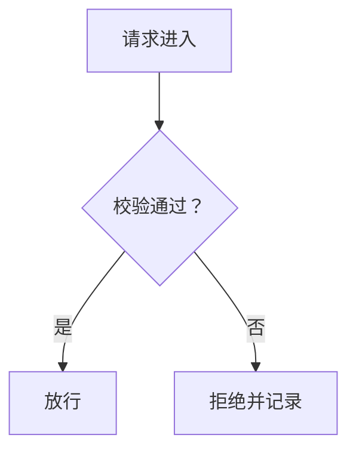

# 博客写作规范：图示与文字

> 适用：`src/content/blog/zh/**` 与 `src/content/blog/en/**` 全部文章。
> 方法论参照 Karpathy 分享的 ASD-STE100「飞行手册」四级阶梯之 ①文字约束 + ②图示——
> 同样的内容，更短、更清楚。③交互网页、④讲解视频 为将来方向。

## 一、图示（Mermaid）

### 渲染机制（作者无需配置）

运行时在 `src/lib/mermaid-diagrams.ts`，由 `src/pages/blog/[slug].astro` 挂载：

- **只在含图页面加载**：页面存在 ` ```mermaid ` 块才动态加载 mermaid 渲染 JS，纯文字页零开销；
- **客户端渲染为 SVG**，跟随全站明暗主题自动重绘，无需刷新；
- **失败隔离**：单块语法错误只降级该块回源码显示（`data-mermaid-state="error"`），整页不崩。

### 写法（四条硬约定）

1. **栅栏语言恰好写 `mermaid`**（小写），顶格、独立段落——不要放进列表、引用块或缩进里；块前空一行。
2. **图题**：紧跟图块之后、另起一段、整行斜体，按篇编号：

   - zh：`*图 1：一句话说清这张图讲什么。*`
   - en：`*Figure 1: One sentence on what the figure shows.*`

3. **语言随目录**：zh 目录图内用中文，en 目录用英文；**图内出现的数字必须与本语言正文一致**——不要从另一种语言复制数字（中英口径不一致时，以各自正文为准并上报）。
4. **一图一事**：大流程拆成多块分别编号。

### 什么内容值得配图

| 内容 | 类型 |
|---|---|
| 流程 / 决策树 / 因果链 | `flowchart TD`（分支用 `-->|"条件"|`） |
| 泳道时序 / 组件交互链 | `sequenceDiagram` |
| 状态机（生命周期） | `stateDiagram-v2` |
| 链式结构（哈希链 / 引用链） | `flowchart LR` |
| 原有 ASCII 字符画 | 一律升级为 Mermaid（例外：纯代码、终端输出、纯数字演算表可保留等宽块） |

规模参考：flowchart ≤ 约 12 个节点；sequenceDiagram ≤ 6 个参与者、4–10 条消息。

### 避坑清单（实测解析陷阱）

- **半角 `;` 是语句分隔符**——Note 文本和标签里都不要用；用全角「；」或破折号——代替。
- **Note 文本里出现第二个半角 `:` 会解析失败**（第一个用于 `Note over X:`）——用全角「：」或破折号。
- **节点标签含任何标点必须用双引号包起来**：`A["标签：带标点"]`。
- **不要用** `%%{init}%%`、`style`、`classDef`、`click`、HTML 标签——渲染走 strict 安全模式，会被剥掉或报错。
- 避免保留字当节点 id（`end` / `graph` / `style` / `class` 等）。

### 最小示例

````markdown
流程一句引子：



*图 1：一次校验的分支——通过放行，不通过拒绝并留痕。*
````

## 二、文字：STE 之镜（针对性优化，不重写）

**做**：

- 超长句拆分：zh 约 >50 字、en 约 >30 词 → 一句一个意思；
- 术语统一：同一概念全篇一个名字；
- 主动语态优先；
- 删冗余修饰堆叠。

**不做**（人话不能改成说明书）：

- 开篇场景、案例叙事节奏、结语排比、口语风格——保留原样。

## 三、事实红线

- **不改任何事实 / 数字 / 引用 / 日期**——文章 frontmatter 均为 `status: verified` + `claims_reviewed: true`；
- **frontmatter 一字不改**（title / date / category / tags / readTime / excerpt / status / 等）；
- 发现疑似事实错误（含中英口径互相矛盾）→ **只报告、不擅改**，由维护者统一拍板。

## 四、本地预览与自检

```bash
pnpm dev   # http://localhost:13118
```

作者自检三件事：

1. 图渲染为 SVG（不是源码）；
2. 切深色**不刷新**即换配色，刷新后主题保持；
3. 故意写坏一处语法：该块降级显示源码、整页不崩、控制台只有 warn 无 error。
