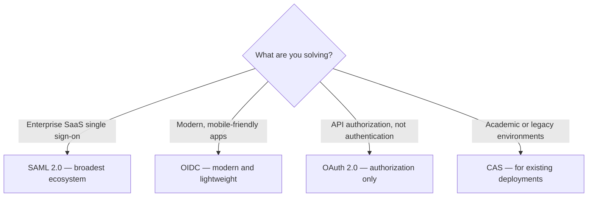

## Why SSO Matters

Single Sign-On (SSO) is the foundation of modern enterprise identity management. In this article, we cover:

### Protocol Selection
- **SAML 2.0** — best for enterprise SaaS, broad ecosystem support
- **OIDC** — modern, lightweight, mobile-friendly
- **OAuth 2.0** — API authorization, not authentication
- **CAS** — academic environments, legacy adoption

*Figure 1: Protocol selection at a glance — SAML 2.0 for enterprise SaaS, OIDC for modern and mobile apps, OAuth 2.0 strictly for API authorization, and CAS for academic or legacy scenarios.*

### Architecture Patterns

**Centralized Gateway**: A unified authentication proxy that handles all SSO traffic. Best for organizations with diverse application stacks.

**Federated Identity**: Each application independently validates tokens against a central IdP. Best for microservice architectures.

### Security Checklist
- Always use PKCE for public clients
- Enforce short-lived access tokens (15-30 min)
- Implement token rotation and revocation
- Use HSM for signing key storage
