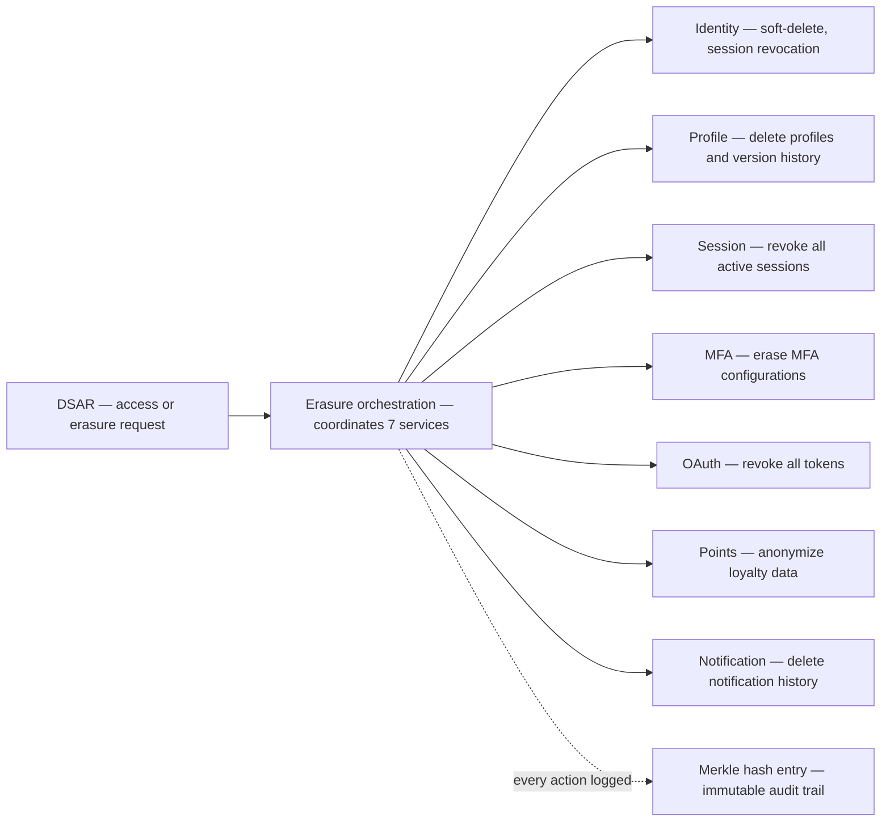

> **Compliance Note**: The technical capabilities described represent Autional's design goals and do not constitute GDPR compliance certification. Final compliance responsibility rests with the data controller.

## The DSAR Challenge

Under GDPR Article 15, data subjects have the right to access their personal data. For organizations with multiple microservices, fulfilling a DSAR means:

1. **Discovery** — locating PII across databases, logs, caches
2. **Aggregation** — merging results into a coherent response
3. **Verification** — proving completeness via audit trails
4. **Timeliness** — responding within 30 days

## Automation Architecture

Autional's erasure orchestration coordinates 7 services:

| Service | Operation |
|---------|-----------|
| Identity | Soft-delete + session revocation |
| Profile | Delete profiles + version history |
| Session | Revoke all active sessions |
| MFA | Erase MFA configurations |
| OAuth | Revoke all tokens |
| Points | Anonymize loyalty data |
| Notification | Delete notification history |

*Figure 1: The erasure orchestration behind a DSAR — the orchestrator coordinates 7 services, and every action leaves a Merkle hash entry.*

## Hash-Chain Verification

Every DSAR action produces a Merkle tree hash entry, creating an immutable audit trail that proves when, how, and by whom data was accessed or deleted.
