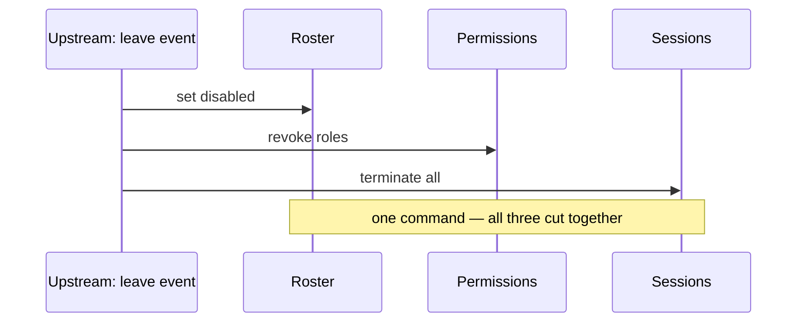

Old Han runs operations. On a new colleague's first day he does three things: creates the account, sets the password (written on a sticky note, handed over), and ticks the permissions the manager listed from memory.

The new colleague is happy. Old Han is practiced. But that practiced routine carries three debts that always come due:

1. **Someone else set the password.** The person who handled it knows it, and the sticky note may have been seen.
2. **Permissions come from memory and only accumulate.** After a transfer, nobody removes the old roles — a year later, nobody can say what that account can touch.
3. **The account was never disabled when the person left.** The door is unlocked and the key went with them.

The industry has a name for the whole domain: **JML — Joiner, Mover, Leaver.** It sounds like paperwork. Every cell of it corresponds to real incidents.

## Three real lessons

### Hawaii Department of Health (2023): the door left unlocked

In January 2023, Hawaii's Department of Health electronic death registry system (EDRS) was accessed without authorization (disclosed publicly that March) by a **dormant external account** — one that had belonged to a **former** medical certifier who had left. The account was never disabled.

Roughly **3,400** death records may have been viewed. There was no exploit and no phishing — just one thing nobody did: **when the person left, the account stayed on the roster.**

### Okta (2022): the people outside the roster

In March 2022, Okta disclosed that a support engineer's workstation at Sitel, a third-party customer-support subcontractor, had been **remotely accessed**, with an access window of roughly **January 16–21, 2022** (about five days).

After analyzing **125,000+ log entries**, Okta said **up to 366 tenants (about 2.5%)** may have been accessed; the company terminated the relevant sessions and disabled the account. Per Okta's account, the actor worked mainly through an internal administration tool, SuperUser (SU), which they described as **designed for least privilege**.

The lesson lives at the edge of the roster: **contractors and third-party support — the people outside the org chart — are exactly whom periodic reviews miss.** Their permissions are often scoped correctly; what nobody watches is who *still* should have them.

### Twitter (2020): the "legitimate entrance" abused

In July 2020, roughly **130** high-profile accounts were targeted and about **45** were taken over to post scams. Attackers used **phone-based social engineering** to obtain employee credentials, then operated through **internal account-management tools** (which could change bound emails and thereby trigger password resets).

The company subsequently restricted tool access and tightened review. The uncomfortable shape of this attack chain: **authentication was subverted, and the attacker then walked in through the authorization side's "legitimate entrance."** Internal admin tooling is necessary capability — and precisely because it's necessary, it's the key that most deserves watching.

## One lifecycle, three states

JML's engineering form puts account creation, permissioning, and revocation on **one lifecycle** with a simple state machine:

| State | Account | Permission bundles | Sessions |
|:--|:--|:--|:--|
| **Pending** | Created, not activated | Not issued | None |
| **Active** | Usable | Job packages attached | Present (listable, revocable) |
| **Disabled** | Entrance closed | Revoked | **All terminated** |

```mermaid
stateDiagram-v2
    [*] --> pending : invitation issued (limited · single-use · email-bound)
    pending --> active : the person sets a password; joined
    active --> active : transfer: permission packages swapped
    active --> disabled : leaving: disable
    note right of disabled : one command — roster + permissions + sessions
```

*Figure 1: One lifecycle, three states — joining moves pending → active, a transfer just swaps permission packages, leaving moves active → disabled; disabling is one command, not a sequence.*

Three design decisions carry the weight:

- **Invitations instead of manual creation.** New people arrive through a **time-limited, single-use, email-bound invitation**, and **they set their own password** — removing "someone else set it" at the source. This follows the standards: NIST SP 800-63A dedicates its own volume to enrollment precisely to make "where accounts come from" explicit.
- **Disabling is one command, not a sequence.** Setting the state to disabled performs **roster update + permission revocation + session termination** in one action. "Account disabled but the person still logged in" is a design defect, not an operator slip.
- **Disabled ≠ erased.** Disabling closes the entrance; retention and deletion are a separate track, governed by retention policy and compliance. Don't delete data inside the offboarding flow.

*Figure 2: The offboarding three-lane — one upstream leave event cuts roster, permissions, and sessions together; skip any lane and "gone" is only a word on paper.*

The standards line up: NIST SP 800-53's **AC-2 (Account Management)** requires disabling inactive accounts (AC-2(3)) and auto-expiry for temporary accounts (AC-2(2)); SP 800-63B-3 §6 covers authenticator binding, loss, revocation, and renewal (moved to §4, Authenticator Event Management, in the -4 revision) — **authenticator lifecycle and account lifecycle are parallel timelines, and offboarding has to close both** (killing sessions addresses the authenticator side).

## Permissions have a lifecycle too: request, approve, review, return

Beyond the account, permissions themselves live a four-phase life:

| Phase | What it governs | Miss it and... | Concrete form |
|:--|:--|:--|:--|
| **Request** | Writing down what's being borrowed | Nobody can say later who asked | A ticket (the borrow slip) |
| **Approve** | Someone else nods — never self-approval | One person decides alone | Approval flow (no self-approval, auto-deny on expiry) |
| **Review** | Periodically: still needed? still deserved? | Grants only accumulate | Recertification |
| **Return** | On departure or expiry: revoke, and close open doors | The door stays open | Disable + de-role + kill sessions |

Compliance treats these as hard requirements: NIST SP 800-53 **AC-6(7)** (review user privileges at an organization-defined frequency), **AC-2(3)** (disable accounts), **AC-6** (least privilege), **AC-5** (separation of duty); **ISO/IEC 27001 A.9.2.5** (the 2013 numbering; A.5.18 in the 2022 revision — periodic review of user access rights); **PCI DSS** (periodic access review — v4.0 requires at least every six months). Microsoft's Entra PIM is the industrial implementation of the pattern: **just-in-time** privilege activation, approval where the role requires it, **24-hour maximum** activation, **no self-approval**.

Review cadence is a trade-off: too frequent burdens the business, too sparse is theater. The sane approach is risk tiering — **money-moving, power-granting, and many-people-visible permissions get the full pipeline; small things don't.** But the premise is that reviews **actually look**. A review that doesn't look is a review that didn't happen.

## From manual creation to sync: SCIM and LDAP

At scale, the answer to "who creates and disables accounts" shifts from the admin to an upstream roster:

- **Then**: admins created accounts, passwords rode sticky notes, permissions were ticked from memory;
- **Now**: the HRIS holds the authoritative roster — joiners auto-provisioned, leavers auto-disabled;
- **Protocols**: **SCIM 2.0** (RFC 7643 / RFC 7644, September 2015) is the modern mainstream — a REST API for creating, updating, and deactivating users; inside corporate networks, **LDAP** (RFC 4511) directory services remain common.

The honest boundary of sync: **automation has latency, and the gap is yours to watch.** Between the upstream change and the downstream delivery, an account sits in a "should-be-disabled" window. Decide the conflict strategy (skip / overwrite / merge) when you integrate — not in the middle of your first real conflict.

## Admin impersonation: the key that most needs watching

Sometimes an admin must literally *become* the user — reproducing a bug, walking through a failure. The capability (impersonation) isn't the sin; **impersonation without a reason, a limit, or a trace is.**

Governing it takes three things:

1. **Who may do it**: highest-privilege admins only, never impersonating themselves, never across tenants;
2. **Evidence on the credential**: the issued temporary credential carries **who is impersonating, why, and under which impersonation ID** (`impersonated_by` / `imp_reason` / `imp_id`);
3. **A clock and a trail**: short-lived credentials (say, one hour), a warn-level audit event recorded at start (with ID and reason), and a one-click "stop impersonation."

The test in one line: **being able to become you isn't the feat — being able to say who did it, and for how long, is.**

## How Autional implements it

The account lifecycle lives in `tenant-service` and the identity services:

1. **Invitations (`TenantInvitation`)**: newcomers arrive by invitation — time-limited (`ExpiresAt`), single-use (`AcceptedAt`), email field encrypted, optionally carrying a default role; invitation events are all recorded (Created / Accepted / Revoked / Resent / Expired / Deleted); registration gates are one of `open`, `approval_required`, `invitation_only`.
2. **Member state machine (`TenantMember`)**: `active / pending / disabled` — disabling updates the roster, revokes roles, and **terminates every session** (`ListActiveSessions` + kick) in one action.
3. **Least privilege by default**: new members receive the tenant default role (`TenantDefaultRole`); additions go through approvals (`ApprovalRequest`: no self-approval, auto-deny on expiry, a separation-of-duty re-check before execution).
4. **Automatic expiry**: temporary roles and approvals are swept by `ExpiredRoleCleaner`; `SimulatePermission` lets you dry-run the impact before changing a grant.
5. **Upstream sync**: SCIM 2.0 (`scim_handler.go`) and LDAP/AD (`ldap_sync`) integrations — auto-provision on join, auto-disable on leave.
6. **Impersonation governance**: only super_admin may initiate; never self, always same-tenant; the temporary credential carries `impersonated_by / imp_reason / imp_id` with a 1-hour TTL; starting one records `admin.impersonation.login` at warn level; `stop-impersonation` returns to the admin identity in one step.

Honest boundaries: department and org data lives in `tenant-service`, and we hold only references to it; PIM's approval requirement is per-role (not every activation needs approval). And one thing automation does not change: **"permissions disappear on their own when someone leaves" never happens.** Someone — or some event handler — must execute the *return* step; automation only wires that step to an upstream event. It doesn't make it optional.

## Common misconceptions

- "Creating an account is one click." It's one lifecycle of invite, grant, and reclaim.
- "Offboarding is handing back a badge." It also means revoking permissions and killing sessions — otherwise the account is disabled and the person is still inside.
- "Disabled means erased." Disabling closes the entrance; deletion is a separate track.
- "Auto-sync means nothing to manage." Sync has latency; the gap needs watching.
- "Approved means it's theirs forever." It's borrowed — it gets reviewed, and it expires.
- "Permissions vanish when people leave." They don't; someone must return them.
- "A box-checking review is fine." A review that doesn't look didn't happen.
- "Just remove the name from the roster." Close the doors they still have open too — or the ledger says gone while the person walks in.

## Closing

Accounts aren't **created** — they're **invited**. Permissions aren't ticked one by one — they arrive as **job packages**. And when someone leaves, it isn't a badge handed back: it's the **door, the keys, and every light still on — cut together.**

Next time you change jobs, leave one, or just inventory your own team's accounts, ask three questions first:

**Did anyone else set the new hire's password? Are permissions granted as packages, or ticked one by one? And on the way out — beyond the badge, does anyone kick the devices still logged in?**
