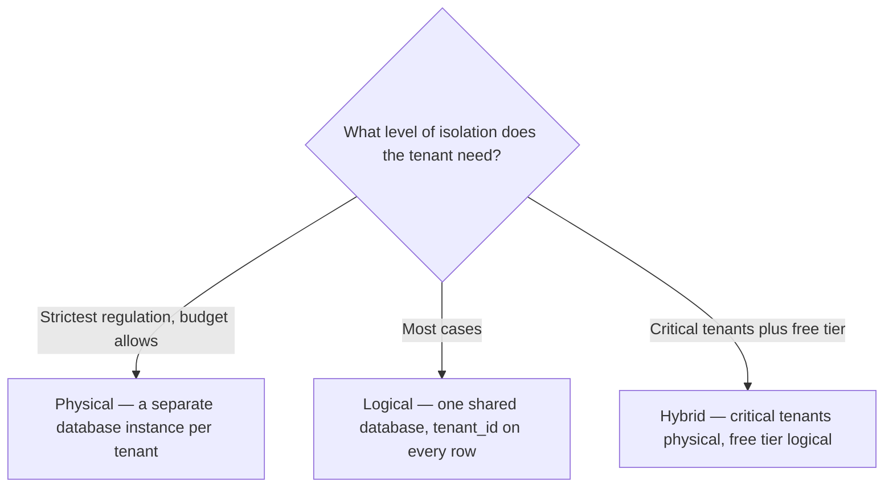

## Tenant Isolation Models

### Physical Isolation
A separate database instance per tenant. Maximum security, highest cost.

### Logical Isolation  
Shared database with tenant_id on every row. Balance of security and efficiency — the most common pattern in Autional.

### Hybrid
Critical tenants get physical isolation; free-tier tenants share logically.

*Figure 1: Choosing among the three isolation models — match each tenant to its regulatory needs and budget, with logical isolation as Autional's most common default.*

## Key Design Decisions

1. **Tenant ID in every query** — enforced by repository layer, verified by CI
2. **Cross-tenant safeguards** — administrators CANNOT accidentally access another tenant's data
3. **Per-tenant configuration** — custom password policies, branding, domains

## Compliance Implications

Multi-tenant architectures require careful GDPR and SOC 2 planning. Each tenant's data boundary must be clearly defined and auditable. Hash-chain audit logs provide cryptographic proof of data isolation.
