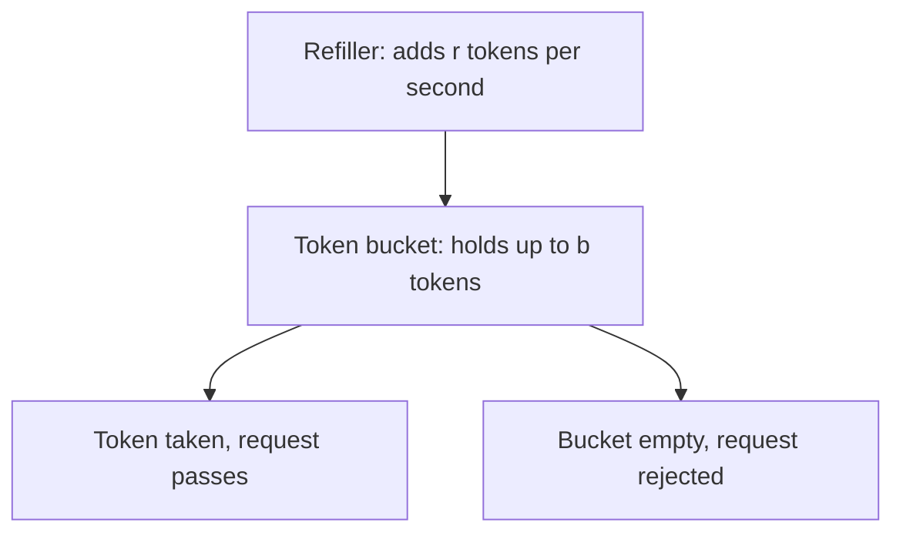
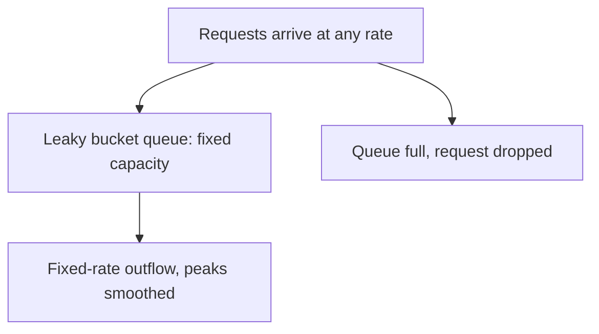

It's 3 AM on a Tuesday. Your ops channel explodes. CPU spikes to 95%, and the p99 latency on your login endpoint goes from 50ms to 12 seconds. Logs show `/auth/login` receiving 3,000 requests per second from a botnet spread across 200+ IPs worldwide. Attackers are brute-forcing your login with a leaked password database.

You have no rate limiting configured. Your login endpoint is in the open.

## Rate Limiting Is Not Optional

Login endpoints are special and must be protected:

1. **CPU-intensive**: Password verification requires bcrypt/argon2 computation, far more expensive than regular APIs. A single bcrypt verification consumes roughly 50-100ms of CPU. Three thousand concurrent requests means 150-300 CPU cores of sustained consumption.
2. **State-changing**: Failed login attempts update `failed_attempts` counters, write audit logs, and trigger failure-count checks. These database write operations become bottlenecks under high concurrency.
3. **Security risk**: Without rate limiting, attackers can try tens of thousands of password combinations in minutes. Even strong passwords eventually fall before enough attempts.

## The Evolution of Rate-Limiting Algorithms

### First Generation: Fixed Window Counter

The simplest approach: count requests within a fixed time window (e.g., 1 minute) and reject requests beyond a threshold.

```
Logic:
    key = "ratelimit:login:ip:{client_ip}"
    count = redis.incr(key)
    if count == 1: redis.expire(key, 60)  # 60-second window
    if count > 100: return 429 Too Many Requests
```

**Problem: Boundary Burst**

Fixed windows have a serious flaw—burst traffic at window boundaries is unrestricted.

```
Timeline:  |──── Minute 1 ────|──── Minute 2 ────|
Requests:        100                 100

But if attackers concentrate requests in the last second of minute 1 and the first second of minute 2:
Timeline:  |────Minute 1─────────|──Minute 2──|
Requests:      98 (59s)   100 (1s)   100 (1s)

In 2 seconds, attackers can send 200 requests, while your rate limit intends 100 per minute.
```

### Second Generation: Sliding Window

Sliding windows solve the boundary burst problem by subdividing the time window into smaller slots.

```
Timeline (1-min window, 6 slots, 10s each):

┌──────┬──────┬──────┬──────┬──────┬──────┐
│ 0-10s│10-20s│20-30s│30-40s│40-50s│50-60s│
│  15  │  20  │  18  │  12  │   8  │   5  │
└──────┴──────┴──────┴──────┴──────┴──────┘

Current total = 15+20+18+12+8+5 = 78 < 100 → Pass

Next 10 seconds, window advances:

┌──────┬──────┬──────┬──────┬──────┬──────┐
│10-20s│20-30s│30-40s│40-50s│50-60s│60-70s│
│  20  │  18  │  12  │   8  │   5  │   0  │
└──────┴──────┴──────┴──────┴──────┴──────┘

Current total = 20+18+12+8+5+0 = 63 < 100 → Pass
```

Sliding windows are far more accurate than fixed windows, but in high-precision scenarios, granularity determines accuracy and storage cost scales with it.

### Third Generation: Token Bucket

The token bucket is the industry's most popular rate-limiting algorithm and the default in Autional gateway-service.



*Figure 1: The token bucket — a refiller drips tokens in at fixed rate r, capacity b caps how big a burst can be saved up; take a token and pass, find the bucket empty and get rejected.*

Core parameters:
- **Rate r**: Tokens added per second (steady-state rate)
- **Capacity b**: Max tokens the bucket can hold (allowed burst)

This is the beauty of the token bucket—**controlled bursts**. With `r=10, b=100`: normally 10 requests/second; but if the bucket accumulates 100 tokens (after idle time), it can handle 100 requests instantly. That doesn't violate the long-term average rate—it just spends the allowance saved up during idle time.

### Fourth Generation: Leaky Bucket

The leaky bucket is the mirror image of the token bucket: token bucket refills at a fixed rate and allows bursts; leaky bucket processes requests at a fixed rate and smooths output.



*Figure 2: The leaky bucket — accept arrivals at any rate up to the brim, release them at one steady rate; when the queue fills up, drops replace delay and downstream sees a flat flow.*

The leaky bucket suits traffic-shaping scenarios—where you need a steady request rate delivered to downstream services. But for bursts, the leaky bucket drops rather than queues, resulting in worse UX than the token bucket.

Autional gateway-service defaults to the token bucket, with config options allowing tenant admins to switch algorithms based on traffic patterns.

## Multi-Dimensional Rate Limiting: Beyond IP

IP-based rate limiting is the most common practice, but has two limitations:

1. **NAT/proxy users share the same IP**: 200 people in one company accessing your service through one egress IP—IP-level limiting can falsely block legitimate users.
2. **Attackers use IP pools**: Attackers with many IP addresses can launch low-frequency, organized attacks on a single account, each IP well below the threshold.

A mature rate-limiting strategy requires multiple layers:

### Layer 1: IP-Level Rate Limiting

```
IP-level parameters (Autional defaults):
  - Window: 60 seconds
  - Threshold: 30 requests / window
  - Algorithm: sliding window
```

This is the outermost defense against large-scale distributed attacks. When a single IP's request volume is abnormal, it's directly rejected.

### Layer 2: User-Level Rate Limiting

```
User-level parameters:
  - Window: 5 minutes
  - Threshold: 10 requests / window
  - Algorithm: token bucket (r=0.03/s, b=10)
```

This is the core defense layer. Even if attackers use different IPs to target the same account, the account is limited to 10 attempts per 5 minutes. This is critical for stopping targeted brute-force attacks.

### Layer 3: Global Rate Limiting

```
Global parameters:
  - Window: 10 seconds
  - Threshold: 500 requests / window (entire login endpoint)
```

This is the disaster protection layer. When overall login request volume far exceeds normal levels (indicating a DDoS attack), it prioritizes availability for other business endpoints.

### Autional Gateway-Service Three-Layer Example

```yaml
# Tenant admin configuration in Autional admin console
rate_limiting:
  login_endpoint:
    ip_limit:
      window: 60s
      max_requests: 30
      algorithm: sliding_window
    user_limit:
      window: 300s
      max_requests: 10
      algorithm: token_bucket
    global_limit:
      window: 10s
      max_requests: 500
      algorithm: token_bucket
    block_duration: 900s  # 15-min block after rate limit triggered
    block_strategy: progressive  # 1st: 1min, 2nd: 5min, 3rd: 30min
```

## Distributed Rate Limiting: Multiple Gateway Instances

Single-instance rate limiting isn't enough in a microservice architecture—with 3 gateway instances each having a 30/min IP threshold, attackers can send 30 requests to each instance, totaling 90/min, easily bypassing the limit.

Distributed rate limiting relies on shared counter storage. Redis is the natural choice:

```
Distributed rate limiting with Redis:

# IP-level rate limiting (sliding window)
EVAL "
  local key = KEYS[1]
  local window = tonumber(ARGV[1])  -- window size in seconds
  local limit = tonumber(ARGV[2])   -- threshold
  local now = tonumber(ARGV[3])     -- current timestamp (ms)
  local window_start = now - window * 1000

  -- Remove entries outside the window
  redis.call('ZREMRANGEBYSCORE', key, 0, window_start)
  -- Count requests within the window
  local count = redis.call('ZCARD', key)

  if count >= limit then
    return 0  -- reject
  end

  -- Add current request to sorted set
  redis.call('ZADD', key, now, now .. ':' .. math.random())
  redis.call('EXPIRE', key, window + 1)
  return 1  -- pass
" 1 "ratelimit:login:ip:192.168.1.1" 60 30 1715692800000
```

Autional gateway-service has this Redis rate limiter built in—developers don't need to implement it themselves. It auto-enables distributed mode via `redis` connection info in the gateway config. If Redis is unavailable, it gracefully degrades to local rate limiting (each instance counts independently) and triggers an alert.

## Real-World Scenario: Complete Brute-Force Defense Chain

Back to the attack scenario at the beginning. Here's Autional's layered response:

```
Time: 03:00:00
Attack begins → 3,000 login requests/second from 200+ IPs

03:00:02
Global rate limit triggered: requests exceed 500 in 10-second window
→ gateway-service returns 429 Too Many Requests
→ System auto-scales gateway-service instances (Kubernetes HPA)

03:00:05
IP-level rate limit triggered: each attacking IP is individually limited
→ Attacker IPs enter the blocklist for 15 minutes
→ Legitimate users are unaffected (their IPs are far below the threshold)

03:00:10
User-level rate limit triggered: multiple IPs detected trying the same account
→ Account enters "protected" mode
→ Subsequent login attempts require MFA (WebAuthn)
→ Security alert triggered, email sent to account owner

03:00:30
Adaptive MFA engine activates:
→ Composite score: unknown device fingerprint + low IP reputation + multi-location + high failure rate = extreme risk
→ Further requests for protected accounts are directly rejected
→ Security team receives alert push notification

03:05:00
Attack traffic subsides.
→ Blocked IPs auto-unblock after 15 minutes
→ System returns to normal
→ Audit log has a complete record of the entire attack
```

## Golden Rules of Rate Limiting Configuration

### 1. Never Rely Solely on IP Rate Limiting

IP rate limiting is only the first line of defense, not the only line. It must be paired with user-level rate limiting.

### 2. Thresholds Should Come From Data

Don't guess thresholds. Analyze your normal traffic patterns:
- How many login attempts does a normal user make in 1 minute? (Use p99, not average)
- How many logins per hour for a normal user? (Use max)
- What are the p95 and p99 request rates for your login endpoint?

Set thresholds at 3-5x the normal p99—enough buffer for abnormal behavior but effective at stopping attacks.

### 3. Keep Error Messages Consistent

When rate limiting is triggered, error messages should not distinguish between "wrong password" and "too many requests," because attackers can infer strategy from responses:

```json
// Bad: leaks rate-limiting policy
{ "error": "Too many attempts. Try again in 215 seconds." }

// Good: doesn't leak information
{ "error": "Authentication failed. Please try again later." }
```

Autional returns a standard `429 Too Many Requests` status code with a `Retry-After` header, but the response body stays consistent with normal authentication failures, not exposing rate-limiting details.

### 4. Progressive Penalties

Don't block for 24 hours on the first threshold breach. Use a progressive strategy:

```
1st trigger: wait 1 minute
2nd trigger: wait 5 minutes
3rd trigger: wait 30 minutes
4th trigger: wait 2 hours + notify account owner
5th trigger: account temporarily locked, contact admin
```

This strategy minimizes punishment for legitimate users who occasionally mistype their password, while applying escalating deterrence against malicious attackers.

### 5. Monitoring and Alerting

Rate limiting isn't "set and forget." You need:

- Monitor rate limit trigger frequency (if triggered daily, you may need to adjust thresholds or investigate)
- Monitor the number of rate-limited IPs (a surge means an attack)
- Monitor the number of rate-limited accounts (many different accounts could mean credential stuffing)
- Set alerts: when rate limit trigger rate exceeds 10x normal levels, send an alert

## Summary

Rate limiting is identity security infrastructure, not an optional add-on. A login endpoint without rate limiting is like a door without a lock—it just hasn't been noticed by attackers yet.

Autional gateway-service's built-in distributed rate limiting provides three layers of protection (IP-level, user-level, global-level), supports both token bucket and sliding window algorithms, and achieves cross-instance precise counting via Redis. Each tenant can independently configure based on their own security needs and traffic characteristics.

Arm your login endpoint with armor.
