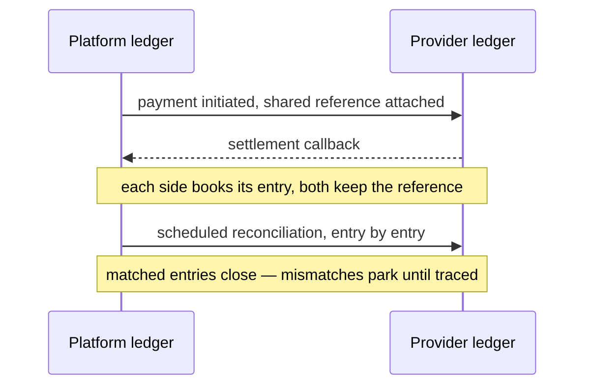
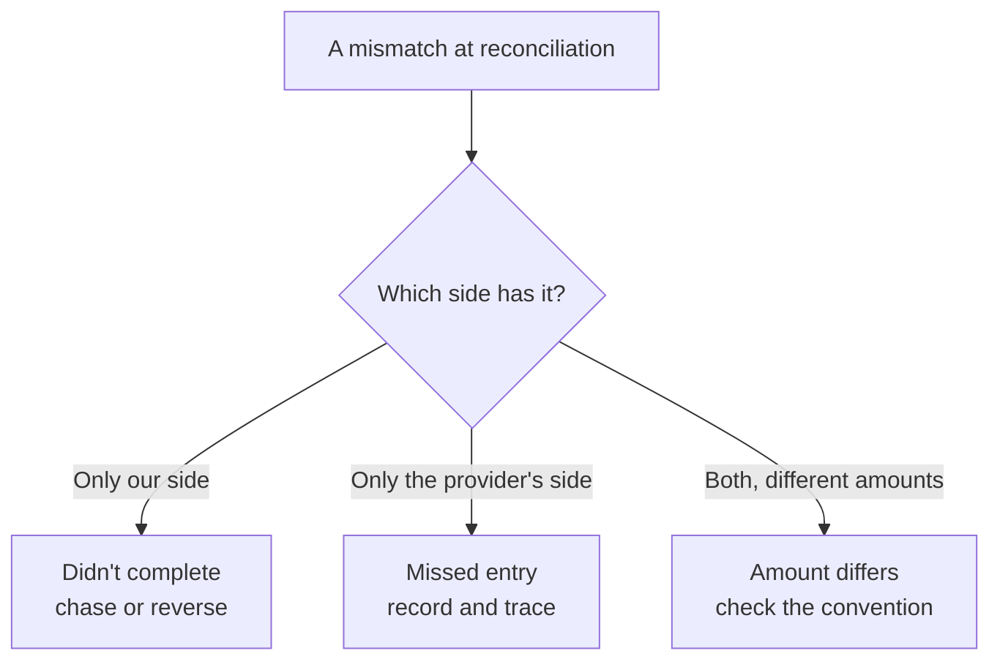

End of month. Finance finds the platform's ledger and the provider's statement disagree by three cents. A day of digging through fee conventions and exchange rates later, the culprit: fees computed in binary floating point — each remainder too small to see (`0.1 + 0.2` comes out as `0.30000000000000004`), thousands of them accumulating into exactly the three cents.

Why do the books fail to match? The answer has two halves: the **representation** of money (how it's stored and computed), and the **comparison** (how two ledgers are checked against each other). Get both right, and "not one cent off" becomes possible.

## Reconciliation compares entries, not totals

Start with the most common wrong approach: compare two totals. "The platform moved 1M today; the provider's statement says 1M. We're square."

Here's why that fails:

| | Total check | Entry-by-entry |
|:--|:--|:--|
| What you compare | Two sums | Every entry on both sides |
| How entries are matched | Not needed | By shared reference number |
| A charge and its refund | Cancel out; invisible | Counted separately; detectable |
| Missing or extra entry | May still balance | Caught |
| Fits | A rough sense | **"Every cent has a trail"** |

**Totals look balanced. Entries actually balance.** Entry-level reconciliation requires one prerequisite: every payment carries the **same reference** on both sides — an internal reference and the provider's reference. Both stay in the record, so matching can recognize "the same payment."



*Figure 1: The reconciliation two-lane — each ledger books its own entries and matches them by the shared reference; mismatches park in a review queue until traced, never auto-adjusted.*

## Where differences come from

A mismatch doesn't mean fraud or a broken formula. The most common differences fall into three shapes:

| Shape | Typical cause | The response |
|:--|:--|:--|
| Only on our side | Validation failed / transaction didn't complete | Chase the state; reverse if needed |
| Only on the provider's side | Missed recording / lost callback | Record it — and find out why it was missed |
| Both sides, different amounts | Fees / FX / discounts | Check the fee convention; adjust per rules |



*Figure 2: The mismatch causal chain — first ask which side holds the record: only ours, only the provider's, or both with different amounts; three shapes, three responses.*

The usual suspects: retries, **refunds**, fee conventions, cross-day and timezone gaps, missed entries, and differing amount conventions (tax-inclusive vs exclusive).

One rule matters above all: **never "fix" a difference by editing an entry.** Adjust the total and you've produced a **fake balance** — the real discrepancy is gone **for good**. The correct path: park the unmatched entry in a review queue (keeping its reference and both timestamps) → trace the reference to the actual snag → only then touch the books.

And one honest caveat: **in transit is not an error.** Settlement cycles, day boundaries, and timezones mean one side may have recorded an entry the other side hasn't yet — those resolve themselves once the other side catches up. Reconciliation runs **period by period** (daily, per settlement window). One unmatched entry today proves nothing.

### The timestamp rule: booking time ≠ reconciliation time

This one comes from hard-won internal experience: **the booking timestamp (`CreatedAt`) and the reconciliation timestamp (`ReconciledAt`) must never be conflated.**

Conflate them and the books disagree every single day, with no amount of digging finding the cause — because "which timestamp aligns the two sides" was wrong at the root. Store both, separately: one answers when the entry happened, the other when it was checked.

## Two classic failures

### The Vancouver Stock Exchange: half the index, gone in 22 months

In January 1982, the Vancouver Stock Exchange's index started at **1000**. It was recomputed about **3,000 times** a day, and each computation **kept three decimal places and truncated the rest** — not rounded, truncated.

Truncation is **systematically downward**. Each chopped remainder is negligible; 3,000 times a day, ~20 trading days a month, the error compounds. The index "fell" about **25 points per month**. After **22 months** it sat at **524.811** — while the true index, computed correctly, had hovered around the thousand mark the whole time.

A weekend fix in November 1983 moved the index from **524.811 to 1098.892** in one step. The missing half wasn't the market. It was accumulated remainders.

This is usually told as an anecdote, but it's the archetype of every reconciliation difference: **each error is tiny; systematic accumulation makes it enormous.**

### TSB Bank: the migration succeeded, the platform died

In April 2018, TSB migrated roughly **1.3 billion** customer records to a new platform. The migration itself was clean — and then the platform failed: branches were affected nationwide, a significant proportion of its **5.2 million** customers hit trouble, **nearly two million** were locked out of their accounts, and operations didn't recover until **December 2018**.

The aftermath: **£32.7 million** paid to affected customers; in December 2022 the FCA and PRA levied a combined **£48.65 million** fine (£29.75M + £18.9M), citing operational risk management and governance failures.

The connection to reconciliation: **a completed migration is not a continued ledger.** Whether every historical entry remains matchable, searchable, and traceable across the old and new systems has to be an acceptance criterion of the migration itself — not a cleanup item afterward.

## Money precision: why `0.1 + 0.2 ≠ 0.3`

Now the representation half.

Computers represent real numbers in **binary floating point**, standardized as **IEEE 754** (first edition 1985; current version IEEE 754-2019). IEEE 754 guarantees **consistency** — the same inputs produce the same results everywhere. It does **not** guarantee decimal exactness.

In plain words: decimal `1/3 = 0.3333…` never terminates; **binary 0.1 is just as non-terminating**. What can't terminate can't be stored — only approximated. The "0.1" you stored is already a hair short.

Hence the famous demo:

```
0.1 + 0.2 = 0.30000000000000004
```

Using floats for money (instead of decimal) has four real consequences:

1. **Accumulation drift**: a hundred 0.1s don't sum to 10.0;
2. **Failed comparisons**: `0.1 + 0.2 == 0.3` is false, and a branch takes the wrong path;
3. **Reconciliation failures**: a few cents off, and someone loses a day chasing it (the opening scene);
4. **Wrong report and invoice amounts**: wrong in the most visible place.

### How to store money

| Representation | Exact for 0.1/0.3 | Controllable rounding | Cost and fit |
|:--|:--|:--|:--|
| `float32` / `float64` | ✗ | ✗ | **Never for money** — drift and comparison failures |
| Integer minor units ("cents") | ✓ | ✓ | Cheapest; needs a canonical minor unit and FX conversion (Stripe's route) |
| `DECIMAL(p,s)` | ✓ | ✓ | Moderate; pick the precision deliberately (the common database choice) |
| Strings | ✓ | ✓ | Heaviest; for **transport and display**, avoiding repeated float conversions |

Three companion disciplines:

- **Transport and display as strings** — every extra float conversion is another chance to get "approximately" wrong;
- **Leave enough digits**: our money columns are uniformly `decimal(20,4)`; historically the codebase migrated from `float64` to `decimal` and widened `(15,2)` to `(20,4)` across **7 model migrations**. Tax rates get their own `decimal(10,6)` — multi-currency and tax math need more places;
- **Currency codes use ISO 4217** (three letters), never homegrown.

### Rounding: write the rule down, never trust defaults

| Rounding mode | Bias | Fit |
|:--|:--|:--|
| Truncation | **Systematically downward** (the Vancouver failure) | Practically never for money |
| Round-half-up | Near-unbiased, but `.5` always rounds up | General use; slight bias under many `.5`s |
| Banker's rounding (half to even) | Near-unbiased | Common in finance/statistics; **must be declared** |

Whichever you choose: **hard-code the rounding rule; never rely on language defaults.** Defaults differ across languages and libraries — delegating "how money rounds" to a default delegates the ledger to luck.

### An exchange rate isn't a number — it's a quote that expires

Model rates as a value object: `{From, To, Rate, QuoteID, ExpiresAt}` — with a **quote ID** and an **expiry**.

Why expiration matters: rates move. Settle with a stale rate and the two sides will disagree at reconciliation by construction. **Expired means re-quote — never settle on the old number.** Encode that rule in the data model; it's more reliable than any policy document.

## Reconciliation ≠ audit ≠ tamper-proof ledger

These three get conflated, yet their goals differ:

| | Reconciliation | Audit | Tamper-proof ledger |
|:--|:--|:--|:--|
| Governs | Whether things match | Who did what, when | Whether records changed after writing |
| Relies on | Shared references + entry comparison | Immutable records | Hash chain + sequence numbers |
| After a finding | Park and chase | Preserve evidence, assign responsibility | Verify entry by entry, alert |

Upstream of reconciliation, the ledger itself has engineering requirements: an **append-only event stream** (one event per money movement: amount, balance before, balance after, sequence number, previous hash, this hash), balances as **projections** of the events, a unique index on `(wallet_id, sequence_num)` against duplicate sequence numbers, and a hash chain that makes every entry verifiable. Add daily **snapshots** so history doesn't need full replay.

Worth knowing on the standards side: **ISO 20022**'s cash management messages **camt.052 / camt.053 / camt.054** (account report / bank-to-customer statement / debit-credit notification) are officially described as "for cash management and/or reconciliation"; camt.053 is designed to replace SWIFT MT940 / MT950 statements. Accounting has a formal name for "park the unmatched difference": **items in transit**. As for records-immutability rules (e.g., SEC 17a-4 and WORM storage), clause-level mappings differ widely and public material is rarely complete — check the original text yourself before relying on it.

## How Autional does it

Reconciliation spans `pay-service`, `billing-service`, and `wallet-service`:

1. **Every payment carries references**: `GatewayRef` (provider side) and `InternalRef` (ours) are both stored — matching recognizes "the same payment" by the shared reference.
2. **Scheduled entry-level checks**: `SchedulerBillingReconciliation` pulls both ledgers daily/per settlement period, counting matches (`MatchedCount`) first, then mismatches (`MismatchedCount`).
3. **Differences stay visible**: a mismatch becomes a `ReconciliationRecord` (keeping both amounts — `GatewayAmount` vs `InternalAmount`, plus `DiffAmount`) and raises an alert for a human to chase. **Nothing auto-adjusts.**
4. **Two timestamps, stored apart**: `CreatedAt` (booking) and `ReconciledAt` (reconciliation) never mix.
5. **On the money side**: `decimal(20,4)` storage, string transport, ISO 4217 `Currency`, rates carrying `QuoteID` and `ExpiresAt`; the wallet ledger runs on the event stream plus hash chain plus daily snapshots.

Honest boundaries: organizations differ widely in reconciliation cadence and difference conventions — our defaults (daily / per settlement period) are engineering choices, not industry mandates. The SEC 17a-4 / WORM reference above is an "adjacent" analogy; clause-level mapping must be verified for each target market.

## Common misconceptions

- "Totals match, so the books match." A charge and its refund missing together cancel out; totals can't see it.
- "A mismatch means fraud or sloppy math." Usually it's fees, refunds, timezone gaps, or a missed entry.
- "Just adjust one entry to balance it." A faked total buries the real difference **permanently**.
- "Reconciliation time is booking time." Conflate them and you'll never balance — that's a real lesson, not a hypothetical.
- "0.1 + 0.2 is just a display quirk." There is no exact binary 0.1; the error is real.
- "Two decimal places is plenty." Multi-currency, FX, and tax need more.
- "Precision incidents are arithmetic errors." Often they're **rounding-rule errors** — Vancouver truncated.
- "An exchange rate is just a number." It's a quote with an ID and an expiry.

## Closing

Reconciliation isn't about totals — it's about **every entry: one shared reference, recognized as the same payment; everything unmatched, chased until it balances.**

And money never does "approximately": **numbers can be close enough. Money can't. Off by a cent, the books are wrong.**

Three questions, in order, next time the books disagree:

**What makes these two entries the same payment? Where did the unmatched ones go? And the differences — are they errors, or still in transit?**
