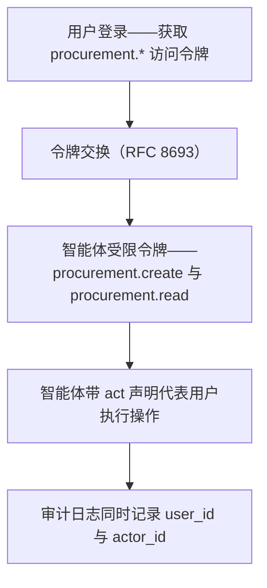

## 问题：操作者究竟是谁？

设想 2026 年某个工作日的一幕：

> 你是一名采购经理，用 AI 智能体自动处理日常采购。本周，智能体检测到办公用品库存低于阈值，自动生成了采购订单并提交给审批人。审批人同样是一个 AI 智能体，它根据预算与策略批准了订单。订单被自动发送到供应商系统。

现在问三个问题：
1. 采购系统的身份日志显示「操作人：采购经理」——但这并不完全准确，直接操作者是 AI 智能体
2. 如果买错了东西——是人的责任？智能体的责任？还是平台的责任？
3. 一条写着「审批人 = procurement_agent」的审计日志，在监管审计中具备法律效力吗？

这不是科幻。2026 年，企业已经在生产环境中使用 AI 智能体处理工作流。而身份基础设施还没有跟上。

## 什么是非人类身份（NHI）？

我们习惯的身份模型是「一个人 = 一个账号」。每个账号绑定：

- 身份标识（用户名/邮箱/手机号）
- 认证凭据（密码/生物特征/TOTP）
- 授权信息（角色/权限/用户组）

但下面这些「账号」并不符合这个模型：

| 类型 | 示例 | 特征 |
|------|---------|-----------------|
| 服务账号 | CI/CD 部署账号 | 代表一个服务，而非一个人 |
| API 客户端 | 第三方应用集成 | 通过 client_credentials 获取令牌 |
| IoT 设备 | 智能门锁、传感器 | 低功耗、无用户界面 |
| AI 智能体 | 自动采购、自动客服 | 代表人类做出决策与操作 |
| RPA 机器人 | 自动录入数据 | 模拟人类的 UI 操作 |

Gartner 预测，到 2028 年非人类身份的数量将超过人类身份。在 AI 智能体崛起的背景下，这一趋势只会加速。

## AI 智能体对身份系统提出的新要求

### 要求 1：委托授权——「AI 替某人行事」

用户绝不应该把密码交给 AI 智能体。正确的做法是：

**委托授权**：用户通过标准授权协议，将自己权限的一个子集委托给智能体。

这可以用 OAuth 2.0 令牌交换（RFC 8693）实现：

```
用户登录 → 获取访问令牌（scope: procurement.*）
         → 请求授权给智能体的委托令牌
         → 智能体获得受限令牌（scope: procurement.create, procurement.read）
         → 智能体使用受限令牌代表用户执行操作
```



*图 1：委托授权链——用户令牌经 RFC 8693 交换为限定 scope 的智能体令牌，智能体以 act 声明代表用户执行，审计日志同时记录委托方与执行者。*

关键区别：智能体令牌的 scope 由用户明确限定——用户拥有 `procurement.*`，但只授予智能体 `procurement.create` + `procurement.read`，不含 `procurement.approve`。

Autional 的 `oauth-service` 通过令牌交换协议（RFC 8693）支持这种委托授权模型：

- 用户令牌 → 换取限定 scope 的智能体令牌
- 智能体令牌中包含 `act` 声明（actor，执行者），表明「本次操作由智能体代表用户执行」
- 审计日志同时记录 `user_id`（委托方）与 `actor_id`（智能体 ID）

### 要求 2：不可否认性——「是人干的还是 AI 干的？」

当一张采购订单被「批准」时，审计日志必须能够区分：

- 情况 A：人类审批人手动点击了「批准」按钮
- 情况 B：AI 智能体在人类授权的规则范围内自动批准

**解决方案**：JWT 令牌中的 `act`（Actor，执行者）声明。

```json
{
  "sub": "user_procurement_manager",
  "act": {
    "sub": "agent_procurement_bot_v2",
    "delegation_id": "delg_01ARZ3NDEK..."
  },
  "scope": "procurement.create",
  "iat": 1715692800,
  "exp": 1715696400
}
```

当 `audit-service` 收到携带该令牌的操作记录时，会同时记录 `sub` 与 `act.sub`——任何时候都能追溯到「由谁授权、由哪个智能体执行」。

### 要求 3：限流——「智能体可能太快了」

人类操作有天然上限——每分钟最多点几次按钮。而 AI 智能体在同一分钟内可以完成 1000 次操作。如果身份基础设施没有为这种速度做 NHI 设计，就会把它当成攻击来限流或锁定。

Autional 的限流需要区分「同一用户、同一设备但由 AI 智能体发起的高频操作」与「人类不可能完成的异常高频操作」：

- **标准限流**：每个用户每分钟 60 次 API 调用（人类上限）
- **智能体限流**：每个智能体每分钟的动态额度（依据智能体的权限级别与历史行为）
- **异常检测**：智能体的操作模式突然偏离基线 → 触发人工复核

### 要求 4：审计——「不可篡改的证据链」

当 AI 智能体做出错误决策（例如错误批准了一笔超预算采购）时，必须有一条完整的证据链：

- 人类用户在何时授予了智能体哪些权限
- 智能体基于哪些数据做出决策（风险评分？规则匹配？LLM 推理？）
- 决策的完整时间线（输入 → 处理 → 输出）
- 智能体的模型版本与配置快照

传统的审计日志（「用户 X 在时间 Z 做了 Y」）不足以承载这些信息。Autional 的 `audit-service` 需要扩展审计模型：从「谁在何时做了什么」扩展到「谁经由谁、在何时、基于什么、做了什么」。

## Autional 的 NHI 路线图

面对 AI 智能体的崛起，Autional 正在多条战线做准备：

### 近期（2026）

**支持令牌交换**：在 `oauth-service` 中完整实现 RFC 8693 令牌交换，支持用用户令牌换取限定 scope 的智能体令牌。

**act 声明标准化**：所有 JWT 令牌均包含 `act` 声明，记录委托链。

**audit-service 支持执行者**：扩展审计日志模型，增加 `actor_type`（human/service/agent）与 `delegation_chain` 字段。

### 中期（2027）

**智能体身份注册**：`identity-service` 支持创建 Agent 类型的身份主体，并拥有独立的注册与认证流程（API Key + OAuth client_credentials）。

**智能体权限模型**：RBAC 扩展为支持智能体专属角色——例如 `agent_procurement` 可以创建采购订单但不能批准。

**智能体行为基线**：`session-service` 为智能体建立行为基线，行为异常时触发告警。

### 远期（2028+）

**智能体间认证**：支持两个 AI 智能体之间直接进行认证与授权，无需人类居中。

**决策溯源**：`audit-service` 记录智能体决策的完整「数据血缘」——输入数据、模型版本、推理步骤——形成可供审查的决策证据链。

## 这对今天的开发者意味着什么

如果你正在构建的产品将在 2026-2027 年引入 AI 智能体，现在就可以做这几件事：

1. **不要让用户把密码交给智能体**。为智能体使用独立的 API Key 或 OAuth 令牌（client_credentials 授权），并通过令牌交换获取代表用户的权限。

2. **在审计日志中区分「执行者」与「代表谁」**。即便你的系统今天还没有智能体，在审计模型中预留 `actor` 字段也能为未来留出空间。

3. **为高频操作设计限流**。智能体的操作速度可以是人类的 10-100 倍。限额应基于操作类型与风险等级，而不是简单规定「每用户每分钟 N 次」。

4. **遵循 OAuth 2.0 令牌交换标准（RFC 8693）**，而不是自创协议。这是业界在委托授权上的最佳实践约定。

## 小结

AI 智能体对身份系统而言不是「未来功能」，而是正在发生的现实。随着 AI 代表人类执行越来越多的数字操作，身份基础设施必须回答一个根本问题：**在人与 AI 混合的操作链条中，责任主体是谁？**

答案将影响整个身份技术栈——从认证协议、授权模型到审计标准。Autional 正从令牌交换、`act` 声明、智能体身份类型与决策溯源四个方向系统性地应对这一挑战。
