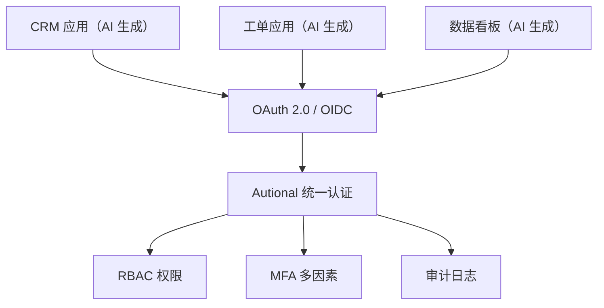

巴别塔的圣经故事广为人知：人类因语言不通而无法协作，塔最终崩塌。在 2026 年的软件开发世界里，一座新的「巴别塔」正在悄然形成——**身份认证的巴别塔**。

## AI 编程工具的爆发

Cursor、Windsurf、Bolt、v0、Lovable 等 AI 编程工具正在重塑软件开发的生产力。一个功能完整的 CRM 系统、工单管理平台或数据看板，如今可以在几小时内由自然语言描述生成。

这带来了巨大的生产力红利：业务团队不再需要等待 IT 排期。销售负责人可以在一个下午用 AI 生成一个内部 CRM；运营经理可以快速搭出一个数据分析看板。

但每个 AI 生成的应用都自带一个问题：**它有自己的登录体系。**

## 巴别塔初现

设想这样一个场景：你的公司使用了 5 个 AI 生成的应用——

| 应用 | 生成工具 | 认证方式 |
|-----|----------------|-------------|
| CRM 系统 | Cursor | 邮箱 + 密码 |
| 工单系统 | Bolt | Google OAuth |
| 数据看板 | v0 | 邮箱 + 密码 |
| 审批流 | Cursor | GitHub OAuth |
| 客户门户 | AI SDK | 邮箱 + 密码 |

问题如今一目了然：

- **5 套登录密码**：员工要记住 5 个不同的密码，或者使用 5 种不同的第三方登录
- **5 个管理后台**：人员入职或离职时，管理员要在 5 个地方分别创建或删除账号
- **0 份统一审计日志**：谁在何时登录了哪个系统？执行了什么操作？记录分散，无法关联
- **安全水平参差不齐**：有的应用有 MFA，有的没有；有的用 bcrypt，有的可能还在用 MD5
- **没有统一的安全策略**：无法在所有应用上强制一致的密码复杂度要求、登录失败锁定或会话超时策略

这就是**身份巴别塔**——每个应用各说各的认证语言，无法协同。应用越多，问题越大。

## 从巴别塔到统一语言：Autional 的方案

Autional 的设计理念是：**把身份认证从应用层拿出来，提升到平台层。** 所有 AI 生成的应用都不再自己管理用户，而是通过 OAuth 2.0 / OpenID Connect 协议把认证委托给 Autional。

### 三步改造

**第 1 步：在 Autional 中注册应用（5 分钟）**

在管理控制台创建一个 OAuth 客户端，获得 Client ID 和 Client Secret。配置回调地址与所需的权限 scope。

**第 2 步：接入 OAuth 登录（30 分钟写代码）**

在 AI 生成应用的登录页加一个「使用 Autional 登录」按钮，跳转到 Autional 的授权端点：

```
GET https://auth.yourcompany.com/oauth/authorize?
  client_id=YOUR_CLIENT_ID&
  redirect_uri=https://crm.yourcompany.com/callback&
  response_type=code&
  scope=openid profile email
```

用户在 Autional 的登录页完成认证——支持密码、通行密钥（Passkey）、TOTP、短信等多种方式——然后被重定向回应用。应用用授权码换取访问令牌与 ID 令牌。

**第 3 步：在管理控制台配置安全策略（2 分钟）**

为该应用选择安全策略：

- 是否强制 MFA？
- 密码复杂度要求？
- 会话超时时间？
- 登录前是否需要审批？

保存，完成。

## 统一之后的世界

当所有应用都接入 Autional 之后，先前的混乱变成了清晰的秩序：

### 一览对比

| 维度 | 统一之前 | 统一之后 |
|-----------|-------------------|-------------------|
| 用户登录 | 5 个密码 / 5 种第三方登录 | 一个账号通行所有系统 |
| 用户管理 | 5 个分散的管理后台 | 集中式管理控制台 |
| 安全策略 | 各自为战 | 一处配置，全局生效 |
| 审计日志 | 分散、无法关联 | 统一、可跨系统关联 |
| 合规报告 | 多系统拼凑 | 一键生成 |

### 核心收益

**1. 用户体验**：员工或客户只需一个账号、一次登录，即可访问所有已授权的应用。支持 SSO——登录应用 A 后，切换到应用 B 无需重新认证。

**2. 管理效率**：
- 入职：在管理控制台创建一个账号、分配角色与权限，用户即可访问所有已授权的应用
- 离职：停用这一个账号，所有应用访问权限自动吊销
- 安全审计：通过 security-dashboard 一处查看所有应用的安全状况

**3. 安全一致性**：
- 密码策略（复杂度、历史记录、有效期）全局统一
- MFA 策略按用户角色与应用敏感度精细控制
- 登录失败锁定与异常告警覆盖所有应用

**4. 合规就绪**：
- 所有应用的访问日志集中到 audit-service，形成完整审计链
- 哈希链保护确保日志防篡改，满足等保 2.0、SOC 2 与 PIPL 的审计要求
- DSAR 数据导出请求一次覆盖所有应用的用户数据

### 架构图



*图 1：AI 生成应用不再各自管理用户——它们统一经 OAuth 2.0 / OIDC 把认证委托给 Autional，权限、MFA 与审计日志在平台层收口。*

## AI 时代的新分工

AI 编程工具极大地加速了应用的**业务逻辑**部分——CRUD 操作、数据展示、工作流编排。但**身份认证**是一个不应该被反复重造的领域。它涉及密码学、协议实现、合规要求与安全审计——任何一个环节的疏漏都可能造成严重的安全事故。

Autional 的角色就是补上这块短板：**你用 AI 生成业务逻辑，Autional 负责身份安全。** 这种分工让开发者能够专注于真正创造价值的业务代码。登录、注册、找回密码、MFA、权限管理和审计日志——这些都不必在每个 AI 生成的应用里重新实现。

### 一个关键数据

- 安全团队的统计显示，**68%** 的自研认证系统至少存在一个严重安全漏洞（与 OWASP Top 10 相关）

AI 正在让应用生成变得前所未有的快。别让身份认证成为这场生产力革命的瓶颈。
