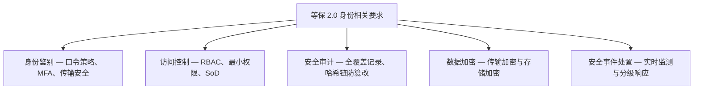
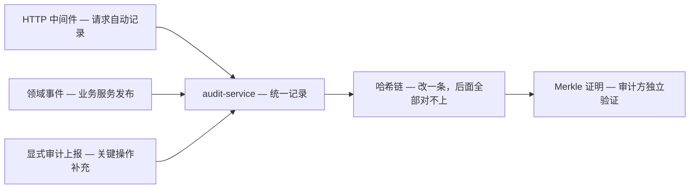

> **合规声明**：本文所述的等保 2.0 相关技术能力为 Autional 平台的设计目标，不构成对等保合规认证的法律陈述。等保测评须由具备资质的测评机构进行全面的现场评估，最终合规责任由信息系统运营使用单位承担。

《信息安全技术 网络安全等级保护基本要求》（等保 2.0）是我国网络安全领域的核心合规标准之一。对 SaaS 平台、企业内网系统与面向公众的在线服务而言，等保 2.0 对身份认证系统提出了明确而严格的要求。

本文逐条解读等保 2.0 中与身份相关的要求，并分析 Autional 如何满足这些要求。



*图 1：等保 2.0 与身份相关的五组要求，以及每组要求背后的关键机制。*

## 等保分级概览

等保 2.0 将信息系统的安全保护等级划分为五级。对大多数 SaaS 与商业平台而言，第二级（系统审计保护级）与第三级（安全标记保护级）是最常见的测评等级。本文以三级要求为主要参考。

等保 2.0 将安全要求分为技术与管理两大类。其中技术部分「安全计算环境」与「安全区域边界」两章直接涉及身份认证系统。

## 一、身份鉴别（安全计算环境 L3-1）

### 测评要求

- 应在登录时对用户身份进行标识与鉴别，身份标识具有唯一性
- 鉴别信息应具有复杂度要求并定期更换
- 应提供登录失败处理功能，包括会话终止、限制非法登录次数与自动退出
- 进行远程管理时，应采取必要措施防止鉴别信息在网络传输过程中被窃听
- 应采用口令、密码技术、生物技术等两种或两种以上组合的鉴别技术对用户身份进行鉴别

### Autional 的应对

**唯一标识与口令策略**：Autional 的 identity-service 支持通过用户名、邮箱或手机号登录——均为唯一标识。口令策略完全可配置：

- **复杂度要求**：支持可配置的最小长度、大小写字母、数字与特殊字符要求
- **口令历史**：用户修改口令时自动校验历史记录，防止重复使用最近 N 次的口令
- **定期更换**：支持口令有效期设置，并在到期前自动提醒用户
- **登录失败锁定**：连续登录失败超过阈值后自动锁定账号；锁定时间与失败次数均可配置
- **会话超时**：通过 session-service 管理会话生命周期，支持空闲超时与绝对超时

**多因素认证（MFA）**：等保 2.0 要求「两种或两种以上组合的鉴别技术」，Autional 的 mfa-service 为此提供了开箱即用的方案。它支持 TOTP 动态口令、短信验证码、邮件验证码与通行密钥（Passkey，WebAuthn）四种认证方式。管理员可通过策略配置，精确控制哪些用户、哪些场景需要 MFA。

**传输安全**：Autional 全链路强制 HTTPS/TLS 1.3。从网关层到微服务、以及服务之间的内部通信均采用 mTLS 加密。口令在传输前经过客户端 PBKDF2 加盐哈希处理，确保鉴别信息在整个传输路径上不被窃听。

## 二、访问控制（安全计算环境 L3-2）

### 测评要求

- 应对登录的用户分配账户与权限
- 应重命名或删除默认账户，修改默认口令
- 应及时删除或停用多余的、过期的账户
- 应授予管理用户所需的最小权限，实现管理用户的权限分离
- 应由授权主体配置访问控制策略，访问控制策略规定主体对客体的访问规则

### Autional 的应对

**细粒度 RBAC**：Autional 的 identity-service 实现了完整的 NIST RBAC 标准——包括 Core RBAC、Hierarchical RBAC（角色继承）与 Static Separation of Duty（SoD，静态职责分离）。

- **角色层级**：角色支持父子层级（ParentID）；子角色自动继承父角色的权限。例如 `SecurityAdmin` 继承 `AuditViewer` 的全部权限
- **角色分配**：`UserRole` 多对多关联，带有授权类型（直接授予/审批授予）与过期时间等属性
- **直接权限**：支持绕过角色直接为用户分配权限，用于临时授权场景
- **SoD 互斥**：定义冲突角色对（`ConflictPair`），防止同一人同时持有互斥角色，满足权限分离要求
- **审批工作流**：敏感角色分配需经审批流程后方可生效

**最小权限原则**：

```go
// Read operations (security_admin can view but not modify)
admin.AdminRequiredWith("super_admin", "admin", "security_admin")

// Management write operations (admin and super_admin only)
admin.AdminRequiredWith("super_admin", "admin")

// Super-admin operations (super_admin only)
admin.AdminRequiredWith("super_admin")
```

**默认账户管理**：Autional 不提供任何硬编码的后门账户。初始管理员在首次部署时通过 bootstrap API 创建，所有默认配置均要求立即修改。账户生命周期管理 API 支持批量停用/删除过期账户。

## 三、安全审计（安全计算环境 L3-3）

### 测评要求

- 应启用安全审计功能，审计覆盖到每个用户
- 审计记录应包括事件的日期和时间、用户、事件类型、事件结果
- 应对审计记录进行保护，定期备份，避免受到未预期的删除、修改或覆盖
- 审计记录的留存应满足 GB/T 20945 等标准要求（三级系统：不少于 6 个月）

### Autional 的应对

**审计全覆盖**：Autional 的 audit-service 通过三条通道采集审计事件：

1. **HTTP 中间件自动审计**：所有请求自动记录——时间戳、操作者 ID、租户 ID、IP 地址、请求路径、HTTP 方法、响应状态码与耗时
2. **领域事件发布**：业务服务通过 `micro-pkg/event.Publisher` 发布领域事件（用户注册、角色变更、权限修改等），audit-service 订阅后自动记录
3. **显式审计上报**：关键操作可主动调用审计 API 补充记录上下文



*图 2：审计链路——三条采集通道汇入 audit-service，哈希链让任何改动立即暴露，Merkle 证明让审计方无需信任管理员即可验证。*

**哈希链防篡改**：这是 Autional 最核心的差异化审计能力。每条审计记录包含：

```
prev_hash = SHA-256(previous record content)
current_hash = SHA-256(prev_hash + current record content)
```

对历史记录的任何修改都会导致其后所有记录的哈希不匹配。审计方可以通过 Merkle 证明独立验证任意记录的完整性，而无需信任系统管理员。

**留存策略**：支持按时间与类型配置审计日志留存策略。超出留存期的日志可自动归档到 MinIO 对象存储（加密并压缩）。归档日志仍受哈希链保护，确保长期完整性与可用性。

**SIEM 对接**：audit-service 支持将审计事件实时推送到外部 SIEM 系统（Splunk、ELK 等），满足等保 2.0 对集中审计与实时监控的要求。

## 四、数据加密（安全计算环境 L3-4）

### 测评要求

- 应采用密码技术保证重要数据在传输过程中的保密性
- 应采用密码技术保证重要数据在存储过程中的保密性

### Autional 的应对

**传输加密**：

| 组件 | 加密方式 |
|-----------|-------------------|
| 客户端 → 网关 | TLS 1.3（AES-256-GCM） |
| 网关 → 微服务 | mTLS 内部证书 |
| 服务间 gRPC | mTLS |
| 数据库连接 | TLS（postgres）+ 口令哈希 |
| 缓存连接 | TLS（redis）+ AUTH 认证 |

**存储加密**：

- **口令存储**：BCrypt（cost=12）加盐哈希——绝不存明文，也不存可逆加密形式
- **MFA 密钥**：TOTP 种子密钥使用 AES-256-GCM 加密；密钥通过环境变量注入
- **OAuth 令牌**：刷新令牌与 Client Secret 以 SHA-256 哈希存储；明文仅在创建时返回一次
- **API Key**：`key_hash` 字段存储 SHA-256 哈希；原始密钥仅在创建时返回。所有敏感字段统一标记 `json:"-"`，防止序列化泄露

**敏感字段盘点**：Autional 的数据库 schema 对所有敏感字段（口令哈希、盐值、OAuth 令牌、MFA 密钥、API Key 哈希、Webhook 密钥、服务商凭据）做了严格审计，确保无遗漏。

## 五、安全事件处置（安全区域边界 L3）

### 测评要求

- 应在发现安全事件后及时处置
- 应建立安全事件分级响应机制
- 应对安全事件进行分类分级

### Autional 的应对

**实时监测**：audit-service 的异常检测模块持续分析审计事件流，识别异常登录模式（地理异常、暴力破解、非常规时段访问）并自动触发告警。

**安全事件跟踪**：compliance-service 的安全事件管理模块提供完整的事件生命周期——从创建、分类、指派、调查到关闭——每一步都有审计记录与证据附件。

**SIEM 连接器**：支持将告警与事件实时推送到 Splunk、ELK 等 SIEM 系统。`security_admin` 角色允许安全运营人员查看安全看板、更新异常状态、导出日志，但限制其修改配置或管理规则——实现安全运营与配置管理的权限分离。

## 等保合规路线图

使用 Autional 的团队可以沿以下路径加速等保认证：

| 阶段 | 工作内容 | Autional 内置能力 | 预估耗时 |
|-------|----------|----------------------------|----------------|
| 1. 差距评估 | 对照等保 2.0 要求逐条自查 | 合规检查清单 + 安全审计报告 | 1-2 天 |
| 2. 技术整改 | 补齐缺失的安全控制项 | 口令策略 + MFA + RBAC + 哈希链审计 | 1-3 天 |
| 3. 运行监控 | 持续运行并采集审计证据 | 自动化审计日志 + 安全看板 | 1-3 个月 |
| 4. 合规测评 | 提交测评机构 | 审计日志导出 + 合规报告生成 | 依测评机构排期 |

Autional 正在为等保 2.0 三级测评做准备，其内置安全能力已覆盖绝大多数与身份相关的要求。如果你正在准备等保测评，Autional 可以把身份部分的合规周期从数月缩短到数天。

---

*本文仅供参考。等保测评的具体要求以测评机构的解读为准。建议委托具备资质的等保测评机构进行正式评估。*
