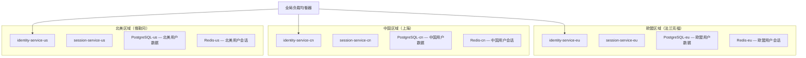
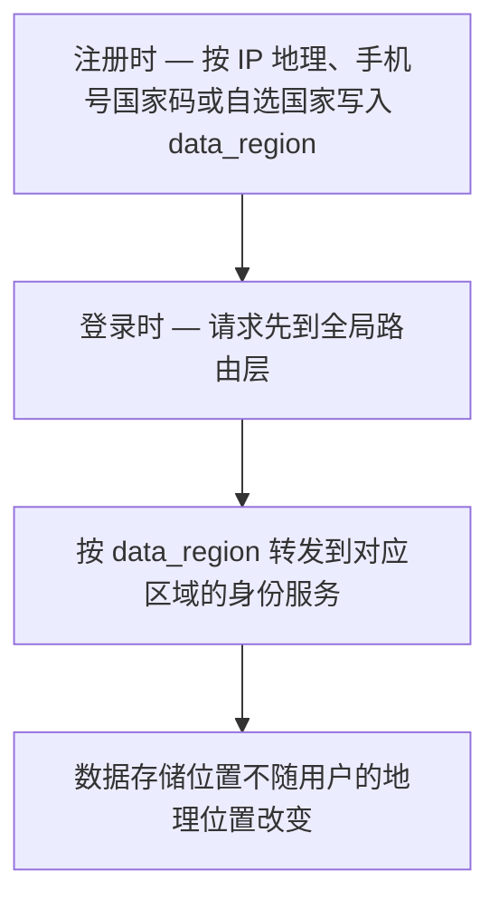

> **合规声明**：本文所述的多国合规框架为 Autional 平台的技术能力设计目标。GDPR、PIPL、CCPA、LGPD、APPI 等法规的合规要求各不相同，客户须根据自身业务管辖范围进行独立的法律评估与合规配置。

## 一套身份，多个法域

跨境电商最大的技术挑战之一不是支付，不是物流，甚至不是翻译——而是当你服务全球用户时，你的身份系统同时受多个法域管辖。

一个典型的跨境电商平台，其用户可能分布在：

- **欧盟**：受 GDPR 保护
- **中国大陆**：受 PIPL（个人信息保护法）保护
- **美国加州**：受 CCPA/CPRA 保护
- **巴西**：受 LGPD 保护
- **日本**：受 APPI 保护
- **东南亚**：各国数据保护法陆续生效

这些法律对身份系统有共同的要求（数据加密、访问控制、用户同意），但在数据跨境传输、数据驻留、用户权利等方面差异显著。在统一的身份系统中满足这些差异化合规要求，是技术团队必须直面的挑战。

## GDPR：欧洲对身份系统的标准

GDPR（通用数据保护条例）是欧盟的数据保护法规，也是全球数据保护的标杆。它于 2018 年生效，处罚上限为全球年营收的 4% 或 2000 万欧元（取其高者）。

### 数据最小化（第 5(1)(c) 条）

GDPR 要求只收集「实现处理目的所必需」的个人数据。对身份系统而言，这意味着：

- 注册环节不应索取不必要的个人信息（例如性别、出生日期——除非业务确实需要）
- 第三方登录（Google/Apple Sign-In）是减少数据收集的有效手段
- Autional 的 identity-service 支持最小化注册：核心只要求邮箱或手机号 + 密码

### 目的限制（第 5(1)(b) 条）

收集的个人数据只能用于已明确告知用户的目的。如果后续希望将数据用于新目的，必须重新获取同意。例如：

- 用于认证的数据不能直接用于营销分析
- 用于 KYC 的数据不能直接用于用户画像

### 用户权利

GDPR 赋予了数据主体一系列权利，这些权利对身份系统有直接的技术要求：

**访问权（第 15 条）**：用户有权索取你持有的全部与其相关的数据副本。Autional 的 compliance-service 内置 DSAR（数据主体访问请求）自动化——自动聚合来自 identity-service、profile-service、session-service 等多个服务的用户数据，并生成结构化数据报告。

**擦除权/被遗忘权（第 17 条）**：用户可以要求删除其个人数据。Autional 支持软删除 + 硬删除双模式：软删除会停用账号但保留审计所需的记录；硬删除会彻底移除数据。两种模式都可通过 API 触发。

**数据可携权（第 20 条）**：用户可以将自己的数据迁移到其他服务商。Autional 支持以结构化、机器可读的格式（JSON）导出用户数据。

**限制处理权（第 18 条）**：用户可以要求限制对其数据的处理（例如暂停账号但保留数据）。Autional 的账号状态机制支持 `active`、`suspended`、`restricted`、`deleted` 等多种状态。

## PIPL：中国个人信息保护法

《中华人民共和国个人信息保护法》（PIPL）于 2021 年 11 月 1 日生效。它在许多方面与 GDPR 相似，但也有自身独特的要求：

### 单独同意

对于特定类型的个人信息处理活动（如向第三方提供个人信息、公开披露个人信息、处理敏感个人信息），PIPL 要求取得用户的「单独同意」——不能藏在冗长的隐私政策里，而必须以独立的弹窗或勾选项呈现。

Autional 在 OAuth 2.0 授权流程中支持细粒度的 scope 拆分。需要单独同意的 scope（如 `profile:sensitive`、`data:share_with_third_party`）会在授权页以独立模块呈现，用户的具体同意选项与时间戳会被记录并存入 audit-service。

### 数据本地化

PIPL 要求两类主体把在中华人民共和国境内收集和产生的个人信息存储在境内：关键信息基础设施运营者，以及处理个人信息达到国家网信部门规定数量的个人信息处理者。确需向境外提供的，应当通过安全评估、获得保护认证或签订标准合同。

对跨境电商身份系统而言，这意味着：

- 中国用户数据应存储在中国境内的数据中心
- 如需将数据传输到海外总部进行分析，需要额外的合规程序

### 跨境传输机制

在 PIPL 框架下，个人信息出境须满足以下条件之一：

1. 通过国家网信部门的安全评估（适用于关键信息基础设施和大量个人信息）
2. 经专业机构进行个人信息保护认证
3. 与境外接收方签订标准合同（SCCs）
4. 符合法律、法规规定的其他条件

## CCPA/CPRA：加州隐私权法案

CCPA（加州消费者隐私法案）及其升级版 CPRA（加州隐私权法案）赋予加州居民一系列权利。与 GDPR 相比，CCPA 更强调「拒绝出售我的个人信息」的权利。

对跨境电商身份系统而言，CCPA 的关键要求是：

- 在首页提供清晰的「Do Not Sell My Personal Information」链接
- 不得因用户行使 CCPA 权利而歧视用户
- 对 16 岁以下用户，出售其个人信息需取得其主动同意（opt-in）

## 多区域部署：数据驻留的技术实现

面对多国的数据驻留要求，最常见的技术方案是「区域化部署」——为每个法域部署独立的服务集群。

Autional 的架构原生支持这种部署模式：



*图 1：区域化部署——全局负载均衡器之下，欧盟、中国、北美各自持有一套完整的身份、会话、数据库与缓存集群。*

关键约束：每个区域的用户数据只存放在该区域的数据库中——不做跨区域复制。

### 全球用户路由

当用户从不同区域访问时，如何把他们路由到正确的区域？

1. **注册时确定区域**：根据注册 IP 的地理位置、手机号国家码或用户自选国家，在用户记录上设置 `data_region` 字段
2. **登录时路由**：登录请求先到全局路由层，路由层根据 `data_region` 将请求转发到相应区域的身份服务
3. **跨区域场景**：当用户从欧盟前往中国，其登录请求依然被路由到欧盟区域的服务器；数据的物理存储位置不受用户地理位置影响



*图 2：登录路由——注册时写入的 data_region 决定请求去向；用户人到哪里，数据都留在原区域。*

### compliance-service 传输记录

当数据确实需要在区域间传输时（如全球报表、反欺诈分析），compliance-service 的「数据传输记录」功能会自动登记：

- 传输的字段清单
- 传输目的与法律依据（如 SCCs 签署编号）
- 传输时间戳
- 接收方与处理目的

这些记录在监管机构要求数据传输审计时是关键合规证据。

## 技术实现建议

### 1. 统一数据分级，差异化存储策略

在数据模型层面，为每个字段标注合规属性：

```go
type User struct {
    ID          string   `compliance:"pii=true, category=identifier"`
    Email       string   `compliance:"pii=true, category=contact, gdpr=yes, pipl=yes"`
    Phone       string   `compliance:"pii=true, category=contact, pipl=sensitive"`
    PasswordHash string  `compliance:"pii=false, category=credential"`
    Region      string   `compliance:"pii=false, category=meta"`
    ConsentLogs []Consent `compliance:"pii=false, category=compliance"`
}
```

这样的标注使 compliance-service 能够自动识别 PII 字段、生成数据报告并响应 DSAR 请求。

### 2. 左移：把合规带进研发阶段

合规不是上线前才检查的事。Autional 的 CI/CD 检查脚本可以校验：

- 新增的 API 端点是否正确处理用户删除请求
- 审计日志是否覆盖了所有敏感操作
- 配置文件中的加密设置是否正确

### 3. 定期合规审计

即便系统运行正常，也应定期（每季度或每半年）开展合规审计：

- 检查用户数据是否存储在正确的区域
- 核查数据传输日志的完整性
- 复核第三方集成是否合规

## 结语

跨境电商身份系统面临的是「一套系统、多个法律框架」的合规挑战。GDPR 强调用户权利与数据最小化，PIPL 增加了单独同意与数据本地化要求，CCPA 则聚焦数据出售的透明度。

Autional 通过「区域化部署 + 统一管理」的架构模式应对这些挑战。compliance-service 把合规能力从「需要时人工响应」提升为「系统自动执行」——从数据传输记录、DSAR 自动化，到数据分级标注，身份系统的合规能力应当和认证本身一样可靠、一样自动化。
