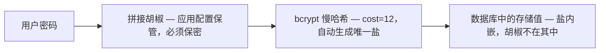
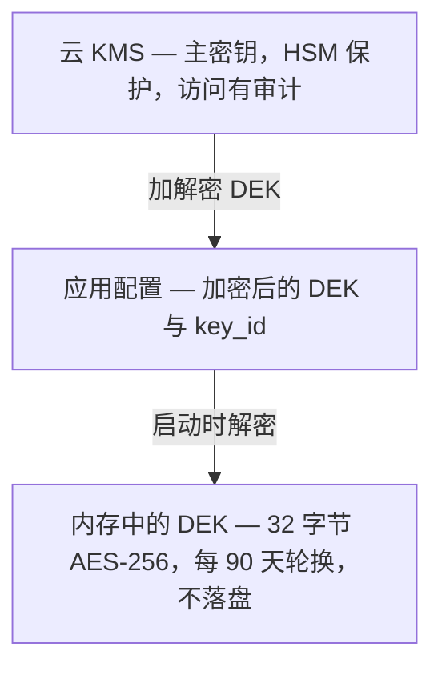

密码存储是每个身份系统的核心操作。而做错的代价极其高昂——当数据库被攻破时，你的密码方案质量决定了攻击者破解用户密码需要多久。

更糟的是，不安全的密码存储**看上去并不明显有问题**。用 SHA-256 加盐做密码哈希，听起来挺合理吧？错。本文从第一性原理出发，讲清楚身份系统中密码学的正确用法。

## 密码哈希：为什么 SHA-256 不够

### 问题在于速度，而不是输出格式

SHA-256 是**通用哈希函数**，设计目标是尽可能快——而这恰恰使它在密码哈希上成为灾难。

现代 GPU（如 NVIDIA RTX 4090）每秒可执行 80 亿次 SHA-256 运算。如果攻击者拿到了你的密码哈希库，暴力破解全部 8 位字符密码需要多久：

```
8 位 ASCII 可打印字符组合数 ≈ 95^8 ≈ 6.6 × 10^15
RTX 4090 的 SHA-256 速率 ≈ 8 × 10^9 次哈希/秒
破解耗时 ≈ 6.6 × 10^15 / 8 × 10^9 ≈ 8.3 × 10^5 秒 ≈ 9.6 天
```

换成 bcrypt（cost 因子 12），RTX 4090 每秒只能算约 5000 次哈希。同样的密码空间需要多久？

```
破解耗时 ≈ 6.6 × 10^15 / 5000 ≈ 1.3 × 10^12 秒 ≈ 42000 年
```

这就是**慢哈希**的威力——计算成本差异只是每次登录 200ms 与 2ms 的区别，用户毫无感知。但对攻击者的暴力破解而言，却是几天与几千年之别。

### 三位候选者：bcrypt、scrypt、argon2

| 特性 | bcrypt | scrypt | argon2 |
|---------|--------|--------|--------|
| 设计目标 | 抵御 GPU 暴力破解 | 抵御 GPU/ASIC/FPGA + 内存硬 | 全能最佳：时间 + 内存 + 并行度 |
| 内存需求 | 固定 4KB（对 GPU 友好） | 可配置（内存硬） | 可配置（内存硬） |
| 成熟度 | 1999 年至今，久经考验 | 2012 年 | 2015 年（PHC 竞赛优胜者） |
| Go 标准库支持 | 无（需 `golang.org/x/crypto`） | 无（需第三方） | 无（需第三方） |
| AES 加速 | 无（GPU 抗性有限） | 有（XOR + Salsa20 核心） | 有（Blake2b） |

**Autional 默认使用 bcrypt（cost 因子 12）。** 理由很直接：

1. **久经考验**：bcrypt 经历了 20 多年的安全审计与真实攻击，至今没有公开已知的 bcrypt 弱点。
2. **Go 生态成熟**：`golang.org/x/crypto/bcrypt` 是 Go 官方扩展库，拥有最好的代码审查与长期支持保障。
3. **实现简单、可调参数少**：bcrypt 只有一个参数——cost 因子。参数越少，配错的概率越低。

Argon2 在理论上更安全（通过内存硬实现对 ASIC 与 FPGA 的抗性），但其安全优势主要体现在极端场景（拥有定制硬件的国家级别攻击者）。对大多数 SaaS 应用来说，bcrypt 能以更低的运维风险提供 80-90% 的安全收益。

Autional 在设计上为迁移到 argon2id 预留了空间——identity-service 的密码校验接口接受任意 `PasswordHasher` 实现，无需改动业务代码即可切换到新的哈希算法。

## 盐与胡椒：被误解的双重保护

### 盐（Salt）：正确用法

盐是每个密码独有的随机值，在哈希前拼接到密码上。它的作用是**消除彩虹表攻击，并防止相同密码产生相同哈希**。

一个常见的误解是：盐必须保密。实际上，盐**不需要**保密（它与哈希一起以明文存储）。盐的价值在于**唯一性**，而非保密性。

Autional 的盐生成方式：

```go
// Password hashing in identity-service
func HashPassword(password string) (string, error) {
    // bcrypt auto-generates salt and embeds it in the hash string
    // Format: $2a$12$[22-char salt][31-char hash]
    bytes, err := bcrypt.GenerateFromPassword([]byte(password), 12)
    if err != nil {
        return "", err
    }
    return string(bytes), nil
}
```

bcrypt 的输出中已经包含盐（内嵌在哈希字符串里），因此无需单独管理盐。

### 胡椒（Pepper）：正确用法

胡椒是应用层的全局密钥，在 bcrypt 哈希前与密码拼接。与盐不同，胡椒**必须保密**——它存放在应用配置中（环境变量或密钥管理服务），而不是与密码哈希一起放在数据库里。

```
最终存储值 = bcrypt(password + pepper, cost=12)
```



*图 1：密码从输入到入库的完整链路——胡椒在应用配置里拼上，bcrypt 自动生成唯一的盐并内嵌进存储值；数据库中永远看不到胡椒。*

如果数据库泄露但应用配置没有泄露，攻击者在不知道胡椒的情况下无法验证密码猜测。但如果**两者同时泄露**（例如一份同时包含数据库与配置文件的备份快照），胡椒就无法提供额外保护。

这就是胡椒的局限：它只在「数据库泄露但配置没泄露」这一特定场景下有效。Autional 采用了另一种方案——**加密整个密码哈希字段**（见下文字段级加密）。同时建议把胡椒值存放在硬件安全模块（HSM）或云 KMS 中，确保与数据存储物理隔离。

## API Key 存储：与密码不同的策略

API Key（后端服务访问密钥、用户 API 令牌）的安全需求与密码不同：

1. **API Key 不需要慢哈希**：API Key 本身就是高熵随机字符串（例如 `tk_` + 64 位十六进制字符 = 256 位熵）。暴力破解它的难度等同于暴力破解一个 AES-256 密钥，无需额外的计算成本。
2. **API Key 需要部分展示**：与密码不同，API Key 在创建时会展示给用户（仅一次），且用户需要看到前缀以区分不同的密钥。

Autional 的 API Key 处理策略：

```go
// Create API Key
apiKey := "tk_" + random_util.GenerateHex(32)  // 64 hex chars = 256 bit entropy

// Storage: SHA-256 hash (not bcrypt)
keyHash := sha256Hex(apiKey)

// Database storage
// - key_hash: SHA-256(apiKey)     # for verification
// - key_prefix: apiKey[:15]        # for display (first 15 chars)
// - key_hash_alg: "sha256"         # record hash algorithm for future migration

// Verification
func VerifyAPIKey(providedKey string, storedHash string) bool {
    return sha256Hex(providedKey) == storedHash
}

// Display to user
// "Your API Key: tk_a1b2c3d4e5f6g7h8..."
// After storage, only the prefix is shown: tk_a1b2c3d4e5f****
```

这里为什么用 SHA-256 而不是 bcrypt？因为 API Key 的熵（256 位）让暴力破解在物理上不可行。SHA-256 的校验延迟是微秒级，而 bcrypt 是数百毫秒——在高频 API 调用场景下，这个差异影响很大。

## 字段级加密：保护 PII 数据

密码与 API Key 的存储策略解决了认证凭据的安全问题。但身份系统中还有另一类敏感数据——个人身份信息（PII）——需要不同的保护方案。

### 为什么需要字段级加密

手机号、邮箱地址、身份证号这类 PII 数据，在以下场景需要保护：

1. **数据库被攻破**：即便整个数据库被拖走，PII 字段仍是密文，攻击者无法直接获取用户个人信息。
2. **内部人员威胁**：拥有生产数据库访问权限的员工无法看到用户 PII 明文。
3. **合规要求**：等保三级、GDPR 都要求对敏感数据做加密保护。
4. **按需解密**：系统可以在需要时解密（例如发送短信验证码、发送邮件），而不是始终存储明文。

### AES-256-GCM：认证加密

Autional 使用 AES-256-GCM 做字段级加密。GCM（Galois/Counter Mode，伽罗瓦计数器模式）是一种认证加密模式，在加密之外还提供数据完整性校验。

```
Encryption:
  plaintext = "13800138000" (phone number)
  key = 32-byte AES key from KMS
  nonce = randomly generated 12 bytes (different nonce per encryption)
  
  ciphertext, tag = AES-256-GCM.Encrypt(key, nonce, plaintext, aad)
  
  Stored in database:
  {
    "encrypted": "base64(ciphertext)",
    "nonce": "base64(nonce)",
    "tag": "base64(tag)",
    "alg": "aes-256-gcm",
    "key_id": "kms-key-2026-05"  # supports key rotation
  }

Decryption:
  key = from KMS by key_id
  plaintext = AES-256-GCM.Decrypt(key, nonce, ciphertext, aad)
  # If tag verification fails (tampered data), Decrypt returns error
```

**认证加密为何重要**：GCM 的 tag 能确保密文未被篡改。如果攻击者修改了加密字段的任何一个比特位，解密都会失败。这是普通 AES-CBC 模式所不具备的能力。

### 密钥管理

加密密钥本身的安全是整个方案的关键。Autional 的密钥管理策略：



*图 2：生产环境的密钥层级——KMS 主密钥守护 DEK，配置里只放加密后的 DEK，启动时解密进内存；明文 DEK 不落盘，并每 90 天轮换。*

启动时，Autional 通过云 KMS 解密 DEK 密文，明文 DEK 只保留在进程内存中。所有字段级加解密操作都使用内存中的 DEK。

### 哪些字段应当加密

Autional 默认对以下 PII 字段启用字段级加密：

| 服务 | 加密字段 |
|---------|-----------------|
| identity-service | 手机号、备用邮箱、身份证号 |
| profile-service | 真实姓名、详细地址、身份证号 |
| wallet-service | 银行账号、开户行名称 |
| compliance-service | 数据主体请求中的个人信息、审计日志中的敏感字段 |

加密字段在 JSON 响应中标记为 `json:"-"`，防止通过 API 意外泄露。

## 安全实践清单

| # | 实践 | 说明 | Autional 的做法 |
|---|----------|-------------|-------------------|
| 1 | 密码使用慢哈希 | bcrypt cost ≥ 12，argon2id | bcrypt cost=12，预留 argon2id 接口 |
| 2 | 盐必须唯一 | 每个密码独立随机盐 | bcrypt 自动生成 22 字符盐 |
| 3 | 胡椒与环境分离 | 胡椒不存数据库 | 以 KMS 托管的字段级加密取代胡椒 |
| 4 | API Key 使用快哈希 | SHA-256 / HMAC-SHA256 | SHA-256 + 前缀存储用于 UI 展示 |
| 5 | PII 使用认证加密 | AES-256-GCM（加密 + 防篡改） | 启动时从 KMS 解密 DEK |
| 6 | 定期轮换密钥 | 主密钥与 DEK 定期轮换 | DEK：90 天，KMS 主密钥：1 年 |
| 7 | 哈希算法带版本 | 数据库存储算法标识 | `key_hash_alg`、`encrypt_alg` 字段 |
| 8 | 加密数据标记为敏感 | 排除在 JSON 序列化之外 | `json:"-"` 标签 |
| 9 | 密钥只驻留内存 | 磁盘上不存明文密钥 | 配置中存 DEK 密文，明文中只在内存 |
| 10 | 日志不得泄露敏感字段 | 日志脱敏 | 日志中间件自动脱敏 PII 字段 |

## 常见错误与后果

### 错误 1：用 MD5/SHA1 存储密码

```
后果：2012 年 LinkedIn 泄露 650 万个密码
      → 使用的是未加盐的 SHA-1
      → 90% 的密码在 72 小时内被破解
      → 攻击者用这些密码在其他平台发起撞库

修复：立即迁移到 bcrypt。在用户下次登录时透明升级哈希算法。
```

Autional 在密码哈希输出中包含算法标识（bcrypt 的 `$2a$12$` 前缀），从而可以在登录时自动识别旧哈希格式并透明升级。

### 错误 2：自己发明密码哈希

```
「我们用一个固定盐做 1000 次 SHA-256 迭代，应该没问题吧？」

后果：密码学家花了几十年设计安全的密码哈希函数。
      bcrypt 抵御了 20 年的攻击，argon2id 赢得了密码哈希竞赛
      （Password Hashing Competition）。任何自研方案几乎 100% 会失败。

修复：始终使用经过同行评审的标准实现，绝不要自己发明。
```

### 错误 3：加密但未认证

```
后果：使用 AES-CBC 但不加 MAC
      → 攻击者可以操纵密文来控制解密后的明文
        （Padding Oracle 攻击）
      → ASP.NET 2010 年的 Padding Oracle 漏洞导致了远程代码执行

修复：使用认证加密（AES-256-GCM，或 AES-256-CBC + HMAC-SHA256）
```

Autional 统一使用 AES-256-GCM，从未使用过未认证的加密模式。

### 错误 4：在生产环境使用调试密钥

```
if os.Getenv("ENV") == "production" {
    key = os.Getenv("ENCRYPTION_KEY")
} else {
    key = "00000000000000000000000000000000"  // 32 zeros
}

Consequence: A deployment config error, env var not properly set
      → System falls back to DEBUG key
      → All PII data is effectively "encrypted" with a public key
      → Equivalent to plaintext storage

Fix: Autional KMS integration ensures the service fails to start (panics)
     when the key is unavailable, rather than falling back to an insecure mode.
```

## 小结

身份系统中的密码学不是可选的「额外一层安全」，而是架构的根本。糟糕的密码学实践不只是降低安全水平，而是在给用户虚假安全感的同时把安全彻底抹掉。

Autional 内置了经过安全评审的密码学方案：bcrypt 密码哈希、SHA-256 API Key 校验、AES-256-GCM 字段级加密，以及与 KMS 集成的密钥管理。对集成 Autional 的应用而言，这些安全实践就是默认行为——开发者无需深入理解。

但如果你正在自研身份系统，请认真对待本文中的每一条实践。用户把最私密的信息托付给你的系统，别让他们失望。
