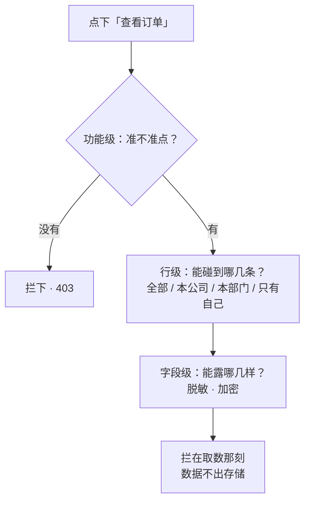

假设你给运营小满开了「查看订单」权限。第二天她问你：为什么我能看到全平台的订单？

你查了一遍角色配置，没错，她确实有「查看订单」。问题出在你没意识到的地方：**「查看订单」只是一张门票。门后她能逛到哪几排货架、货架上哪几样盖着布，是另划的一道边界。**

这道边界，行话里叫**数据权限**。它和角色权限是同一张工单上被混在一起的两件事。

## 同一个按钮，两件事

| | ① 能不能点（动作那头） | ② 碰得到哪些（数据那头） |
|:--|:--|:--|
| 问的是 | 你这号上有没有「查看订单」这一条 | 点下去，你能碰到哪些订单、哪几样 |
| 表现 | 按钮亮 / 灰 | 同是亮着的按钮，翻出来的批次不同 |
| 再往细分 | ——（一条动作权限） | **行级**（哪几条）+ **字段级**（哪几样） |
| 谁来管 | 权限给不给这个动作 | **另外单独划**一道边界 |

功能侧是「谁 + 哪样东西 + 什么动作」三样凑齐去清单对一眼；数据侧是「同一条数据，谁能碰」。两件事没拆开，就会出现本文开头那一幕：权限配得没错，数据却实实在在地漏出去了。



*图 1：一次点按的三道关——功能级答「准不准点」，行级划「哪几条」，字段级定「哪几样」；三道关都要在取数那一刻生效。*

## 行级：四档，一刀一刀往里收

行级权限解决「**哪几条记录**」的问题。工程上最常用的不是无穷细的规则，而是四档：

| 档 | 一句话 | 他翻得到的 |
|:--|:--|:--|
| **全部** | 整片货架都归你 | 全平台订单 |
| **本公司** | 只算这家店 | 本公司（租户）全部订单 |
| **本部门** | 只算你这个班组经手的 | 本部门订单 |
| **只有自己** | 就你那几条 | 自己经手的订单 |

同一个按钮，同事划「本公司」能翻全店，小满划「只有自己」只有几条——按钮是同一个，数据边界各划各的。

注意一个容易被忽略的默认值选择：**范围应该默认「只有自己」**，要放宽再单独给。默认给宽了再往回收，总要等出事才发现哪条收漏了。

## 字段级：同一条里，横切一刀

行级管住「哪几条」，字段级管住「同一条里**哪几样**」。

一条订单记录里：订单号、金额可以看；手机号、证件号必须盖住。这两种字段混在同一行里，行级挡不住它们——它只管整条记录。

字段级的正解只有两条路：**脱敏与加密**。

- **脱敏**：展示层拿到的是 `138****5678`，明文从不离开受控范围；
- **加密**：敏感字段在落库时就加密，没有密钥的查询方拿到的是密文。

**界面上把手机号藏起来，不等于字段级安全。** 打开开发者工具、换个接口、导出一份 CSV——数据还在。盖住字的纸下面，数据一个字都没少。

## 边界要在「取数那一刻」生效

数据权限最常见的实现错误，是过滤的**位置**。

先查全量、再在应用层挑掉不该看的——**晚了。数据已经出来了**：日志里、缓存里、异常堆栈里，全都可能留下痕迹。

正确的姿势是像在水龙头上装筛子：**先拦，再出**。过滤必须发生在数据离开存储的那一刻——SQL 查询加条件、数据库行级安全策略、或数据访问层统一改写。

还有一条对称的纪律：**读要拦，改和删也得拦。** 只保护查询接口、放任 `UPDATE` / `DELETE` 按主键裸奔，等于前门上锁、后门大开。

## 两条实现路线

### 路线一：数据库侧——PostgreSQL RLS

PostgreSQL 从 9.5（2016）起内置**行级安全**（Row-Level Security），让数据库自己执行过滤：

```sql
ALTER TABLE orders ENABLE ROW LEVEL SECURITY;

CREATE POLICY orders_tenant_isolation ON orders
  USING (tenant_id = current_setting('app.tenant_id')::uuid);

CREATE POLICY orders_self_only ON orders
  USING (owner_id = current_setting('app.user_id')::uuid);
```

要点：

- **默认拒绝**——开了 RLS 但没有匹配的策略，一行都查不出来；
- **`BYPASSRLS` 与表属主会绕过策略**（官方文档明确写明）——迁移脚本、备份工具、DBA 专用的连接往往带着这些特权，审计时要单独盘点；
- 应用层连接必须以**普通角色**接入，并且每个请求都要正确设置会话变量，否则策略形同虚设。

### 路线二：应用侧——统一的数据访问层

不让业务代码自己拼 `WHERE`，而是由统一的数据访问层根据当前身份**改写查询**：

```go
// 伪代码：取数前统一收窄
func ApplyDataScope(q *Query, ident Identity, res Resource) *Query {
    switch ident.Scope(res) {
    case ScopeAll:
        return q                                    // 平台级管理员
    case ScopeTenant:
        return q.Where("tenant_id = ?", ident.TenantID)
    case ScopeDepartment:
        return q.Where("tenant_id = ? AND department_id = ?", ident.TenantID, ident.DepartmentID)
    case ScopeSelf:
        return q.Where("tenant_id = ? AND owner_id = ?", ident.TenantID, ident.UserID)
    }
    return q.Where("1 = 0")                          // 未知范围 → 什么都别返回
}
```

两条路线不是互斥的：应用层负责语义（「本部门」怎么算），数据库层负责兜底（漏网的查询也出不去）。

## 真实教训：USPS 的 6000 万条记录

2018 年 11 月，美国邮政总局（USPS）的「Informed Visibility」系统被公开披露存在对象级授权缺陷：面向 usps.com 账号的接口**没有做对象级授权**。任何**已登录**的普通账号，都能查询**其他用户**的账户资料（邮箱、用户名、账号、街道地址、电话等）。接口还接受通配符，一次可以拉走某个数据集的**整批记录**。

- 受影响用户约 **6000 万**；
- 一位匿名研究者**提前约一年**报告，未获响应；安全媒体 KrebsOnSecurity 在刊发前知会了 USPS（接口已先行修改），报道于 2018-11-21 公开；
- 一个必须澄清的归因：USPS 监察长办公室（OIG）2018-10 的审计报告发现的是**认证与加密弱点**，**并未**发现这起对象级越权——不能拿那份官方审计当本事件的证据来源。

这就是 OWASP 榜单上连续多年排名第一的 **API1:2023 Broken Object Level Authorization（BOLA，对象级授权失效）** 的典型案例：不是「没登录」，而是「登录了，但没人检查这条记录是不是他的」。相邻的 **API3:2023（BOPLA，对象属性级授权失效）** 管的则是字段级——响应里多带了不该带出的字段，或请求里悄悄塞进了不该改的字段。

## 为什么这道边界贵

做数据权限的难，不在概念，在四个成本：

1. **依赖组织架构**——「本部门」「只有自己」这些范围要成立，系统得先知道谁在哪个部门。这个数据往往在别的系统里，要打通、要同步、要有权威来源。
2. **性能成本**——行级过滤把「取一条」变成「按条件取一批再判」，索引设计、查询计划都要重新调。
3. **敏感字段的真实处理**——脱敏和加密不是加个开关：加密要考虑密钥管理和已存量数据的迁移，脱敏要考虑下游系统拿到掩码后还能不能用。
4. **读写的对称性**——读接口做完过滤只算做了一半，改、删、导出、批量操作都要走同一套规则。

## 合规视角：这不是可选项

数据权限直接对应多条硬合规要求：

- **《个人信息保护法》**：处理个人信息应当遵循「最小必要」原则；
- **等保 2.0（GB/T 22239-2019）**：访问控制要求「最小权限」，主体对客体的操作应被授权且受控；
- **GDPR 第 5 条**：数据最小化原则（data minimisation）；
- **NIST SP 800-53 Rev.5**：AC-3（访问执行）、AC-4（信息流强制）、AC-6（最小特权）；
- **OWASP ASVS V4.2**：对象级授权的测试要求。

对多租户 SaaS 来说还有一层业务含义：**租户隔离就是最粗的那一档行级权限**——「本公司」这一档漏一条，就是一次跨租户数据事故。

## Autional 的做法

Autional 对数据权限的实现分三段：

1. **四档范围挂在角色上**：`DataScope` 常量共四档——`all` / `tenant` / `department` / `self`，角色默认 `self`。改一次角色，挂它的这批人的范围一起收窄。
2. **取数据时只捞该归你的**：数据访问统一走受控通道，按当前身份改写查询条件，而不是取回来再挑。
3. **敏感字段单独处理**：口令哈希、MFA 密钥、OAuth 令牌等敏感字段在存储层即受控；展示侧按需脱敏。

诚实边界：按「本部门 / 只有自己」过滤**要先拿到组织架构**，Autional 这一步还在逐步接通（`department` / `self` 两档的完整过滤尚未全部落地，当前仅以调试日志标记）；通用的「行级 / 字段级策略引擎」也仍在路线图上。组织与部门信息在 `tenant-service`，我们只保存引用。要上线严格的字段级策略之前，建议先对着自己的数据分类分级清单做一次实测盘点。

## 常见误区

- 「有『查看订单』权限 = 能看所有订单」——能点 ≠ 碰得到全部，两件事；
- 「取回来在界面上筛一下就行」——数据已经出来了，晚了；必须取数那刻就拦；
- 「界面上把手机号藏了 = 字段级安全」——数据还在；真盖住得靠脱敏 / 加密；
- 「四档越窄越保险」——窄过头，该看的也看不到；范围要圈得「不多不少」；
- 「配一次就完事」——人调岗、离职，范围得跟着收回；旧的没收回，他还能看到不该看的；
- 「RLS 开了就万事大吉」——`BYPASSRLS` 与表属主会绕过，特权连接要单独盘点。

## 结语

下次你在后台看到「只有自己那几条」，别急着骂它坏了——先想一想：**是这道边界，替你盖住了别人那一排。**

判据两句话，放在任何一次权限评审里都适用：

**同一个按钮，谁碰得到哪些？这道边界，是在取数据那刻就拦住了，还是取回来再挑的？**
