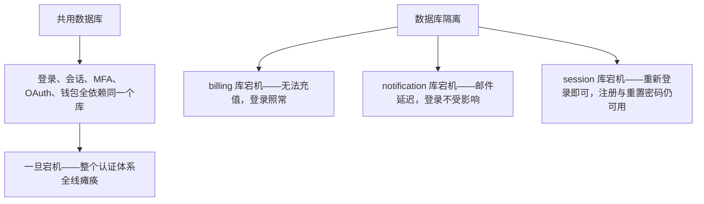
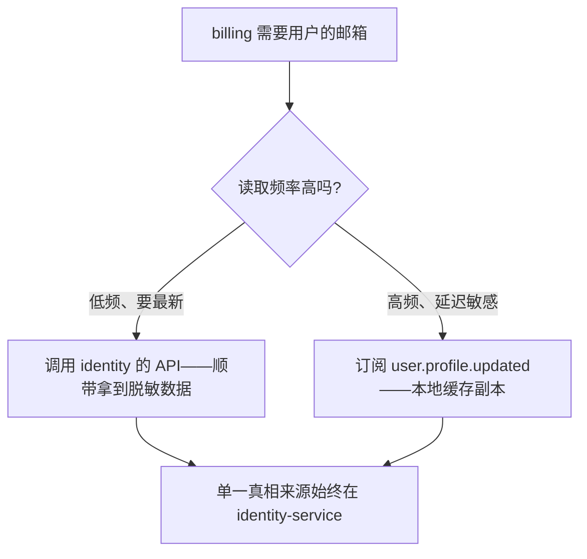

在微服务架构中，有一个问题反复被提起：「每个服务真的都需要自己的数据库吗？共用一个库不是更简单？」

答案是：对身份与认证系统而言，数据库隔离不是过度设计——而是**安全与可靠性的基石**。Autional 从第一天起就严格遵循 Database-per-Service 模式，27 个微服务各有一个独立的 PostgreSQL 数据库。以下是我们这样设计的原因与经验教训。

## 为什么不能共用一个数据库？

共用数据库的「好处」看上去很直接：JOIN 查询简单、事务一致性强、只需管理一个数据库。但这些「好处」实际上是陷阱：

### 隐式耦合

当 identity-service 的 `users` 表和 billing-service 的 `subscriptions` 表放在同一个数据库里，开发者会自然而然地写跨表 JOIN。这个看似方便的操作会带来：

- 计费团队的 DBA 调整一个索引，却意外影响了身份的查询计划
- 某个服务的慢查询拖垮整个数据库实例
- 「这张表归谁管」的归属变得模糊

### 级联单点故障

这是最关键的问题。如果共用的数据库实例宕机：

- ❌ 用户无法登录（identity）
- ❌ 所有会话失效（session）
- ❌ MFA 验证不可用（mfa）
- ❌ OAuth 授权失败（oauth）
- ❌ 钱包余额无法读取（wallet）

**整个平台的认证体系彻底瘫痪。** 而如果做了数据库隔离：

- billing 库宕机 → 无法充值，但用户仍能登录并使用既有余额
- notification 库宕机 → 邮件发送延迟，但登录不受影响
- session 库宕机 → 用户需要重新登录（体验降级），但注册与重置密码仍可用



*图 1：共用数据库 vs 数据库隔离——同样是宕机，一边是全线瘫痪，一边只是局部降级。*

这才是真正的**故障隔离**。

## Autional 的数据库隔离实践

### 27 个服务，27 个数据库

| 服务 | 数据库 | 核心职责 |
|---------|----------|-------------------|
| identity-service | `authms_identity` | 用户、角色、权限、租户 |
| profile-service | `authms_profile` | 用户扩展属性、部门 |
| tenant-service | `authms_tenant` | 租户配置、订阅、白标 |
| session-service | `authms_session` | 登录会话、刷新令牌 |
| mfa-service | `authms_mfa` | 多因素认证（TOTP/短信/邮件） |
| oauth-service | `authms_oauth` | OAuth 2.0 / OIDC 授权 |
| wallet-service | `authms_wallet` | 钱包余额、交易流水 |
| point-service | `authms_point` | 积分体系 |
| billing-service | `authms_billing` | 计费、账单、支付 |
| notification-service | `authms_notification` | 通知模板、渠道、发送记录 |
| communication-service | `authms_communication` | 邮件、短信、Webhook |
| storage-service | `authms_storage` | 文件存储元数据 |
| audit-service | `authms_audit`（MongoDB） | 审计日志 |
| compliance-service | `authms_compliance` | 合规报告、数据导出 |
| 其他服务 | 各自独立数据库 | — |

> 说明：audit-service 使用 MongoDB 而不是 PostgreSQL，因为审计日志数据是面向文档的（非结构化、以追加为主、时序写入），访问模式与关系型数据库有本质区别。这种数据库类型的多样性本身就是隔离带来的好处。

### 连接与认证

每个服务使用独立的数据库用户连接自己的数据库：

```yaml
# tenant-service connection config
POSTGRES_HOST: postgres
POSTGRES_PORT: 5432
POSTGRES_DB: authms_tenant
POSTGRES_USER: authms_tenant
POSTGRES_PASSWORD: ${TENANT_DB_PASSWORD}
```

连接池也是按服务独立配置的。identity-service 的 25 个连接不会和 billing-service 的 10 个连接争抢数据库资源。虽然它们在 PgBouncer 层共享同一个 PostgreSQL 集群，但数据库级隔离保证了配额与资源公平。

## 跨服务数据查询：超越数据库 JOIN

### 方式 1：gRPC/HTTP API 调用

当 billing-service 需要用户的邮箱时，它不会直接 JOIN 数据库，而是调用 identity-service 的 API：

```go
// billing-service calling identity-service
resp, err := identityClient.GetUser(ctx, &pb.GetUserRequest{UserId: userID})
if err != nil {
    return nil, fmt.Errorf("get user: %w", err)
}
email := resp.GetEmail()
```

这种方式的收益：

- identity-service 可以随时修改其 `users` 表结构而不影响 billing
- identity-service 可以对邮箱字段做脱敏（`j***@example.com`），billing 拿到天然就是脱敏后的数据
- 集中的访问控制：只有 identity-service 有权限读取 `password_hash` 这类敏感列
- 内置重试与熔断：gRPC 客户端拦截器自动处理网络问题

### 方式 2：领域事件 + 数据冗余

对于高频读取场景，API 调用的延迟与可用性成本过高。事件驱动的数据冗余才是答案：

1. identity-service 的用户修改邮箱 → 发布 `user.profile.updated` 事件
2. billing-service 消费该事件 → 更新本地 `user_profiles` 缓存表

```go
// billing-service local cache table
type UserProfile struct {
    UserID    string `gorm:"primaryKey"`
    Email     string `gorm:"-:migration"`  // encrypted storage
    EmailHash string `gorm:"index"`         // for exact matching
    UpdatedAt time.Time
}
```

这种模式在 Autional 中被广泛使用：

- notification-service 缓存用户的 `email` 与 `phone`（避免每封邮件都调用 profile API）
- compliance-service 缓存租户的 `plan` 信息（避免每次合规扫描都调用 billing API）
- audit-service 通过事件流接收所有服务的审计日志，而不是轮询 API

**关键原则**：冗余数据只在消费方服务内缓存，绝不作为跨服务的真相来源。身份数据的「单一真相来源」永远在 identity-service。



*图 2：跨服务取数的两条路——低频读调 API 拿最新数据，高频读订阅事件换本地副本；真相来源永远留在 identity-service。*

## 数据一致性与最终一致性

数据库隔离用**最终一致性**换取了单库 ACID 保证：

### 事件驱动的一致性模式

当用户注册时，会涉及多个服务：

1. identity-service 创建用户 → 写入 `authms_identity`
2. 发布 `user.created` 事件到 RabbitMQ
3. profile-service 消费事件 → 创建默认档案 → 写入 `authms_profile`
4. wallet-service 消费事件 → 创建空钱包 → 写入 `authms_wallet`

如果第 3 步失败，事件会进入死信队列（DLQ），触发告警并重试。

对于需要强一致性的操作（例如扣款），Autional 使用**事务性发件箱模式（Transactional Outbox Pattern）**：

```go
func (s *WalletService) Withdraw(ctx context.Context, req *WithdrawRequest) error {
    return s.db.Transaction(func(tx *gorm.DB) error {
        // 1. Update balance (atomic)
        result := tx.Model(&Wallet{}).
            Where("user_id = ? AND balance >= ?", req.UserID, req.Amount).
            Update("balance", gorm.Expr("balance - ?", req.Amount))
        if result.RowsAffected == 0 {
            return ErrInsufficientBalance
        }
        
        // 2. Write transaction record
        tx.Create(&Transaction{...})
        
        // 3. Write outbox record
        tx.Create(&Outbox{
            Topic: "wallet.transaction.completed",
            Payload: marshal(event),
        })
        
        return nil
    })
}
```

发件箱后台 worker 会扫描 `outbox` 表并把消息可靠地投递到 MQ。即便 MQ 短暂不可用，消息也不会丢失——这是跨服务数据一致性的核心机制。

## 独立扩缩容

数据库隔离让每个服务可以独立选择自己的数据库配置：

- **高并发服务**（identity、session）：读写频繁，需要更多连接与更高的 IOPS 配额
- **低频服务**（billing、compliance）：以批处理为主，可以用更小的实例规格
- **时序写入密集**（audit）：MongoDB 分片集群支持写入的水平扩展
- **混合型**（storage）：PostgreSQL 存元数据，MinIO 存文件二进制

这种灵活性在共用数据库下是不可能的。一个计费导出任务（compliance-service 对 200 万条审计记录做全表扫描）不该占用认证查询的 I/O 带宽。那是 identity-service 对 `users` 表的高频点查。

## 安全边界

数据库隔离构筑了最坚固的安全边界之一：

- **密钥隔离**：每个服务有独立的数据库口令。攻破一个服务不会暴露全部数据。
- **泄露遏制**：billing 的 `subscriptions` 表出现 SQL 注入，并不会让攻击者拿到 `users` 表的口令哈希。
- **合规范围清晰**：一个 GDPR「数据导出」请求只需扫描 identity 与 profile 两个库，而不是全部 16 个。
- **审计完整性**：audit-service 的 MongoDB 集群有独立的访问控制——其他服务无法修改审计日志。

## 运维成本与化解手段

数据库隔离确实增加了运维开销。Autional 通过以下方式化解：

### 统一的 Schema 管理

每个服务使用 GORM AutoMigrate 处理 schema 变更。CI 流水线中的 `check-db-schema.py` 脚本会比对 Go 领域模型与实际数据库表结构——在部署前就发现漂移。

### PgBouncer 统一入口

全部 27 个服务的数据库连接都经过 PgBouncer（事务池模式）。运维团队只需维护一个 PostgreSQL 集群 + 一个 PgBouncer 实例，而不是 27 台独立的数据库服务器。

### 备份策略

```bash
# Full backup (daily)
pg_dumpall -h pgbouncer -U authuser > /backups/all_dbs_$(date +%Y%m%d).sql

# Single DB backup (on-demand, e.g., identity hourly)
pg_dump -h pgbouncer -U authuser -d authms_identity > /backups/identity_$(date +%Y%m%d%H).sql
```

隔离带来了更灵活的备份粒度。审计日志（数十 GB、每日增量大）可以有自己的备份窗口，与身份核心数据（数百 MB、变更频率低）分开。

## 小结

Database-per-service 不是银弹，但在身份与认证系统中，收益远大于成本：

| 收益 | 说明 |
|---------|-------------|
| 故障隔离 | 单个库宕机不影响核心登录功能 |
| 安全边界 | 泄露遏制 + 独立密钥 + 合规范围清晰 |
| 独立扩缩容 | 高吞吐 → 高规格，低频 → 低规格 |
| 技术异构 | audit 用 MongoDB，storage 用 MinIO + PG |
| Schema 独立 | 各服务独立演进，变更无需加锁 |
| 备份灵活 | 按服务粒度定制备份策略 |

如果你正在构建多租户 SaaS 身份平台，请从第一天就采用数据库隔离。后期拆分共用数据库，远比起步就隔离困难得多——这正是 Autional 做出这个选择的原因。
