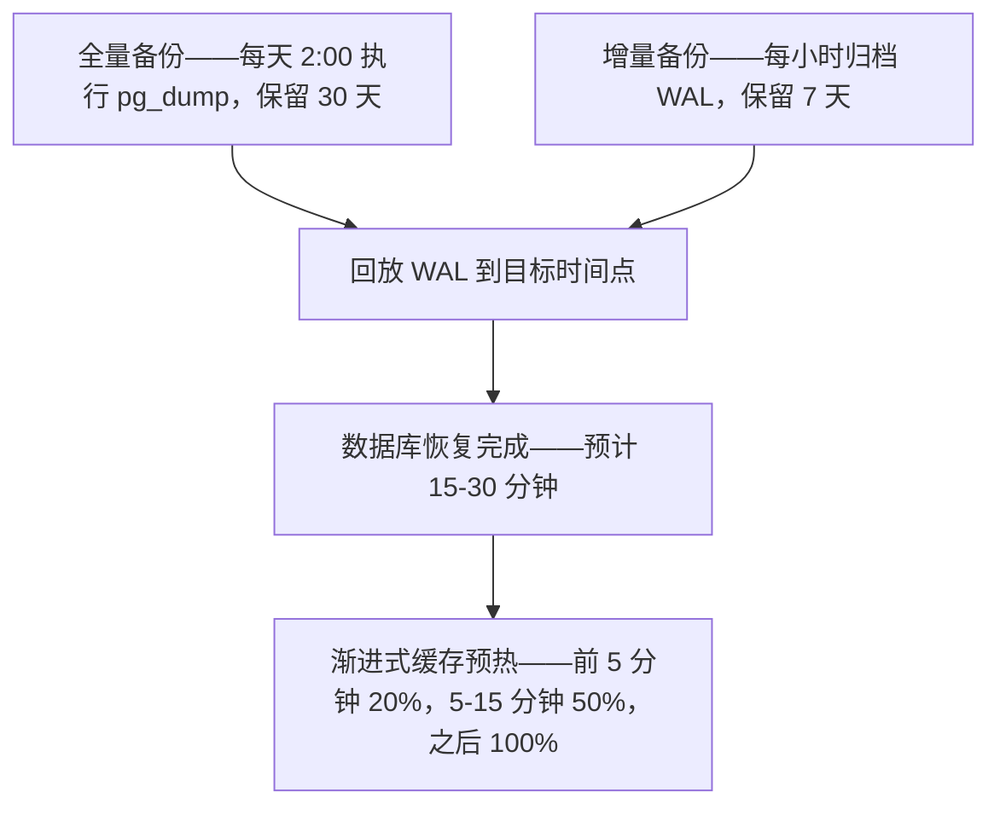
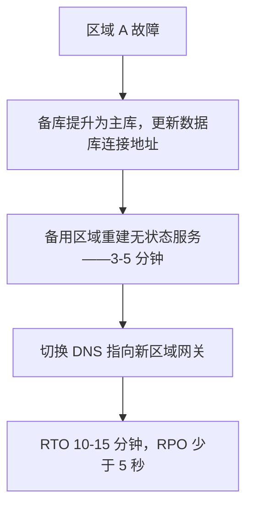

每一本《系统运维手册》里都有一章叫「容灾（DR）」。但真正把它当回事——定期演练、确保凌晨 3 点也能照方案执行——的团队少之又少。原因很简单：**灾难感觉太遥远，演练太麻烦，预算太紧张。** 直到某一天——某个数据库文件被误删、云厂商整个可用区宕机、或者一次灰度不到位的发布污染了生产数据——你才发现，省下三年的容灾预算，得用未来三年的营收来还。

身份系统在容灾中有特殊地位：**它的故障影响半径是所有基础设施中最大的。** `wallet-service` 挂了，用户余额还在，交易可以等一等。但 `identity-service` 挂了，用户登录不了，钱包、订单、看板、通知——每一个服务都会彻底不可用。这不是一个系统的故障，而是整个产品生态的停摆。

本文从 Autional 的架构出发，系统讨论身份系统可能遭遇的灾难场景、对应的恢复策略，以及如何通过架构设计在灾难发生前就把影响半径压到最小。

## 场景一：数据库损坏

### 灾难描述

凌晨 2:15，一位 DBA 在执行数据清理脚本时漏写了 `WHERE` 条件，把 `users` 表清空了。或者更常见的情况：磁盘故障导致 PostgreSQL 的 WAL（预写日志）文件全部损坏，数据库无法启动。

### 影响

- 所有与用户相关的认证操作全部失败
- 包含用户信息的 JWT 令牌可能已过时。但由于令牌是自包含的，已签发的令牌在其有效期内仍然有效（取决于令牌设计）
- 所有会话失效（会话存储在数据库中）

### Autional 的恢复策略

**第一步：时间点恢复（PITR）**

Autional 为每个服务分配独立的 PostgreSQL 数据库（`authms_identity`、`authms_session`、`authms_mfa` 等），各自独立备份，恢复时无需重建整个集群。Autional 的备份策略：

- **全量备份**：每天凌晨 2:00 执行 `pg_dump`，保留 30 天
- **增量备份**：每小时归档 WAL，保留 7 天
- **备份加密**：所有备份文件使用 AES-256 加密
- **跨区域复制**：备份自动同步到备用区域的 S3/MinIO

恢复单个服务：找到最近一次全量备份 → 回放 WAL 日志到目标时间点 → 数据库恢复完成。预计恢复时长：15-30 分钟（取决于数据库规模）。

**第二步：令牌有效性保护**

关键的设计决策：Autional 的 JWT 令牌是**自包含**的——令牌中编码了用户 ID、租户 ID、角色列表与过期时间。这意味着：
- 即使 identity-service 的数据库损坏，用户手中的有效令牌仍可被网关验证通过
- session-service 数据库损坏不会强制在线用户退出登录
- 签名密钥存放在独立的安全模块中（环境变量或 KMS），不会随数据库损坏而丢失

**第三步：缓存预热**

数据库恢复后立即放开流量会造成 100% 缓存未命中，请求洪峰可能压垮刚刚恢复的数据库。Autional 采用渐进式缓存预热：
1. 前 5 分钟：以 20% 的流量比例逐步放量，后端将热点数据预加载进 Redis
2. 5-15 分钟：流量提升到 50%，持续监控数据库负载
3. 15 分钟后：若数据库负载正常，放开到 100%

*图 1：数据库恢复的完整路径——全量备份加 WAL 归档回放到时间点，恢复完成再阶梯式放量，避免冷缓存压垮刚醒来的库。*

## 场景二：整个区域故障

### 灾难描述

某云厂商的可用区发生电力系统故障，或者光缆被施工队挖断。整个区域——包括你的 Kubernetes 集群、数据库、Redis——全部不可达。

### 影响

- 部署在该区域的所有服务不可用
- 如果数据库是单区域的，数据无法访问
- 可能需要手动切换 DNS 到备用区域

### Autional 的恢复策略

**第一步：数据库主备切换**

Autional 支持数据库主备复制：
- 主库在区域 A，承担全部读写
- 备库在区域 B，持续异步复制
- 区域 A 不可用时，运维人员执行故障切换：将备库提升为主库，更新服务配置中的数据库连接地址

异步复制的问题在于可能丢失最后几秒的数据。对身份系统来说，这可以接受吗？
- **新注册用户**：最坏情况下用户需要重新注册，影响可控。
- **口令修改**：如果用户在故障前 3 秒修改了口令，且数据尚未同步到备库，用户可能需要用旧口令登录，「忘记密码」流程可作为兜底。
- **审计日志**：audit-service 将审计数据存放在 MongoDB，通过 MQ 异步写入。未消费的 MQ 消息在备库提升后由新的消费者接手。

**第二步：无状态服务快速重建**

Autional 的所有业务服务（identity、profile、session、mfa 等）都是无状态的——不在本地保存数据，全部状态都放在 DB/Redis/MQ 中。这意味着在备用区域恢复服务只需要：
1. 启动 Kubernetes Deployment（镜像已存在）
2. 更新 DNS，指向新区域的网关
3. 服务从 ConfigMap 读取新区域的 DB/Redis/MQ 地址

耗时：3-5 分钟（不含 DNS 生效时间）。

**第三步：非对称跨区域设计**

对身份系统来说，全套双活架构并非最优解。原因：
- JWT 签名密钥需要多区域同步，会引入安全风险
- 双活要求数据库双向同步（如 PostgreSQL 逻辑复制），复杂度呈指数上升
- 成本翻倍，而对身份这种「低频、高关键性」的服务来说，投入产出比不划算

Autional 选择**主备（active-passive）架构**：
- 生产流量由主区域承载
- 备用区域维持最小规模部署（单副本 + 数据库备库）
- 故障切换时，备用区域扩容到全量规格

这样带来的 RTO（恢复时间目标）为 10-15 分钟，RPO（恢复点目标）为数据丢失少于 5 秒。对 99.99% 的 SaaS 场景而言，这些指标已经足够。

*图 2：主备切换的动作序列——提升备库、重建无状态服务、切 DNS；整体 RTO 10-15 分钟，数据最多丢 5 秒。*

## 场景三：配置发布失误

### 灾难描述

这比硬件故障更常见。一个看起来人畜无害的配置变更——比如给 `JWT_SECRET` 多加了一个空格，或者把 `SESSION_TTL` 从 30m 改成 30s——被推到了生产环境。服务重新加载配置后，所有用户都被锁在门外。

### 为什么配置发布失误格外危险

- 它能绕过所有健康检查——JWT_SECRET 错了，服务依然返回 200 OK，但生成的令牌永远无效
- 回滚时间取决于配置下发速度——ConfigMap 挂载需要重启所有 Pod
- 它可能不会立即触发——错误的 SESSION_TTL 可能几个小时都没人察觉，但影响覆盖所有用户
- 没有「部分损坏」——不像数据库故障可能只影响部分表，JWT_SECRET 错误会影响 100% 的认证请求

### Autional 的恢复策略

**第一步：配置版本化 + 快速回滚**

Autional 采用 YAML 文件 + 环境变量覆盖的模式：
- `configs/service/{service}.yaml` 由 Git 管理，每次变更都有完整的 diff 与提交记录
- 环境变量覆盖（如 `JWT_SECRET`）来自 `.env` 文件或 Kubernetes Secret
- 回滚 = `git revert` + 重新部署

**第二步：金丝雀验证**

对于高风险配置变更（JWT_SECRET、数据库连接串、MQ 配置），Autional 建议采用金丝雀发布：
1. 先更新 1 个 Pod
2. 观察 5 分钟的错误率与健康检查
3. 正常则扩展到 25% 的 Pod
4. 再观察 10 分钟
5. 全量发布

但这需要自动化工具链来执行。手动 kubectl apply 会让金丝雀发布变成一厢情愿。

**第三步：密钥独立管理**

JWT_SECRET、数据库口令、API Key 等敏感信息不应与普通配置放在一起。Autional 建议使用 Kubernetes Secret 或 HashiCorp Vault 独立管理，通过 `envFrom` 注入 Pod。即使普通配置被误改，密钥也不受影响。

## 如何把灾难影响半径压到最小

理想的容灾策略是在灾难发生前就减小影响。Autional 做了几个关键的架构决策：

### 1. 每个服务独立数据库

如果 `profile-service` 的数据库损坏，`identity-service` 不受影响。用户仍能登录，只是看不到头像和个人资料。这是可接受的降级。

### 2. 优雅停机 + DLQ

服务异常退出时，`micro-middleware/app` 的优雅停机机制会确保未处理完的消息回到 MQ 队列。死信队列（DLQ）机制确保失败的消息不会被丢弃，而是保留下来供人工排查或重试。

这对审计日志尤为关键，因为合规要求「任何审计记录都不能丢失」。即使 `audit-service` 宕机，MQ 队列中的消息也会被保留，等服务恢复后再消费。

### 3. 正确选择同步与异步

并非所有操作都需要同步：
- **同步（必须等待）**：口令校验、令牌签发、权限检查
- **异步（可以延后）**：审计日志写入、通知发送、统计分析

Autional 通过 MQ 异步投递审计日志，这意味着即使 `audit-service` 挂了，登录流程也不受影响。这就缩小了影响半径——审计服务故障不会波及登录可用性。

### 4. 定期演练

没有演练过的容灾方案等于没有方案。Autional 建议每季度做一次容灾演练，覆盖：
- 从零开始恢复数据库（使用最近一次备份）
- 区域故障切换（主 → 备）
- 密钥轮换（更换 JWT_SECRET，确保旧令牌仍能验证通过）

演练中发现的问题，修复成本比生产环境暴露出的问题低 100 倍。

## 结语

容灾不像买保险——交了钱就完事。它是一项需要持续投入的工程实践。每个季度问自己：

1. 最近一次备份能成功恢复吗？（不是「应该可以」，而是「上次演练已验证」）
2. 如果主数据库此刻故障，从备份到恢复需要多久？
3. 团队里有几个人知道恢复流程？如果关键人物正在休假怎么办？
4. 上一次容灾演练是什么时候？

如果这几个问题有一个答不上来，你的身份系统就是没有防护的。灾难不会按你的日程表发生——但你可以让灾难之后的恢复按你的日程表进行。

---

*Autional 内置跨区域部署支持、自动化备份策略与 PITR 数据库恢复能力。更多信息请[查看定价说明](/pricing)。*
