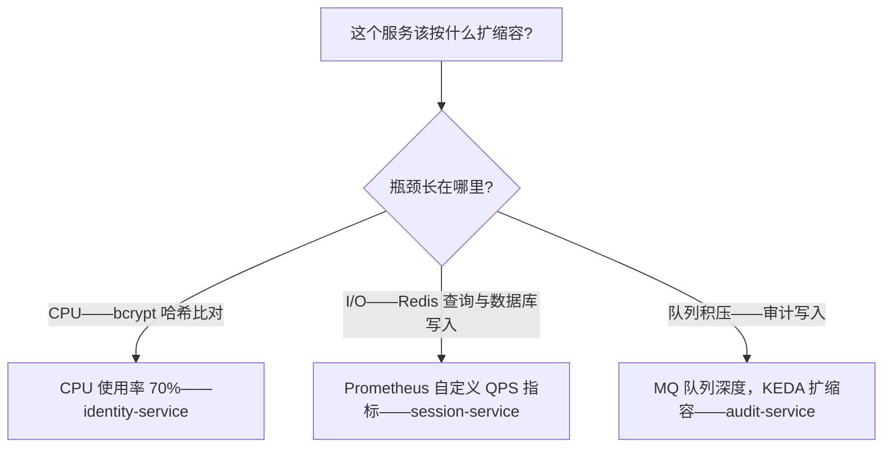
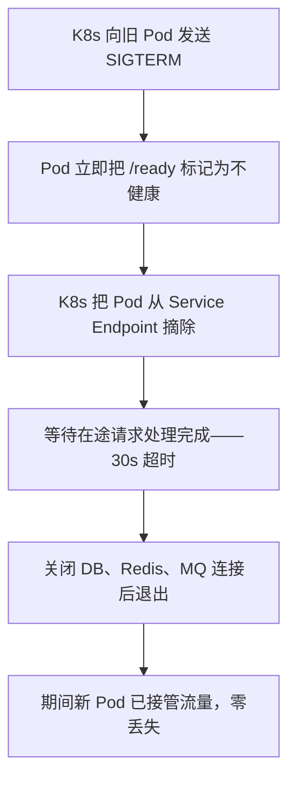

Autional 从第一天起就确立了一条原则：**部署方式绝不应该成为用户采用它的障碍。** 初创团队可能只在单台 4 核 8GB 云服务器上跑 docker-compose；中型企业可能用 3 副本的 Kubernetes 集群；大型企业可能需要多可用区、多集群部署。同一套代码、同一份 Docker 镜像，必须能覆盖这三种截然不同的场景。

本文记录了我们从 Docker Compose 走到 Kubernetes 的完整历程——不是为了炫技，而是因为每个阶段我们都踩进过真实的坑，其中一些如果早做规划完全可以避免。

## 阶段一：本地开发（pnpm + Go）

在写任何 Dockerfile 之前，开发体验优先。开发者不该为了看到代码改动生效而去等 Docker 构建。

Autional 的开发环境完全跑在本地：

```powershell
# Backend development
cd micro-services/identity-service
go run cmd/server/main.go

# Frontend development
cd web
pnpm dev:auth
```

基础设施依赖（PostgreSQL、Redis、RabbitMQ）通过 `docker-compose.infra.yml` 在本地运行：

```powershell
docker compose -f docker-compose.infra.yml up -d
```

这个文件里只有基础设施容器——27 个微服务没有一个通过 Docker 运行。它们都是直接在 Windows 上跑的原生 Go 二进制。好处是：
- 近乎零延迟的热重载（Go 编译通常 < 5s）
- 可直接用 delve 调试器打断点调试
- 环境变量与配置文件直接从本地文件系统读取

## 阶段二：Docker Compose 统一部署

当需要部署到测试环境或小型生产环境时，Docker Compose 是最简单的选择。

### 统一 Dockerfile：27 个服务共用一套模板

Autional 有 27 个微服务，但只有**一个 Dockerfile**（位于 `docker/Dockerfile.service`）。所有差异都通过构建参数实现：

```dockerfile
ARG SERVICE_NAME          # e.g., identity-service
ARG SERVICE_PORT          # e.g., 11001
ARG RUNTIME_EXTRA_COPYS   # optional extra files
```

构建命令示例：

```powershell
docker build \
  --build-arg SERVICE_NAME=identity-service \
  --build-arg SERVICE_PORT=11001 \
  -f docker/Dockerfile.service \
  -t authms/identity-service:latest .
```

这个设计的核心价值是：**新增一个服务不需要新增 Dockerfile。** 只要服务遵循标准目录结构（`micro-services/{name}/cmd/server/main.go`），构建系统就会自动适配。27 个服务共用同一份构建层缓存（Go 依赖缓存、构建缓存），因此在构建完第一个服务后，用 `--build-arg` 构建第二个服务只需几秒。

### 多阶段构建细节

```
Stage 1 (base-builder): Install Go dependencies + copy all local module code
Stage 2 (builder):       Compile target service into a statically linked binary
Stage 3 (runtime):       Minimal Alpine image + binary + config files
```

关键优化：
- 在 `COPY .` 之前先 `COPY go.mod go.sum`，利用 Docker 层缓存——依赖没变就跳过下载
- `CGO_ENABLED=0` 生成纯静态二进制，把运行时镜像从 800MB 压到 20MB
- 通过 CI 系统的 Docker 层缓存或 BuildKit cache mount 保留构建缓存

### docker-compose.yml 结构

Autional 的 `docker-compose.yml` 使用 YAML 锚点消除配置重复：

```yaml
x-postgres-env: &postgres-env
  POSTGRES_HOST: postgres
  PGBOUNCER_PORT: 5432
  POSTGRES_USER: authuser
  POSTGRES_PASSWORD: authpassword

services:
  identity-service:
    build:
      context: .
      dockerfile: docker/Dockerfile.service
      args:
        SERVICE_NAME: identity-service
        SERVICE_PORT: 11001
    environment:
      <<: [*postgres-env, *redis-env]
      POSTGRES_DB: authms_identity
    ports:
      - "11001:11001"
```

这样 27 个服务的定义都保持非常精简——每个只有 10-15 行，主体配置通过锚点复用。

### Docker Compose 的局限

Docker Compose 适合：
- 开发/测试环境
- 单机部署（服务器少于 5 台）
- 客户 PoC 环境

但不适合：
- 自动扩缩容
- 无中断滚动更新
- 跨主机服务发现
- 有状态服务的数据持久化管理

这就是我们需要 Kubernetes 的原因。

## 阶段三：Kubernetes 生产部署

### 处理有状态服务

对身份系统来说，K8s 部署最棘手的不是微服务本身（它们是无状态的），而是数据库。

**PostgreSQL 应该跑在 Kubernetes 里吗？**

我们花了大量时间讨论这个问题，最终确定了两档策略：

- **小型部署（< 10 万用户）**：PostgreSQL 可以跑在 K8s 里，用 StatefulSet + PersistentVolume，搭配 CloudNativePG 或 Zalando Operator 实现高可用。
- **中大型部署（> 10 万用户）**：使用云托管 PostgreSQL（RDS、Cloud SQL）。身份数据库是最关键的单点组件——托管服务在自动备份、PITR、只读副本、跨可用区高可用方面，比自建更可靠也更划算。

Redis 同理——小型部署用 K8s Redis + Sentinel，大型部署用云托管 Redis（ElastiCache、Memorystore）。

### ConfigMap 与 Secret

Autional 的配置分两类：

**ConfigMap（非敏感配置）**：
```yaml
apiVersion: v1
kind: ConfigMap
metadata:
  name: identity-service-config
data:
  config.yaml: |
    service:
      name: identity-service
      port: 11001
    postgres:
      host: ${POSTGRES_HOST}
      port: 5432
```

**Secret（敏感配置）**：
```yaml
apiVersion: v1
kind: Secret
metadata:
  name: identity-service-secrets
type: Opaque
stringData:
  JWT_SECRET: "${JWT_SECRET}"
  POSTGRES_PASSWORD: "${POSTGRES_PASSWORD}"
  REDIS_PASSWORD: "${REDIS_PASSWORD}"
```

**核心原则**：
1. ConfigMap 与 Secret 必须分开——即便你的组织认为「所有配置都可以放进 ConfigMap」，把 JWT_SECRET 放进 ConfigMap 就像把银行金库密码贴在正门上。
2. Secret 通过环境变量注入（`envFrom`），而不是挂载卷。挂载卷形式的 Secret 更新后需要重启 Pod；环境变量注入更可控。
3. 绝不把明文 Secret 提交到 Git。在 GitOps 流程中用 Sealed Secrets、External Secrets Operator 或 SOPS 管理加密后的 Secret。

### 水平 Pod 自动扩缩容（HPA）

Autional 各服务的扩缩容需求差异很大：

| 服务 | 扩缩容策略 | 目标指标 | 最小/最大副本数 |
|---------|-----------------|---------------|-------------------|
| identity-service | CPU 70% | 登录请求是 CPU 密集型（bcrypt） | 2 / 10 |
| session-service | QPS | 单副本最高 5000 QPS | 2 / 20 |
| audit-service | MQ 队列深度 | KEDA + RabbitMQ scaler | 1 / 5 |
| profile-service | CPU 70% | 负载较低 | 1 / 3 |
| oauth-service | CPU 60% | OAuth 流程涉及多次重定向 | 2 / 8 |

HPA 配置示例：

```yaml
apiVersion: autoscaling/v2
kind: HorizontalPodAutoscaler
metadata:
  name: identity-service-hpa
spec:
  scaleTargetRef:
    apiVersion: apps/v1
    kind: Deployment
    name: identity-service
  minReplicas: 2
  maxReplicas: 10
  metrics:
  - type: Resource
    resource:
      name: cpu
      target:
        type: Utilization
        averageUtilization: 70
```

**为什么 identity-service 用 CPU 而 session-service 用 QPS？** identity-service 的每个请求都涉及 bcrypt 哈希比对（CPU 密集型），因此 CPU 使用率与流量呈线性相关。session-service 的请求主要是 Redis 查询与数据库写入（I/O 密集型），CPU 使用率无法准确反映负载——所以要改用自定义 Prometheus 指标（`http_requests_per_second`）。



*图 1：扩缩容指标的选型——CPU 密集型看 CPU，I/O 密集型看自定义 QPS，队列型看 MQ 深度。*

### audit-service 的特殊处理

`audit-service` 采用双角色设计：`api`（接收审计写入）+ `processor`（消费 MQ 消息）。在 K8s 中，这两个角色用同一镜像跑成不同的 Deployment：

```yaml
# api role
- name: audit-service-api
  image: authms/audit-service:latest
  env:
  - name: ROLE
    value: "api"

# processor role
- name: audit-service-processor
  image: authms/audit-service:latest
  env:
  - name: ROLE
    value: "processor"
```

它们共用同一镜像与配置，但 processor 实例由 KEDA 根据 MQ 队列深度自动扩缩容。

### 优雅停机与滚动更新

```yaml
spec:
  strategy:
    type: RollingUpdate
    rollingUpdate:
      maxUnavailable: 0
      maxSurge: 1
```

配合 `micro-middleware/app` 的优雅停机机制（SIGTERM → readiness 标记为不健康 → 等待 30s → 关闭连接 → 退出）：
1. K8s 向旧 Pod 发送 SIGTERM
2. Pod 立即把 `/ready` 标记为不健康
3. K8s 将该 Pod 从 Service Endpoint 中摘除（新请求不再路由过来）
4. Pod 等待现有请求处理完成（30s 超时）
5. Pod 关闭 DB/Redis/MQ 连接并退出
6. 与此同时，新 Pod 已经开始接收流量（`maxSurge: 1`）



*图 2：滚动更新的六步接力——旧 Pod 先摘流量再退场，新 Pod 同时顶上，整个过程零丢包。*

这个过程确保**滚动更新期间零流量丢失**。

## 迁移路径：从 Docker Compose 到 K8s

如果你已经用 Docker Compose 跑着 Autional，迁移到 Kubernetes 分三步即可完成：

**第一步：用 Kompose 生成初始 manifest**

```bash
kompose convert -f docker-compose.yml -o k8s/
```

这会生成基本的 Deployment、Service、ConfigMap YAML 文件。但 Kompose 的产出只是起点——它不理解你的有状态组件需求、扩缩容策略与密钥管理。

**第二步：人工审查与优化**

- 把 `docker-compose.yml` 中的 `depends_on` 换成 K8s 的 `initContainers` 或健康检查依赖
- 把敏感的 `environment` 值迁移到 Secret
- 为每个服务补充 resource requests/limits
- 为需要扩缩容的服务配置 HPA

**第三步：逐步切流**

不要一次性把所有流量切到 K8s。先把完整应用部署到 K8s，通过 Ingress 把 5% 的流量路由到 K8s，观察 24 小时无异常后，再逐步提高比例。

## 实战教训

1. **资源限制不是「建议」，而是「保护」。** 我们曾遇到一个服务因内存泄漏不断 OOM 重启。由于没设 CPU 限制，每次重启的编译/初始化阶段都会占满节点 CPU，拖慢同节点上的其它服务。**一定要设置 limits。**
2. **绝不要用 `latest` 作为 Docker 镜像标签。** 使用 Git commit SHA 或语义化版本号。在 `imagePullPolicy: Always` 下，`latest` 可能让 Pod 在重启时拉到不同版本的镜像，而你浑然不觉。
3. **健康检查的 `initialDelaySeconds` 要给足。** Autional 的 identity-service 启动时需要连接数据库、执行 AutoMigrate、预加载缓存。如果 initialDelay 太短，readiness 探针会在服务尚未就绪时失败，K8s 随即杀掉 Pod——陷入无限重启循环。

容器化不是目的，而是手段。无论用 Docker Compose 单机跑，还是用 K8s 集群跑，标准只有一个：**凌晨 3 点服务挂了，它能自动恢复吗？如果不能，那就还没算部署好。**

---

*Autional 支持从单机 Docker Compose 到生产级 Kubernetes 集群的多种部署形态。请访问[快速开始指南](https://developer.autional.cn/quickstart)开始使用。*
