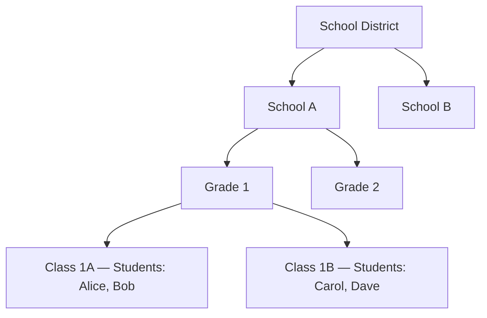
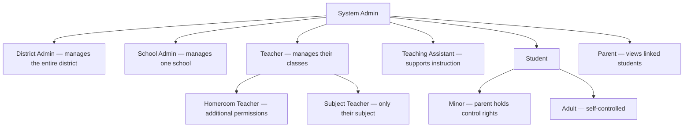

> **合规说明**：本文所述的 FERPA 与 COPPA 相关技术能力为 Autional 平台的设计目标。FERPA 合规须由教育机构自行评估；COPPA 合规需要配套的家长同意机制与隐私政策。Autional 通过技术架构帮助客户满足相关标准，但不构成法律合规背书。

## 教育科技的身份挑战

一个典型的在线教育平台要服务：
- 5-12 岁的小学生
- 13-17 岁的初高中生
- 18 岁以上的大学生
- 他们的家长
- 教师与学科讲师
- 学校/学区管理员

这些群体对身份系统的要求完全不同。小学生可能没有手机号、没有邮箱，甚至记不住自己的口令。他们的家长需要查看学习进度，但不应该能代替孩子考试。教师需要管理自己带的整个班级，但不应该看到其它班级的数据。管理员需要全校报表，但不应该访问单个学生的敏感信息。

更麻烦的是，这些要求还必须落在美国两部联邦法律的框架内：FERPA 与 COPPA。

## FERPA：学生教育记录的守护者

FERPA（《家庭教育权利与隐私法》）是一部保护学生教育记录隐私的美国联邦法律，1974 年颁布，是教育数据保护的基石。

### FERPA 的核心权利

FERPA 赋予家长（或年满 18 岁的合格学生）以下权利：

1. **查阅与复核教育记录的权利**：学校必须在 45 天内提供访问
2. **要求更正记录的权利**：如果认为记录不准确或有误导性
3. **控制信息披露的权利**：学校披露学生记录前通常需要取得书面同意

### 对身份系统的技术要求

**角色分离**：FERPA 的核心原则是「权利归属」。18 岁以下学生，权利属于家长；18 岁以上，权利属于学生本人。身份系统必须支持：

- 家长-学生关联（Parent-Student Link）关系
- 根据学生年龄自动切换权限模型
- 家长访问多个子女账号

Autional 的 RBAC 实现：

```go
// Parent role: can view linked students' grades and attendance, but cannot act on their behalf
Role: parent
  → Permission: student_record.read (scope: linked_students_only)

// Student role (<18): cannot control disclosure of their own data
Role: student_minor
  → Permission: course.content.read, assessment.take

// Student role (≥18): gains full control over their own data
Role: student_adult
  → Permission: course.content.read, assessment.take, record.privacy.manage
```

**披露控制**：FERPA 严格限制教育记录的披露。除非取得书面同意或适用法定例外情形（如转学、审计、司法命令），否则不允许向第三方披露。

对教育科技产品而言，这意味着：
- 与第三方集成（如学习分析工具、AI 辅导系统）需要单独的授权流程
- OAuth scope 必须精确——「仅用于学习分析，不用于营销」
- 授权记录必须持久化存储以备审计

Autional 的 oauth-service 支持自定义 scope，compliance-service 的 DSAR 功能可以生成某个学生的「数据共享清单」——列出哪些第三方收到了什么数据、用于什么目的。

## COPPA：保护 13 岁以下儿童

COPPA（《儿童在线隐私保护法》）是一部保护 13 岁以下儿童在线隐私的美国联邦法律，由 FTC 负责执法。单次违规的罚款可达数万美元。

### 可验证的家长同意

COPPA 的核心要求是：在收集 13 岁以下儿童的个人信息之前，必须取得「可验证的家长同意」。可接受的验证方式包括：

1. 签署同意书并通过邮寄、传真或电子扫描件回传
2. 使用信用卡、借记卡或其它在线支付系统（需通知家长）
3. 与受训人员视频会议
4. 政府签发的身份证件验证

### 儿童账号的技术实现

Autional 为 COPPA 合规提供以下技术支持：

**家长同意工作流**：儿童注册时触发特殊审批流程：
1. 儿童填写基本信息（姓名、年龄、家长邮箱）
2. 系统检测到年龄 < 13，触发 COPPA 同意流程
3. 同意请求（附同意书）发送到家长邮箱
4. 家长通过邮件链接完成身份验证并签署同意
5. 同意生效后，儿童账号激活

该工作流由 identity-service 的审批机制驱动，audit-service 记录每一步的时间戳与操作人。

**数据最小化**：COPPA 要求只收集为提供在线服务所合理必需的信息。Autional 的注册流程支持按年龄裁剪必填字段：
- 13 岁以下：最小字段集（昵称、口令、家长邮箱）
- 13-17 岁：可增加邮箱
- 18 岁以上：标准注册流程

**家长看板**：家长需要能够：
- 查看孩子的活动日志
- 了解已收集了哪些数据
- 撤回同意并要求删除数据
- 控制孩子与平台上其它用户的互动

这些能力通过 identity-service 的用户关联、audit-service 的活动日志与 compliance-service 的数据删除功能实现。

## 复杂的角色层级

### 教育场景的角色矩阵

教育场景的角色层级比典型企业更复杂，因为它跨越多个维度：

**机构维度**：



*图 1：机构维度——学区、学校、年级、班级构成四层结构，权限范围沿这棵树逐层划定。*

**角色维度**：



*图 2：角色维度——System Admin 之下逐层细分；学生再分 Minor 与 Adult，控制权随之从家长移交到本人。*

**数据维度**：
- 成绩记录：教师可写，学生可读，家长可读（仅限关联学生）
- 行为记录：仅管理员与班主任可写
- IEP（个别化教育计划）：仅特殊教育团队可见
- 医疗记录：仅校医与指定管理员可见

Autional 通过以下方式支持这种多维度授权模型：

**层级角色 + 范围约束**：
```go
// Teacher role permissions: can view and edit grades for taught classes
Role: teacher
  → Permission: grade.read (scope: taught_classes)
  → Permission: grade.write (scope: taught_classes)
  → Permission: student.profile.read (scope: taught_classes)
```

**基于属性的访问控制（ABAC）**：
权限决策必须考虑请求上下文属性——请求者是谁、属于哪所学校、教哪个班、正在操作哪个学生的数据。

**职责分离（SoD）**：
成绩录入与成绩复核应由不同角色执行，防止教师私自篡改学生成绩。

## 技术建议

### 1. 按年龄分档的数据策略

注册时采集年龄，并按年龄段分别处理数据：

| 年龄段 | COPPA 约束 | FERPA 权利归属 | 数据收集策略 |
|-----------|------------------|---------------------|-------------------------|
| < 13      | 需家长同意 | 家长 | 最小化收集，需家长同意 |
| 13-17     | 不受 COPPA 限制 | 家长 | 标准收集，家长可查看 |
| 18+       | 不受 COPPA 限制 | 学生本人 | 完整收集，学生自主管理 |

### 2. 敏感字段的强化保护

某些学生信息比其它信息更敏感——IEP 记录、心理咨询记录、违纪记录。它们应当：
- 存储时使用字段级加密
- 有独立的访问控制
- 每次访问都产生审计日志

### 3. 数据生命周期管理

教育数据不能无限期保留。学生毕业或转学后：
- 家长/学生应能导出数据
- 学校应在法定留存期结束后删除数据
- 应通知第三方停止使用该数据
- 上述所有操作都应有审计记录

## 小结

教育科技的身份系统与企业身份系统有本质区别：它包含需要特殊保护的未成年人、跨越多个组织层级的角色体系，以及必须同时处理机构层级、角色类别与数据敏感度三个维度的权限模型。

Autional 通过其 NIST RBAC 体系（层级角色 + SoD + ABAC 扩展）、compliance-service 的家长同意工作流与数据生命周期管理、audit-service 的完整审计轨迹，为教育科技产品提供符合 FERPA/COPPA 要求的身份基础设施。
