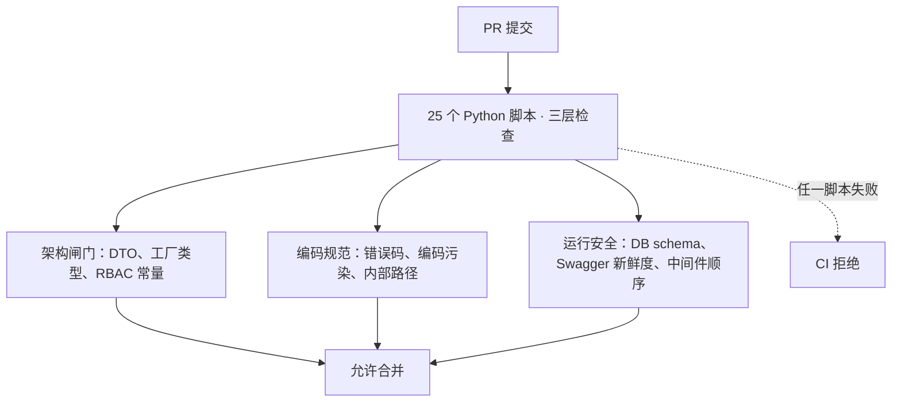
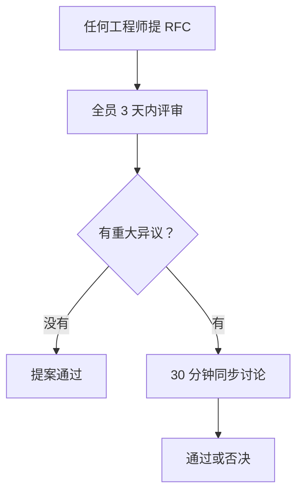

2024 年初，Autional 还只是一个由 3 人团队维护的 Go 单体应用。两年后，我们有 15 个人、27 个微服务、约 43 万行 Go 代码、1437 个 API 端点。更重要的是——**这些端点不是野蛮生长出来的，它们遵循同一套架构约束、编码规范与工程流程。**

本文讲的是背后的工程文化——不是「我们热爱写代码」这类口号，而是具体的工具、流程与决策逻辑。包括我们最聪明的选择，也包括那些让我们想抽自己的决定。

## 为什么选 Go

这不是一个艰难的选择。Autional 的业务特征让 Go 几乎成了唯一候选：

- **身份认证天然高并发。** 一个中型 SaaS 平台每秒可能要处理数千次令牌校验请求。Go 的 goroutine 模型能以极小的内存开销撑起海量并发——单个 session-service 实例用 2GB 内存就能稳定支撑 15,000 QPS 的 JWT 校验。
- **静态编译，单二进制部署。** 对私有化部署的客户来说，不需要安装任何运行环境——把一个 `identity-service.exe`（约 28MB）丢到服务器上就能跑。Java 做不到，Python 做不到，Node.js 也做不到。
- **类型安全 + 编译期检查。** 当你要在 27 个服务之间定义 gRPC 接口时，类型安全不是「锦上添花」，而是生存必需。我们承受不起因为一个字段名拼错而导致的跨服务运行时故障。

唯一被认真考虑过的替代方案是 Rust，但当时我们招不到足够的 Rust 开发者。Go 的人才市场更成熟，学习曲线也更平缓——这对快速组建团队至关重要。

## 为什么是微服务

如果你读过我们另一篇文章《从单体到微服务：Autional 的演进》，就会知道我们并不是一开始就做微服务。我们从单体起步，直到团队规模、用户量与功能复杂度都触及临界点后才开始拆分。

但有一个容易被忽略的细节：**即使当时只有一个服务，我们从第一天起就按微服务的标准写代码。** 这是什么意思？即使在单体时代，我们也坚持：

- 按业务能力组织包（`identity/`、`session/`、`oauth/`），而不是按技术分层（`handler/`、`service/`、`repository/`）
- 用接口解耦领域模型（`type UserRepository interface { ... }`）
- 数据库操作封装在 repository 层——业务逻辑永远不写 SQL

这些原则让后来的拆分出奇顺利——过去两年里，每次服务拆分平均只花了 2-3 周。

## 如何在 27 个服务之间保持一致性

这是工程文化的核心难题。27 个独立的 `go.mod`、27 个 `main.go`、27 套 handler/service/repository——如果没有强约束，它们很快就会演变成 27 种风格，谁也读不懂谁的代码。

我们的解法不是开更多的架构会，而是把约束写进工具里。

### 统一启动框架：`micro-middleware/app`

27 个业务服务的 `main.go` 都使用同一套启动框架：

```go
app := app_pkg.New("identity-service", logger).
    WithRouter(router).
    WithHealth(healthHandler).
    WithServer("grpc", grpcServer).
    WithServer("mq-consumer", mqConsumerServer).
    WithCleanupNamed("db", func() error {
        sqlDB, _ := db.DB()
        return sqlDB.Close()
    })

app.Run(11001)
```

这个框架统一管理：HTTP 服务启动、优雅停机、健康检查、资源清理、gRPC 服务与 MQ 消费者。一个新服务的 `main.go` 从不超过 40 行。更重要的是——**如果有人在任何服务里手写 `http.ListenAndServe`，CI 会直接拒绝。**

### 25 个 Python 检查脚本

这是我们最引以为傲的工程投入之一。每个 PR 提交前，CI 流水线会运行 25 个 Python 脚本，覆盖三个层次：



*图 1：合并前的自动关卡——25 个 Python 脚本分三层把关：架构闸门、编码规范、运行安全；任一脚本失败，CI 直接拒绝。*

**架构闸门（防止架构退化）：**
- `check-dto-compliance.py`：所有 HTTP 响应必须使用 `dto_base.NewDataResponse` 或 `dto_base.NewListResponse`。禁止用裸 struct、`gin.H`、`map[string]interface{}` 作为 JSON 响应。
- `check-factory-types.py`：工厂类型名必须与注册表一致。
- `check-rbac-constants.py`：RBAC 角色码必须存在于注册表中。

**编码规范（防止质量悄然侵蚀）：**
- `check-error-codes.py`：错误码必须在 `base/error/registry.go` 中注册。禁止在 handler 里直接返回 `errors.New("something wrong")`。
- `check-encoding.py`：扫描所有源文件中的 GBK 污染与 UTF-8 损坏。Windows 开发者经常在中文注释里混入 GBK 编码——这个脚本救过我们无数次。
- `check-internal-paths.py`：检测硬编码的内部 API 路径（如 `"/api/v1/internal/..."`），要求改用常量。
- `check-auth-constants.py`：检测硬编码的 MFA 类型与 OAuth grant type——这些应使用 `micro-share/auth` 中定义的常量。

**运行安全（防止生产事故）：**
- `check-db-schema.py`：比对 GORM 模型定义与实际的 PostgreSQL 表结构，检测缺失字段与类型不匹配。
- `check-swagger-freshness.py`：检测 handler 注解变更后未同步重新生成 Swagger 文档的情况。
- `check-middleware-order.py`：校验中间件注册顺序（Recovery → Logging → Auth → RBAC）。

**这些脚本不是因为不信任开发者，而是因为再优秀的开发者也会在凌晨两点写出有 bug 的代码。** CI 不会疲惫、不会分心，也永远不会说「这次就先放过吧」。

### 用 Lint 强制架构边界

我们的 `.golangci.yml` 不只检查代码风格——它执行架构约束：

- `depguard`：禁止低层模块引用高层模块。如果 `base/config` 引用了 `micro-share/auth`，CI 立即失败。
- `forbidigo`：禁用特定函数调用。例如禁止直接调用 `grpc.NewServer()`——必须用 `grpc_mw.NewServer()`。禁止使用 `slog.SetDefault()`——必须用 `logger_base.SetDefault()`。

**为什么要把架构约束写进 lint？因为会议和文档拦不住技术债的堆积。** 当你在半夜赶工期时，你不会翻开架构文档去确认「这个 import 方向对不对？」Lint 会在你提交之前告诉你。

### 自动生成 Swagger 文档

我们有 1437 个 API 端点。手写文档的话，写完第二天就过期了。

我们的做法：
1. 在 handler 上写标准 Swagger 注解（`@Summary`、`@Param`、`@Success`、`@Router` 等）
2. `swag init` 从注解自动生成 `swagger.json`
3. 生成器从 `swagger.json` 产出 API 索引、Wiki 文档与前端 TypeScript 类型
4. Git pre-commit hook 检查：如果修改了 handler 文件却没有重新生成 Swagger 文档，提交会被拦下

结果是：**文档与代码永远同步，因为不同步就提交不了。**

## 工程价值观

以上讲的是工具。但工具只是价值观的载体，不是价值观本身。以下是 Autional 的核心工程价值观：

### 安全是默认，不是可选项

我们有一条铁律：所有涉及口令哈希、API Key、OAuth Token、MFA secret 的 GORM 结构体字段，都必须带 `json:"-"` 标签。这不是建议——是强制。曾经有开发者新增了字段却忘了加 `json:"-"`。结果整个结构体被打印进日志，口令哈希直接泄漏到了 ELK 里。

类似的规则还有：
- 所有服务间通信必须通过 `auth_mw.InternalAPIKeyAuth` 鉴权——不允许手写校验逻辑
- 所有用户输入都要先经过统一的参数校验框架才能到达 handler
- 所有跨服务数据同步使用领域事件 + MQ 实现最终一致性——禁止跨服务直连数据库

### 显式优于隐式

Go 社区的价值观在 Autional 被推到了极致：

- 每个错误码必须有明确的 8 位数字，并在 `registry.go` 中注册
- 每个缓存键必须有已注册的前缀（不允许手写 `"user:" + id`）
- 每个环境变量名必须在常量文件中定义
- 每个数据库表名必须在常量注册表中注册

这听起来很繁琐。但当新人接手一个服务时，他能在 10 分钟内找到所有需要的信息——因为一切都显式声明了，不需要「我猜应该是」或者「问问老员工」。

### 文档也是代码的一部分

我们的工程规范不在 Wiki 里——而在 `AGENTS.md` 里，和代码放在同一个仓库。任何修改架构决策的 PR 都必须同步更新 AGENTS.md。好处是：
- 文档永远不会过期（因为文档不同步就过不了评审）
- 新人入职只需要读一个文件
- `git blame` 能把每个架构决策追溯到作者与当时的上下文

## 我们做错的三件事

只讲成功的工程文化文章不值得一读。以下是我们做错、且会换种做法重来的三个决定：

### 错误一：过早引入测试覆盖率指标

早期我们设定了「单元测试覆盖率 80%」的目标。结果呢？开发者为了达标，给 getter 和 setter 写了成堆毫无意义的测试，而核心业务逻辑的测试反而被忽略了。

现在的做法：**我们不追覆盖率指标。我们要求关键路径（注册、登录、支付、权限校验）必须有集成测试。** 一个覆盖认证流程的集成测试，比 100 个测试 `GetName()` 的单元测试更有价值。

### 错误二：过早引入 gRPC

我们在微服务拆分的早期就引入了 gRPC 做服务间通信。但当时只有 3 个服务，维护 protobuf 定义的开销远远超过性能收益。更糟的是，gRPC 的错误处理方式（状态码）与我们的错误码体系产生了语义冲突，逼得我们多写了一层转换。

我们现在的原则：**先用 HTTP + JSON。只有当服务间调用真的成为性能瓶颈时才引入 gRPC。** 目前只有 compliance-service 和少数高频内部接口使用 gRPC。

### 错误三：技术选型过于多样

早期我们允许不同服务试验不同技术栈——一个服务用 MongoDB，另一个用 Kafka，再一个用 RabbitMQ。结果是运维团队要维护 5 套中间件，新成员要学 3 种消息队列。

我们现在的原则：**技术选型默认统一，引入新组件必须有充分理由。** 我们的标准技术栈是 Go + Gin + PostgreSQL + Redis + RabbitMQ。MongoDB 只用在 audit-service（审计日志是文档型数据）。Kafka 只在需要高吞吐事件流的场景使用。

## 团队组织：没有专职「架构师」

Autional 的工程团队没有专职架构师。这不是因为不重视架构——恰恰相反。**我们太重视它，所以不能把它变成某一个人的责任。**

每当面临重大架构决策（例如是否采用 gRPC、如何设计事件溯源、数据库选型），流程是：
1. 任何工程师都可以提 RFC，写在 Notion 上
2. 所有工程师在 3 天内评审并评论
3. 如果没有重大异议，提案通过
4. 如果有争议，组织一次 30 分钟的同步讨论



*图 2：架构决策的 RFC 流程——任何工程师可提，全员评审；没有重大异议即通过，有异议就开 30 分钟同步会定去留。*

这个流程跑了两年，产出了 40 多份 RFC。其中 3 份被否决，5 份在大幅修改后通过。没有人能单方面决定架构方向——同样，也没有人能把架构责任推给「架构师」。

## 给想效仿的团队的建议

如果你正在组建工程团队，以下是我们最重要的几条心得：

1. **约束不是自由的对立面。** 27 个服务，如果没有强约束，你得到的不是多样性，而是混乱。Lint 规则、CI 脚本与代码生成器不会限制创造力，它们把创造力聚焦到真正重要的地方（业务逻辑），而不是浪费在「这个 API 该返回什么格式」上。

2. **能自动化的检查都自动化。** 如果一条规则重要到值得在 Code Review 里提出，它就应该写成 CI 脚本。人是最不可靠的检查者。

3. **新人体验是最重要的工程指标之一。** 如果一个新开发者需要两周才能提交第一个 PR，那不是他的问题——是你的入职流程有问题。我们的目标：第一天，本地开发环境跑起来；第二天，提交第一个 bug 修复。

4. **对错误保持诚实。** 本文的三个错误不是「经验分享」式的表演——它们是真实浪费了团队大量时间的失误。如果你在团队里看到类似的苗头，希望我们的经验能帮你少走一步弯路。

Autional 的工程文化不是一夜之间建成的。它是 15 个人用两年时间，在无数次争论、妥协、重构与反思中塑造出来的。而且它仍在演进——我们目前正在试验 AI 辅助 Code Review，结果会在后续文章中分享。
