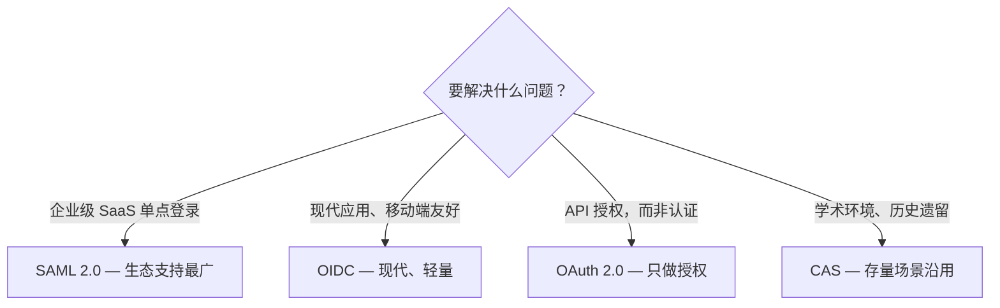

## 为什么 SSO 很重要

单点登录（SSO）是现代企业身份管理的基础。本文将覆盖：

### 协议选型
- **SAML 2.0**——最适合企业级 SaaS，生态支持最广
- **OIDC**——现代、轻量、对移动端友好
- **OAuth 2.0**——用于 API 授权，而非认证
- **CAS**——学术环境，历史遗留采用较多

*图 1：协议选型决策——企业级 SaaS 看 SAML 2.0，现代与移动端看 OIDC，OAuth 2.0 只用于 API 授权，CAS 留给学术与历史遗留场景。*

### 架构模式

**集中式网关**：统一的认证代理，处理所有 SSO 流量。最适合应用技术栈多样化的组织。

**联邦身份**：各应用独立向中心 IdP 校验令牌。最适合微服务架构。

### 安全检查清单
- 公共客户端一律使用 PKCE
- 强制短时效访问令牌（15-30 分钟）
- 实现令牌轮换与吊销
- 使用 HSM 存放签名密钥
