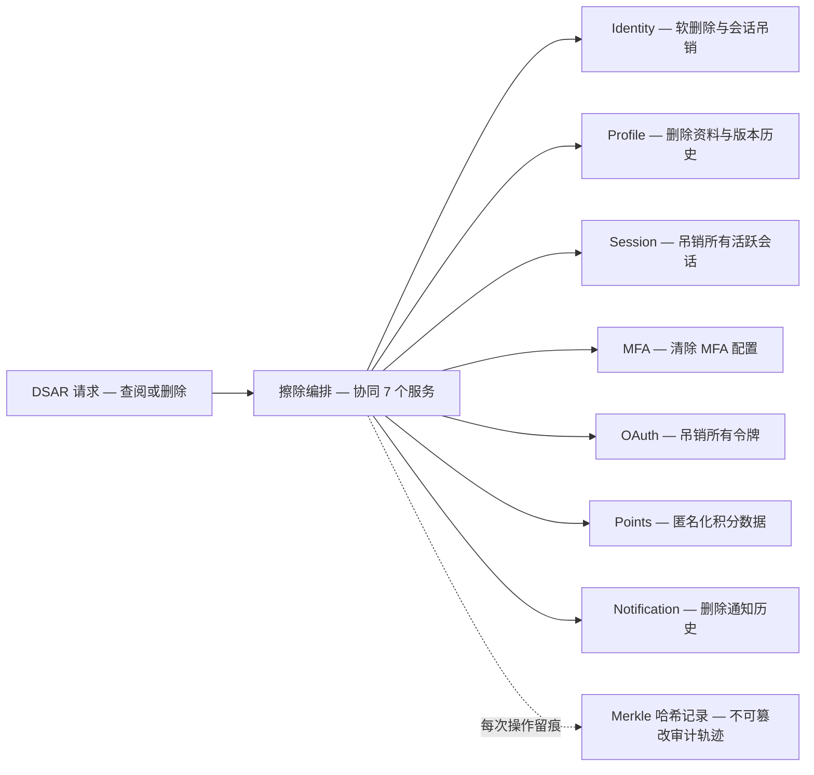

> **合规说明**：本文所述技术能力为 Autional 的设计目标，不构成 GDPR 合规认证。最终合规责任由数据控制者承担。

## DSAR 的挑战

根据 GDPR 第 15 条，数据主体有权访问其个人数据。对拥有多个微服务的组织来说，完成一次 DSAR 意味着：

1. **发现**——在数据库、日志、缓存中定位 PII
2. **聚合**——把结果合并成一份连贯的响应
3. **验证**——通过审计轨迹证明完整性
4. **时效**——在 30 天内作出响应

## 自动化架构

Autional 的擦除编排会协同 7 个服务：

| 服务 | 操作 |
|---------|-----------|
| Identity | 软删除 + 会话吊销 |
| Profile | 删除个人资料 + 版本历史 |
| Session | 吊销所有活跃会话 |
| MFA | 清除 MFA 配置 |
| OAuth | 吊销所有令牌 |
| Points | 匿名化积分数据 |
| Notification | 删除通知历史 |

*图 1：一次 DSAR 的擦除编排——请求进入后由编排器协同 7 个服务，每一步都留下 Merkle 哈希记录。*

## 哈希链验证

每一次 DSAR 操作都会产生一条 Merkle 树哈希记录，形成不可篡改的审计轨迹。它能证明数据在何时、以何种方式、被谁访问或删除。
