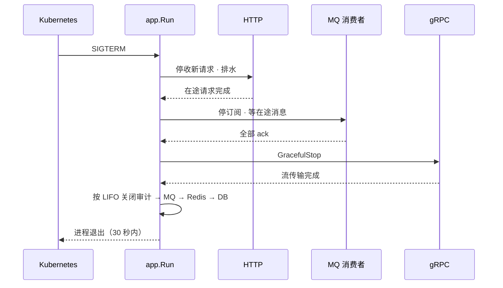

服务重启在生产环境是常态——Kubernetes 滚动更新、节点驱逐、资源扩缩容——每一次都会向 Pod 发送 SIGTERM 信号。不处理 SIGTERM 的微服务会立即终止，导致：

- 处理中的 HTTP 请求被中断，客户端看到连接重置错误
- 已从 RabbitMQ 取出但尚未处理完的消息永久丢失（自动 ack）
- gRPC 流中途断开，下游服务收到 `UNAVAILABLE` 错误
- 数据库连接池被暴力关闭，未提交的事务被回滚

Autional 的 27 个微服务通过统一的 `micro-middleware/app` 启动框架实现了 **零停机优雅停机**。

## 暴力停机 vs 优雅停机

### 暴力停机（什么都没做）

```
Timeline:
T+0s   Kubernetes sends SIGTERM → process exits immediately
T+0s   8 in-flight HTTP requests all disconnected → users see 502
T+0s   3 MQ messages auto-acked but not processed → message loss
T+0s   2 database transactions uncommitted → data inconsistency
T+0s   gRPC stream disconnected → downstream retries (avalanche risk)
```

这是最常见也最危险的场景——一个简单的 `go run cmd/server/main.go`，没有信号处理，也没有停机逻辑。

### 优雅停机（Autional 模式）

```
Timeline:
T+0s   Received SIGTERM → shutdown sequence starts
T+0s   Stop accepting new HTTP requests (return 503 + Retry-After header)
T+5s   Wait for 3 in-flight HTTP requests to complete
T+6s   HTTP server.Shutdown() complete
T+6s   Stop MQ consumer, wait for in-flight messages to finish
T+8s   All 3 MQ messages acked
T+8s   gRPC server.GracefulStop() → wait for stream transfers to complete
T+12s  Close database connection pool (LIFO)
T+12s  Process exits
```

而消费方对此毫无感知。Kubernetes 的 `terminationGracePeriodSeconds` 设为 30 秒，留出了充足的缓冲时间。

## Autional 统一启动框架设计

### Application Builder 模式

每个服务在 `main.go` 中通过 Builder 构建启动配置：

```go
import app_pkg "gitee.com/linmes/authms/micro-middleware/app"

func main() {
    cfg := config.Load("configs/service/identity-service.yaml")
    logger := logger_base.New(cfg.Log)
    
    // Initialize dependencies
    db := gorm_client.MustInitDB(cfg.DB, domainModels...)
    mq := rabbitmq_client.Connect(cfg.RabbitMQ)
    redis := redis_client.Connect(cfg.Redis)
    
    // Build application
    app := app_pkg.New(cfg.Service.Name, logger).
        WithRouter(router).
        WithHealth(healthHandler).
        WithServer("grpc", grpcServer).
        WithServer("mq-consumer", consumerServer).
        WithCloser("db", sqlDB.Close).             // Database connection pool
        WithCloser("redis", redis.Close).           // Redis connection pool
        WithCloser("mq", mq.Close).                 // MQ connection
        WithCleanupNamed("audit", auditClient.Stop)
    
    app.Run(cfg.Service.Port)
}
```

每个 `WithServer` 与 `WithCloser` 都注册了一个**具名停机回调**。停机时它们按**注册顺序的逆序**（LIFO）执行，确保「先创建、先打开的资源后关闭」，符合依赖顺序。

### WithServer：生命周期管理

`WithServer` 注册实现了 `app.Server` 接口的组件：

```go
type Server interface {
    ListenAndServe() error
    Shutdown(ctx context.Context) error
}
```

Autional 中常见的 Server 实现：

| 组件 | 实现 | 用途 |
|------|------|------|
| Gin Router | `app.NewHTTPServer(addr, handler)` | HTTP 服务 |
| gRPC 服务 | 经 `app.NewGRPCServer` 包装的 `grpc_mw.Server` | gRPC 端点 |
| MQ 消费者 | `consumer_pkg.NewServer(consumer)` | RabbitMQ 消费 |
| 健康检查 | `health.StartStandaloneServer` | 纯健康探针 |

停机时，`app.Run` 按逆序调用每个 Server 的 `Shutdown(ctx)`，并把上下文超时（默认 30 秒）传给每个组件。

### WithCloser 与 WithCleanupNamed

Autional 区分两种清理方式：

- `WithCloser(name, fn)` —— 简单的 `func() error` 闭包，用于单步清理（关闭 DB、关闭 Redis）
- `WithCleanupNamed(name, fn)` —— 与 Closer 相同，但语义上用于「副作用清理」（如审计客户端刷缓冲区）
- 已废弃：`WithCleanup(func())` —— 没有名称、不返回错误、不可观测

```go
// Correct: returns error, has a name
app.WithCloser("db", func() error {
    sqlDB, _ := db.DB()
    return sqlDB.Close()
})

// Wrong: no name, no error
app.WithCleanup(func() { db.Close() })
```

## 停机时序详解



*图 1：停机时序——SIGTERM 到达后，按 HTTP → MQ → gRPC → 连接池的顺序分层收尾，全程在 30 秒宽限内完成。*

### 第一步：停止接受新请求（0-1 秒）

收到 SIGTERM 后，`app.Run` 立即调用 `http.Server.Shutdown(ctx)`：

```go
func (a *Application) Run(port int) {
    // ... start all Servers ...
    
    quit := make(chan os.Signal, 1)
    signal.Notify(quit, syscall.SIGINT, syscall.SIGTERM)
    <-quit
    
    a.logger.Info("shutting down", slog.String(logger_base.KeyReason, "signal"))
    
    // Step 1: HTTP stops accepting new requests
    ctx, cancel := context.WithTimeout(context.Background(), a.shutdownTimeout)
    defer cancel()
    
    for _, srv := range a.servers {  // reverse order
        a.logger.Info("shutting down server", slog.String("name", srv.Name))
        if err := srv.Shutdown(ctx); err != nil {
            a.logger.Error("shutdown failed", 
                slog.String("name", srv.Name),
                slog.Any(logger_base.KeyError, err))
        }
    }
}
```

HTTP Server 的 Shutdown 行为：
- 关闭监听套接字 → 新连接被拒绝，返回 503
- 等待所有处理中的请求完成或超时（`ctx` 截止时间）

### 第二步：排空 MQ 消费者（3-8 秒）

MQ 消费者通过 `consumer_pkg.Server` 实现优雅停机：

```go
// internal implementation of consumer_pkg.NewServer
func (s *Server) Shutdown(ctx context.Context) error {
    s.cancel()  // ← triggers consumer internal context cancellation
    // consumer on receiving cancel:
    //  1. Stops subscribing (no longer receives new messages)
    //  2. Waits for all in-flight messages to finish processing
    s.wg.Wait()  // ← waits for all handler goroutines to exit
    return nil
}
```

在 Autional 的消费者架构中，消息只有在处理成功后才 ack（手动确认模式）。因此即使进程停机时 MQ 消费者还没处理完消息，消息也会被重新入队（未被 ack），不会丢失。

对于耗时较长的消息（如合规报告生成，可能超过 30 秒），上下文取消会中断处理，消息回到队列由另一个 Pod 接手。

### 第三步：gRPC 优雅停止（8-10 秒）

```go
func (s *GRPCServer) Shutdown(ctx context.Context) error {
    done := make(chan struct{})
    go func() {
        s.grpcServer.GracefulStop()  // blocks until all RPCs complete
        close(done)
    }()
    
    select {
    case <-done:
        return nil
    case <-ctx.Done():
        s.grpcServer.Stop()  // force close on timeout
        return ctx.Err()
    }
}
```

gRPC 的 `GracefulStop` 确保进行中的流传输能完整结束，而 `Stop` 是超时后的强制关闭兜底。

### 第四步：关闭基础设施连接池（10-12 秒）

按 LIFO 顺序关闭：

```
Close order (reverse of registration):
[4] audit_client.Stop()      ← flush buffered logs first
[3] mq.Close()               ← close MQ connection
[2] redis.Close()            ← close Redis connection pool
[1] db.Close()               ← close database connection pool (last opened, first closed)
    ↑ sql.DB.Close() waits for all borrowed goroutines to return connections
```

每一步都会记录日志：

```
INFO shutting down server name=http
INFO shutting down server name=grpc
INFO shutting down server name=mq-consumer
INFO closing name=audit
INFO closing name=mq
INFO closing name=redis
INFO closing name=db
INFO shutdown complete
```

如果某个 Closer 返回错误，它不会跳过后续的 Closer——所有清理步骤都会执行。这是防御性设计：即使 Redis 连接已经断开导致 Close 失败，数据库连接池仍然需要正常释放。

## 超时与兜底

```go
const defaultShutdownTimeout = 30 * time.Second

// In app.Run
ctx, cancel := context.WithTimeout(context.Background(), a.shutdownTimeout)
defer cancel()

// If all Shutdown steps don't complete within 30 seconds, force exit
go func() {
    <-ctx.Done()
    if errors.Is(ctx.Err(), context.DeadlineExceeded) {
        a.logger.Error("shutdown deadline exceeded, forcing exit")
        os.Exit(1)  // hard exit, let Kubernetes restart the Pod
    }
}()
```

为什么要设超时：

- Kubernetes 默认的 `terminationGracePeriodSeconds` 是 30 秒
- 如果优雅停机没能在 30 秒内完成，Kubernetes 会发送 SIGKILL 强制杀死 Pod
- Autional 的 30 秒默认值与之一致，也可通过 `WithShutdownTimeout` 自定义

## 生产环境实证

Autional 的优雅停机在生产环境的表现：

**场景一：正常滚动更新**

```
Pod identity-service-7f8b9c-abc12 receives SIGTERM
→ 0.2s: Stop accepting new requests
→ 2.1s: Last 3 requests complete
→ 3.5s: MQ messages acked
→ 3.8s: gRPC stream complete
→ 5.0s: DB connection pool released
→ 5.0s: Process exits
```

网关负载均衡器检测到 Pod 终止，自动把流量路由到新 Pod。零错误、零 5xx。

**场景二：数据库连接故障（兜底测试）**

```
Pod billing-service-6c3d9a-xyz78 receives SIGTERM
→ 0.1s: Stop accepting new requests
→ 0.3s: HTTP shutdown successful
→ 0.5s: gRPC shutdown successful
→ 0.5s: Close DB failed → error logged, continues
→ 0.6s: Close Redis successful
→ 0.7s: Close MQ successful
→ 0.7s: Process exits (despite db.Close failure)
```

因为 `db.Close()` 返回了错误，但 `WithCloser` 的实现会**始终调用所有 Closer**，绝不因单步失败而中断：

```go
for _, closer := range s.closers {  // reverse order
    if err := closer.Fn(); err != nil {
        logger.Error("close resource failed",
            slog.String("name", closer.Name),
            slog.Any(logger_base.KeyError, err))
    }
}
```

## 为什么这很重要

### 用户体验

零停机优雅停机意味着：正在进行 MFA 多因素认证、正在提交口令重置请求、正在查看钱包余额的用户——这些进行中的操作都不会被发布打断。用户毫无感知。

### 数据完整性

MQ 消息不丢失：未 ack 的消息在停机后重新入队，由新 Pod 接手。数据库事务不会悬挂：连接池优雅关闭，等待所有 goroutine 归还连接并完成事务。

### 运维友好

完整的停机时序都记录在日志里。如果某个 Pod 持续停机失败，运维可以从 `close resource failed name=xxx` 这类日志快速定位到问题组件。

## 小结

Autional 的 `micro-middleware/app` 启动框架用不到 300 行代码，统一管理了 27 个微服务的生命周期：

- **声明式注册**：Builder 模式的 `WithServer` + `WithCloser`
- **信号驱动**：监听 SIGTERM/SIGINT，自动触发停机时序
- **分层优雅**：HTTP → MQ → gRPC → 基础设施，有序停机
- **兜底机制**：超时强制退出 + 单步失败不中断后续清理
- **完整日志**：每个组件的停机都有名称与错误记录

如果你在用 Go 写微服务，不必重新造轮子——这套模式可以直接照搬到你的项目里。核心原则只有一条：**永远不要让 SIGTERM 直接杀死你正在处理的请求。**
