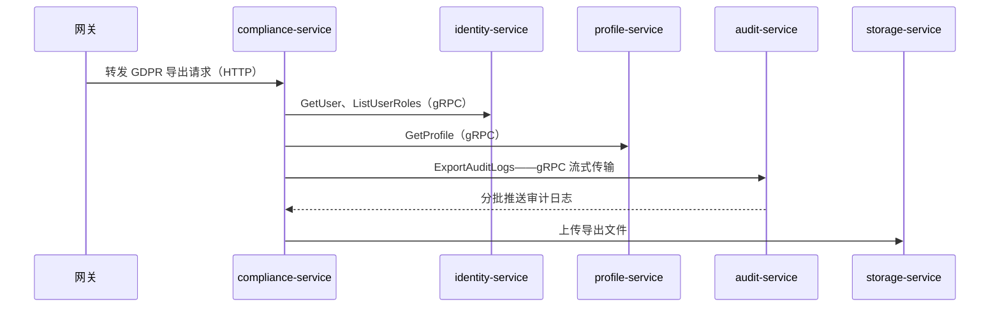

微服务架构的核心挑战之一，是让服务之间既能安全通信、又能高效通信。REST + JSON 看起来简单，但在服务间通信场景下暴露出不少问题：序列化开销高、缺少强类型约束、难以支持流式传输。Autional 的选择是：**对外用 REST，内部用 gRPC。**

## 为什么内部调用用 gRPC？

### 效率对比：Protobuf vs JSON

假设 identity-service 需要向 compliance-service 返回用户信息：

**JSON（REST）：**

```json
{
  "user_id": "01ARZ3NDEKTSV4RRFFQ69G5FAV",
  "email": "user@example.com",
  "display_name": "张三",
  "roles": ["admin", "developer"],
  "created_at": "2026-05-13T10:30:00Z"
}
```

原始载荷约 180 字节，且每次调用都需要 JSON 编解码。

**Protobuf（gRPC）：**

```protobuf
message GetUserResponse {
  string user_id = 1;
  string email = 2;
  string display_name = 3;
  repeated string roles = 4;
  google.protobuf.Timestamp created_at = 5;
}
```

序列化后约 80 字节（二进制），没有解析开销。

对于每秒数万次的内部调用（认证、权限校验、数据校验），Protobuf 的序列化效率会直接转化为更低的 CPU 占用与更快的响应。

### 强类型契约

REST API 的契约是「文档 + 约定」——Swagger/OpenAPI 规范了描述方式，但无法在编译期校验调用方传的参数类型是否正确。

gRPC 的契约是 `.proto` 文件——**在编译期就得到保证**：

- 调用方与服务端从同一个 `.proto` 文件生成代码
- 字段类型错误在编译期就会被捕获
- 新增字段不影响既有调用方（Protobuf 向后兼容）
- 标记为 `reserved` 的废弃字段若被复用会导致编译错误

在 Autional 中，所有 `.proto` 文件统一由 `scripts/generate-proto.ps1` 生成。CI 流水线中的 `check-grpc-compliance.py` 确保生成代码与 proto 定义一致——杜绝「文档说接受 int，代码却传了 string」这类运行时 bug。

### 流式传输

REST 很难优雅地处理大数据量传输：

- compliance-service 导出审计日志：需要分页 API（`?page=1`、`?page=2`……），产生 n+1 次 HTTP 调用
- audit-service 推送实时告警事件：需要 WebSocket 或 SSE，增加协议复杂度

gRPC 原生支持四种通信模式：

```
Unary:               Request→Response (traditional RPC)
Server Streaming:    Request→Streaming Response (large data export)
Client Streaming:    Streaming Request→Single Response (batch upload)
Bidirectional:       Bidirectional streams (real-time alerts, conversations)
```

在合规报告导出场景中，compliance-service 调用 audit-service 的 `ExportAuditLogs` 方法。audit-service 通过 Server Streaming 分批推送数据，compliance-service 边收边写入 CSV——不必等整个数据集加载进内存。

## Autional 的 gRPC 安全架构

### 传输安全：TLS / mTLS

Autional 的内部 gRPC 通信默认启用 TLS：

```yaml
grpc:
  enabled: true
  port: 12018
  tls:
    enabled: true
    cert_file: "/certs/server.crt"
    key_file: "/certs/server.key"
    ca_file: "/certs/ca.crt"
```

在生产环境升级为 mTLS（双向认证）：每个服务持有自己的客户端证书，服务端校验调用方身份。这样可以阻断未授权的内部调用——即使攻击者突破了网络隔离，没有有效证书也无法调用 gRPC 端点。

### 认证：JWT + API Key 双模式

内部服务间调用有两类认证场景，Autional 都支持：

**JWT（用户上下文透传）：**

网关把用户请求转发到内部服务时，JWT 令牌中的 `user_id` 与 `tenant_id` 通过 gRPC metadata 透传给下游：

```go
// Injected in the gRPC client interceptor
md := metadata.Pairs(
    "authorization", "Bearer "+token,
    "x-tenant-id", tenantID,
    "x-user-id", userID,
)
ctx := metadata.NewOutgoingContext(ctx, md)
```

**API Key（服务间互信）：**

对于不携带用户上下文的内部调用（如定时任务触发合规扫描），使用预先配置的 API Key：

```go
md := metadata.Pairs("x-api-key", internalAPIKey)
ctx := metadata.NewOutgoingContext(ctx, md)
```

### 统一拦截器链

Autional 的 gRPC 服务端通过 `grpc_mw.NewServer` 工厂方法创建，自动注入四层拦截器链：

```
Client Request
  ↓
[Recovery]         ← panic recovery, prevents a single request from crashing the entire service
  ↓
[Logging]          ← records method, duration, status
  ↓
[Metrics]          ← Prometheus metrics: request_count, latency_histogram
  ↓
[Auth]             ← validates JWT or API Key, injects user_id/tenant_id
  ↓
Business Handler   ← actual gRPC method implementation
```

Auth 拦截器会自动跳过健康检查端点（`/grpc.health.v1.Health/*`），确保 Kubernetes 存活探针始终可达：

```go
// Health check whitelist inside grpc_mw.NewServer
if info.FullMethod == "/grpc.health.v1.Health/Check" ||
   info.FullMethod == "/grpc.health.v1.Health/Watch" {
    return handler(ctx, req)  // skip auth
}
```

## 全链路追踪：OpenTelemetry

服务间的调用链很复杂，排查延迟问题需要全链路追踪。Autional 的所有 gRPC 调用都会注入 W3C Trace Context：

**客户端侧：**

```go
conn, err := grpc.NewClient(addr,
    grpc.WithTransportCredentials(insecure.NewCredentials()),
    grpc.WithStatsHandler(otelgrpc.NewClientHandler()),
)
```

**服务端侧：** `grpc_mw.NewServer` 自动注入 `otelgrpc.NewServerHandler()`。这样，从网关进来的一次请求穿过 gRPC 调用链时，Jaeger 能展示完整的 trace：

```
Gateway → [identity-service: GetUser] → [profile-service: GetProfile] → [compliance-service: CheckCompliance]
                                                                          ↑ Span: 45ms
                                                        ↑ Span: 12ms
                                  ↑ Span: 8ms
            ↑ Trace: 3a2b1c4d5e6f...
```

每个 Span 记录调用方服务名、方法名、状态码与耗时。当 P99 延迟飙升时，你可以快速定位到是哪个下游服务的哪个方法拖慢了整体响应。

## 实战：合规扫描的认证链路

以 compliance-service 执行 GDPR 数据导出为例，完整的 gRPC 调用链如下：

```
1. Admin initiates export request (HTTP → gateway)
2. Gateway forwards to compliance-service (HTTP)
3. compliance-service calls identity-service (gRPC):
   → GetUser(user_id) → gets user basic info
   → ListUserRoles(user_id) → gets role list
4. compliance-service calls profile-service (gRPC):
   → GetProfile(user_id) → gets extended attributes
5. compliance-service calls audit-service (gRPC):
   → ExportAuditLogs(user_id, stream) → streams audit logs
6. compliance-service assembles data → generates export file → uploads to storage-service
```



*图 1：合规扫描的调用链——网关把 GDPR 导出请求交给 compliance-service，它再经 gRPC 分头向 identity、profile、audit 取数，最后把文件交给 storage-service 落盘。*

第 3-5 步都是 gRPC 调用，各自携带同一个 Trace ID。如果第 3 步的 `GetUser` 失败，compliance-service 可以快速返回错误（而不是等到超时），并记录失败的 gRPC 状态码：

```
level=ERROR msg="gdpr export failed" user_id=01ARZ... 
  error="rpc error: code = NotFound desc = user not found"
  step=get_user grpc_code=NotFound
```

## Autional 中 gRPC 与 REST 的分工

Autional 不建议对面向最终用户的 API 使用 gRPC：

| 场景 | 方案 | 原因 |
|------|------|------|
| 浏览器 → 后端 | REST + JSON（网关代理） | 浏览器无法直接调用 gRPC，需要 grpc-web 代理 |
| 移动端 → 后端 | REST + JSON | 为移动端增加 gRPC 层收益有限 |
| 服务间通信 | gRPC + Protobuf | 效率最高，类型安全，支持流式传输 |
| 第三方 API | REST + OAuth 2.0 | 行业标准，生态兼容性最好 |
| Webhook 回调 | HTTP POST + JSON | 接收方易于处理 |
| 实时推送 | WebSocket / SSE | 对浏览器友好 |

## 小结

gRPC 在 Autional 内部通信中的角色可以概括为：

- **效率**：Protobuf 二进制序列化，载荷比 JSON 小 50% 以上，CPU 开销更低
- **安全**：TLS/mTLS 传输加密 + JWT/API Key 双模式认证 + 统一拦截器链
- **可靠**：编译期类型安全、proto 变更向后兼容、CI 强制一致性
- **可观测**：OpenTelemetry 全链路追踪，每个 Span 记录方法名、状态码与耗时

如果你的微服务超过 5 个，且服务间调用越来越频繁——现在就是引入 gRPC 的最佳时机。
