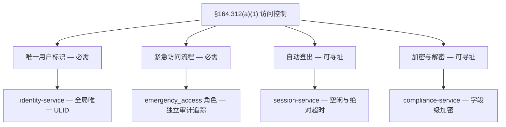
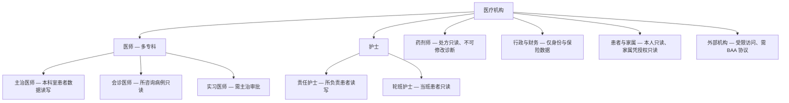

> **合规提示**：本文描述的 HIPAA 安全规则相关技术能力，代表 Autional 平台的设计目标，不构成 HIPAA 合规认证。HIPAA 合规需要管理、物理与技术三方面的保障措施——最终的合规责任由医疗机构承担。

## 医疗数据：最具价值的攻击目标

在暗网上，一份完整的病历售价约 1,000 美元，而一个信用卡号只值 5 美元。这并非夸大其词——病历包含一个人的姓名、出生日期、社会安全号、家庭住址、病史与保险信息。一旦泄露，它们无法像信用卡那样「挂失换新」。

这正是 HIPAA（Health Insurance Portability and Accountability Act，健康保险流通与责任法案）对电子受保护健康信息（ePHI）的访问控制提出如此严苛要求的原因。

### HIPAA 核心概念：谁在保护什么？

在深入技术细节之前，先厘清几个关键概念：

- **PHI（Protected Health Information，受保护健康信息）**：任何能识别到具体个人的健康相关信息——诊断记录、治疗方案、处方记录，甚至当包含患者姓名时的预约时间。
- **ePHI**：电子形式的 PHI。存储在 EHR 系统、PACS 影像系统与医疗 App 中的患者数据。
- **Covered Entity（受涵盖实体）**：直接处理 PHI 的组织，如医院、诊所与保险公司。
- **Business Associate（业务伙伴）**：为受涵盖实体提供服务的第三方，如云服务商与 SaaS 平台。

如果你的系统处理 PHI，无论你是受涵盖实体还是业务伙伴，都必须满足 HIPAA 安全规则的技术要求。

## HIPAA 安全规则：对身份认证的技术要求

HIPAA 安全规则将保障措施分为三类：管理、物理与技术。本文聚焦与身份认证系统直接相关的技术保障措施。

### §164.312(a)(1)：访问控制

这是对身份系统最核心的技术要求：

> 实施技术策略与流程，仅允许经授权的人员或软件程序访问 ePHI。

它包含四项实施规范：

*图 1：§164.312(a)(1) 的四项实施规范与 Autional 的对应实现——唯一标识和紧急访问是必需项，自动登出与加密是可寻址项。*

**唯一用户标识（必需）**：每个用户必须拥有唯一标识符，以便追踪其对 ePHI 的访问。共享账号被明确禁止——「护士站共用账号」是 HIPAA 审计中最常见的违规之一。

Autional 的 identity-service 天然保证唯一用户标识。每个用户拥有全局唯一的 ULID，支持多种登录方式（用户名、邮箱、手机号）。但内部标识始终是单一主键，每一条审计日志都绑定到具体的用户 ID。

**紧急访问流程（必需）**：在紧急情况下（如危及生命的状况），经授权人员必须能够绕过常规访问控制获取 ePHI。「Break Glass」（打破玻璃）流程必须具有独立的审计追踪。

Autional 可为此场景配置专门的紧急角色（如 `emergency_access`）。授予该角色的行为会触发独立审计事件，并在 audit-service 中以显著标记记录。紧急访问结束后该角色自动回收。

**自动登出（可寻址）**：会话必须在闲置一段时间后自动终止，防止未授权人员在已登录的终端上访问 ePHI。

Autional 的 session-service 支持：
- 闲置超时：如闲置 15 分钟后自动登出
- 绝对超时：如 8 小时后强制重新登录（即使持续有操作）
- 并发会话限制：单用户同时最多 N 个活跃会话

**加密与解密（可寻址）**：实施 ePHI 的加密与解密机制。这涵盖传输加密（TLS）与存储加密（字段级/磁盘级）。

### §164.312(b)：审计控制

> 实施硬件、软件和/或流程机制，记录并检查包含或使用 ePHI 的信息系统中的活动。

HIPAA 要求审计日志覆盖：

1. **谁**访问了 ePHI（用户标识）
2. 访问了**哪些数据**（数据对象标识）
3. **何时**访问（精确到秒的时间戳）
4. 执行了**什么操作**（读取/修改/删除/导出）
5. 访问**是否成功**（允许/拒绝）

Autional 的 audit-service 完整覆盖这五个维度。基于 MongoDB 的文档存储模型，每条审计记录可灵活携带上下文信息——如访问的科室、患者 ID、数据类别——这对 HIPAA 审计至关重要。

更重要的是，audit-service 的哈希链校验机制保证审计记录不可篡改。每次写入日志时都会计算与前一条记录的哈希链接，形成链式结构。对历史日志的任何修改都会破坏哈希链，在审计校验时被立即发现。这为 HIPAA 的「审计日志完整性」要求提供了有力的技术证明。

### §164.312(c)(1)：完整性控制

> 实施策略与流程，保护 ePHI 免遭不当篡改或破坏。

对身份系统而言，这意味着：
- 权限变更必须有审批流程和审计追踪
- 用户身份信息变更（如绑定 MFA 设备）必须验证操作者身份
- 关键配置变更（如密码策略、会话超时策略）需要多人确认

### §164.312(d)：人员或实体认证

> 实施流程，验证寻求访问 ePHI 的人员或实体确为其声称的身份。

这是 HIPAA 的「你是谁」验证要求。具体措施包括：

- 密码 + 生物特征（指纹/人脸）
- 物理令牌（工牌/门禁卡）+ PIN
- 数字证书 + 密码
- 至少两种因素组合

在 Autional 中，mfa-service 提供所需的全部认证因素。针对医疗场景，推荐配置为：
- **常规访问**：密码 + TOTP
- **高敏感访问**（如查看完整诊断记录）：密码 + 通行密钥（Passkey）（WebAuthn）
- **远程访问**：密码 + TOTP + 设备证书

### §164.312(e)(1)：传输安全

> 实施技术安全措施，防范经电子通信网络传输的 ePHI 被未授权访问。

实践要求：
- 所有 HTTP 流量必须使用 HTTPS/TLS 1.2+
- 微服务间通信必须使用 mTLS
- 包含 PHI 的邮件必须加密

Autional 在网关到微服务的全链路支持 TLS 1.3。gateway-service 负责外部请求的 TLS 终止，服务间内部通信通过 gRPC + mTLS 加密。notification-service 发送的邮件通知支持 S/MIME 加密。

## 医疗行业的角色层级：复杂的人员访问模型

医疗机构中的角色结构远比一般企业复杂：

*图 2：医疗机构的人员访问模型——临床角色按职称分层，行政、患者与外部机构各有独立边界。*

Autional 的 RBAC 系统通过以下方式支持这种复杂度：

- **层级角色**：`doctor.senior` 继承 `doctor.base` 的权限，`doctor.base` 继承 `medical_staff`
- **基于属性的权限（ABAC）**：同一用户对不同科室的患者数据拥有不同的访问权限。当前范围从请求上下文中提取。
- **租户 + 科室隔离**：`tenant_id = hospital_A, department_id = cardiology`
- **SoD（职责分离）**：开具处方与调配处方必须由不同角色执行

## PHI 的字段级加密

HIPAA 并未强制要求加密所有数据，但建议对 ePHI 采取加密保护。实践中，密码哈希存储是强制要求，而对敏感 PHI 字段（如社会安全号、诊断代码）的加密则是强烈建议。

Autional 的 compliance-service 提供字段级加密：

- 敏感字段在写入数据库前使用 AES-256-GCM 加密
- 加密密钥通过 KMS 管理，不存放在代码或配置文件中
- 读取时透明解密，由 RBAC 控制谁可以访问解密后的数据
- 数据脱敏：无权限用户看到脱敏数据（如 `SSN: ***-**-1234`）

## 审计即证据：为 HHS OCR 审计做准备

HIPAA 的执法机构是 HHS 民权办公室（OCR）。当发生数据泄露时，OCR 会要求受涵盖实体提供：

1. 完整的审计日志（谁在何时访问了什么）
2. 安全策略文档（访问控制策略、密码策略、MFA 策略）
3. 员工培训记录（安全意识与 HIPAA 培训）
4. 风险评估报告（对 ePHI 风险的定期评估）

Autional 的 audit-service 可提供第 1 项所需的全部数据。导出格式支持 CSV 与 JSON，适合提交给审计机构。

## 总结

HIPAA 合规不是「装一套软件」就能实现的——它是一个持续的过程，涉及技术控制、管理流程与人员培训等多维度的体系建设。在技术层面，身份认证系统是 HIPAA 合规的基石：它决定了谁能访问 ePHI、访问了哪些数据，以及访问行为是否被完整记录。

通过 identity-service（用户管理 + RBAC）、mfa-service（多因素认证）、session-service（会话安全）、audit-service（审计追踪）与 compliance-service（数据加密与脱敏）的协同工作，Autional 为医疗场景提供了完整的 HIPAA 合规身份基础设施。
