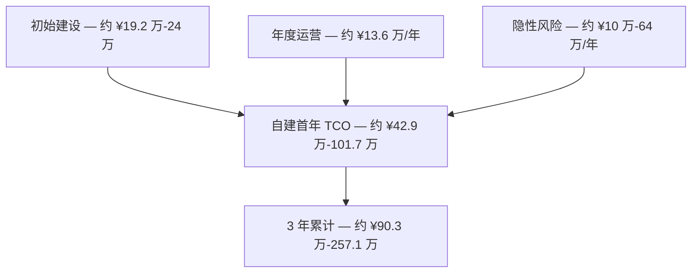
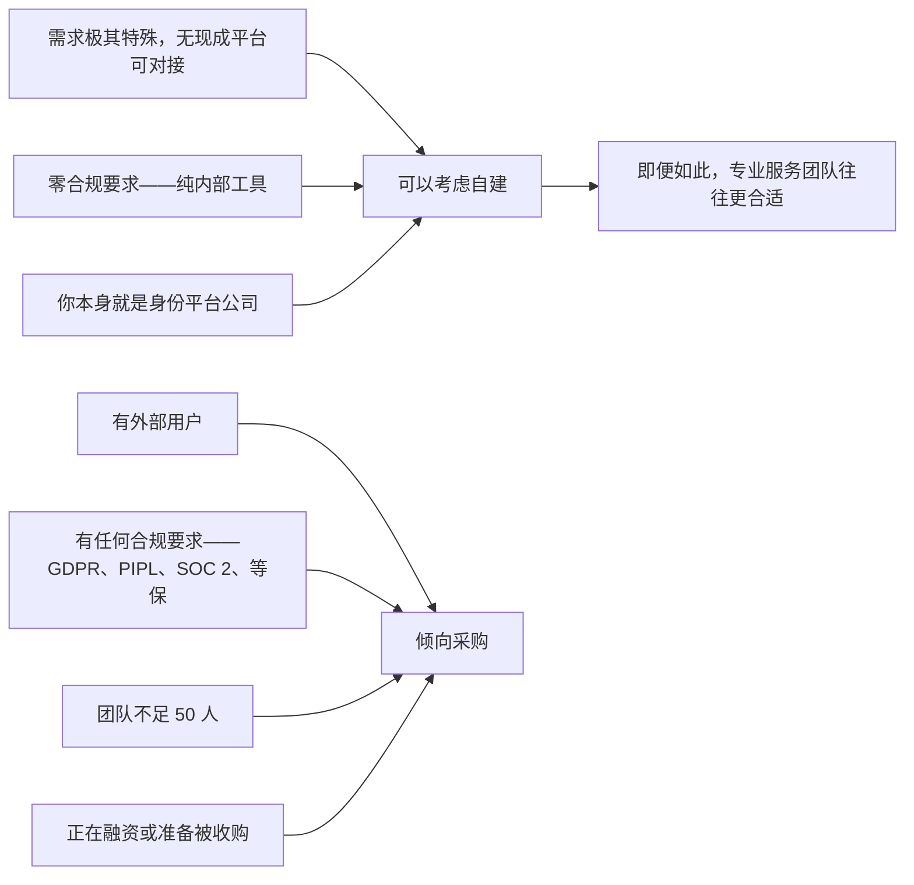

技术圈流传着一个段子：「程序员最贵的一句话不是写代码，而是『这个我也能写』。」这句话放在身份系统上格外贴切。几乎任何一支研发团队都能在一个月内拼出一个「能用」的登录注册系统——密码哈希、JWT 签发、Redis 会话管理。看起来很简单。为什么要每年花几万块买现成的？

答案是：**认证（登录系统）与身份平台是两回事。** 前者是一个功能模块；后者是需要持续投入、持续合规、持续安全的系统工程。两者的差距，就像在自家车库攒一辆卡丁车和运营一条汽车生产线。

> **测算说明**：本文的 TCO 测算基于行业典型场景（一线城市中级工程师薪资、通用云服务定价）。实际成本因团队所在地、技术栈、服务商定价与市场环境而异。合规成本以中国市场为参照，其他地区应以当地监管要求为准。Autional 定价以官网最新定价页为准。

本文不是产品推销——它是一份完整的 TCO 测算，数据你都可以代入自己团队重算。

## TCO 基本公式

对身份系统来说，TCO 可以拆成三个阶段：

```
TCO = Initial Build Cost + Annual Operations Cost + Implicit Risk Cost
```



*图 1：自建 TCO 的三段账——初始建设、年度运营与隐性风险，合成首年与三年累计 TCO。*

下面逐项拆解，并给出公式与合理的市场参考值。

## 第一阶段：初始建设成本

### 基础认证（必做）

| 功能模块 | 工程量 | 说明 |
|---------------|-------------------|-------|
| 邮箱 + 手机号注册/登录 | 15 人天 | 含密码策略、邮箱验证、短信验证码 |
| 社交登录（微信/Google/GitHub） | 10 人天 | 各平台 OAuth 对接 + 令牌管理 |
| JWT 签发与校验 | 5 人天 | 访问令牌 + 刷新令牌机制 |
| 找回密码流程 | 5 人天 | 邮件找回 + 安全校验 + 密码强度检查 |
| 会话管理 | 5 人天 | Redis 存储 + 过期策略 + 并发限制 |
| 基础 RBAC（角色 + 权限） | 10 人天 | 用户-角色-权限模型 + 动态权限校验 |
| **小计** | **50 人天** | **约 2.5 人月** |

### 安全增强（强烈建议）

| 功能模块 | 工程量 | 说明 |
|---------------|-------------------|-------|
| MFA（TOTP + 短信 + 邮件） | 15 人天 | 三种方式 + 恢复码 + 设备管理 |
| 登录风控（限流 + 异地检测） | 10 人天 | IP 限流 + 地理位置异常检测 |
| 密码哈希策略（bcrypt/argon2） | 3 人天 | 算法选型 + 升级迁移机制 |
| API Key 管理 | 5 人天 | 生成/轮换/吊销 + 权限绑定 |
| 会话强制失效 | 3 人天 | 管理员强制下线 + 改密失效 |
| **小计** | **36 人天** | **约 1.8 人月** |

### 合规功能（市场硬要求）

| 功能模块 | 工程量 | 说明 |
|---------------|-------------------|-------|
| 审计日志（完整 + 防篡改） | 10 人天 | 结构化日志 + 哈希链校验 |
| 数据导出（用户数据主体请求） | 5 人天 | GDPR DSAR / PIPL 数据可携带 |
| 数据删除（账号注销 + 数据清理） | 8 人天 | 级联删除 + 审计留存 + 备份清理 |
| 隐私政策 + Cookie 同意管理 | 3 人天 | GDPR/ePrivacy 合规 UI |
| 等保合规（日志留存 180 天 + 加密 + 审计） | 15 人天 | 面向中国市场 |
| **小计** | **41 人天** | **约 2 人月** |

### 初始建设成本合计

```
Initial development effort = 50 + 36 + 41 = 127 person-days ≈ 6.4 engineer-months
```

按中国一线城市中级后端工程师年薪 30 万-45 万元（含福利与办公成本）计，月成本约 3 万-3.5 万元：

```
Initial build cost = 6.4 months × ¥30,000/month × 1 person ≈ ¥192,000
```

如果多人并行（3 人团队分模块同时开发），总人月不变，但日历时间可压缩到 2-3 个月。不过团队越大，沟通成本越高，实际人月通常要上浮 20-30%：

```
3-person parallel build cost = 6.4 × 1.25 × ¥30,000 ≈ ¥240,000
```

## 第二阶段：年度运营成本

### 基础设施

| 资源 | 月成本 | 年成本 |
|----------|-------------|------------|
| 云服务器（4C8G × 2，高可用） | ¥800 × 2 | ¥19,200 |
| 托管 PostgreSQL | ¥500 | ¥6,000 |
| 托管 Redis | ¥300 | ¥3,600 |
| 短信 + 邮件服务 | ¥500 | ¥6,000 |
| 域名 + SSL 证书 | ¥100 | ¥1,200 |
| 监控（托管 Prometheus + Grafana） | ¥300 | ¥3,600 |
| **小计** | **¥3,300/月** | **¥39,600/年** |

### 人力维护

身份系统的维护不是「写完就不管」的事。持续投入包括：

| 维护项 | 频率 | 年度投入 |
|-----------------|-----------|---------------|
| 安全漏洞修补（如 CVE 跟进） | 按需，约 1 次/月 | 12 人天 |
| 依赖升级（Go 版本、第三方库） | 每季度 | 8 人天 |
| 功能迭代（新增 OAuth 提供商、新增 MFA 方式） | 按需 | 20 人天 |
| 合规审计（年度安全审计 + 渗透测试） | 1 次/年 | 15 人天 |
| 值班（处理生产问题与用户支持） | 持续 | 12 人天 |
| **小计** | — | **67 人天/年** |

```
Annual human maintenance cost = 67 person-days ÷ 20.83 person-days/month × ¥30,000/month ≈ ¥97,000/year
```

### 年度运营成本合计

```
Annual operations cost = ¥39,600 (infrastructure) + ¥97,000 (human) ≈ ¥136,000/year
```

## 第三阶段：隐性风险成本

这是 TCO 中最常被忽略的部分——不体现在账面上，但一旦发生就是真金白银：

| 风险事件 | 概率 | 单次损失 | 年化风险成本 |
|------------|------------|-------------|---------------------|
| 安全事件导致数据泄露 | 5%/年 | ¥50 万-500 万（罚款 + 赔偿 + 品牌损失） | ¥2.5 万-25 万 |
| 合规审计不通过（无法服务客户） | 20%/年（初创） | 流失 1-3 家企业客户，每家 ¥10 万-50 万 | ¥2 万-30 万 |
| 功能延期（团队被老功能拖住） | 不适用 | 产品发布推迟 1-3 个月 | 机会成本难以量化 |
| 核心工程师离职带走经验 | 15%/年 | 新人需要 2-3 个月熟悉代码 | ¥6 万-9 万 |
| **隐性风险成本合计** | — | — | **约 ¥10 万-64 万/年** |

你可能会说这些概率只是估算。没错。但关键在于：**这些风险在采购平台时近乎为零**——安全漏洞由厂商修补，合规认证由厂商维持，知识延续性由厂商保证。自建的风险溢价，就是你自己承担的概率 × 损失。

## TCO 汇总

| 成本项 | 第 1 年 | 第 2 年 | 第 3 年 |
|-----------|--------|--------|--------|
| 初始建设 | ¥19.2 万-24 万 | ¥0 | ¥0 |
| 基础设施 | ¥4 万 | ¥4 万 | ¥4 万 |
| 人力维护 | ¥9.7 万 | ¥9.7 万 | ¥9.7 万 |
| 隐性风险 | ¥10 万-64 万 | ¥10 万-64 万 | ¥10 万-64 万 |
| **自建年度 TCO** | **¥42.9 万-101.7 万** | **¥23.7 万-77.7 万** | **¥23.7 万-77.7 万** |
| **3 年累计 TCO** | — | — | **¥90.3 万-257.1 万** |

对比 Autional：

| 版本 | 费用 | 3 年累计 |
|---------|----------------------|-------------------|
| 开源组件（门户/设计系统/SDK）自托管 | 免费（AGPL-3.0 / MIT） | ¥0 |
| 核心身份服务（商业授权，私有化部署含源码访问权） | 商业授权另议 | 以商务报价为准 |
| 云托管 | 路线图中（即将推出） | 尚未提供 |

## 什么时候该自建，什么时候该采购？

### 适合自建的情况：

1. **需求极其特殊**——比如你的身份系统需要与一套 15 年历史的老 ERP 深度耦合，没有现成平台能对接。即便如此，你真正需要的也很可能是专业服务团队，而不是纯自建。

2. **零合规要求**——你的系统是内部工具，没有外部用户、不处理个人信息、不受监管审查。但你仍然需要安全——而安全的隐性成本不会因为不涉及合规就消失。

3. **你本身就是一家身份平台公司**——好吧，如果你要做 Auth0、Keycloak 或 Autional 的竞品，那你确实得自建。但既然你在读这篇博客，多半不是这种情况。

### 适合采购的情况：

1. **你有外部用户**——系统一旦对真实用户开放，任何身份相关的安全事件都是品牌事件。
2. **你有任何合规要求**——无论是面向欧洲用户的 GDPR、面向中国用户的 PIPL、面向企业客户的 SOC 2，还是中国的等保，合规成本都远超平台费用。
3. **团队不足 50 人**——小团队没有余力维护一个完整的身份平台。采购能让你专注核心业务。
4. **你正在融资或准备被收购**——投资人与收购方在做尽职调查时，会仔细审视身份系统是否专业构建。自研的「够用就行」的登录系统是减分项。



*图 2：自建还是采购——左侧三条信号指向「可以考虑自建」，右侧四条指向「倾向采购」；多数 SaaS 产品落在右侧。*

## 结语

这份 TCO 测算的目的不是说「买永远比自建便宜」。事实是：**如果你真的只需要一个登录框，自建一个月可能确实比买一年便宜。** 问题在于，几乎每一款 SaaS 产品需要的都不是「登录框」，而是「身份平台」。身份平台是一项系统工程，需要在安全、合规、功能与运维上持续投入。

算账时把隐性成本算进去，评估时把风险溢价算进去，你会得到一个足够清晰的数字。而这个数字大概率会指向「采购」。

---

*Autional 的开源组件（门户、设计系统与 SDK，AGPL-3.0 / MIT）可免费自托管；核心身份服务为商业授权（私有化部署含源码访问权），详情可[查看定价说明](/pricing)。*
