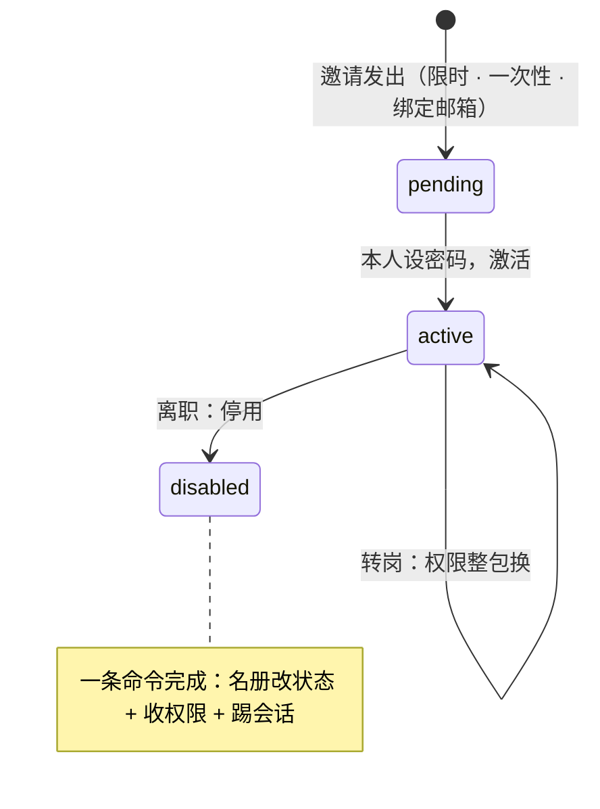
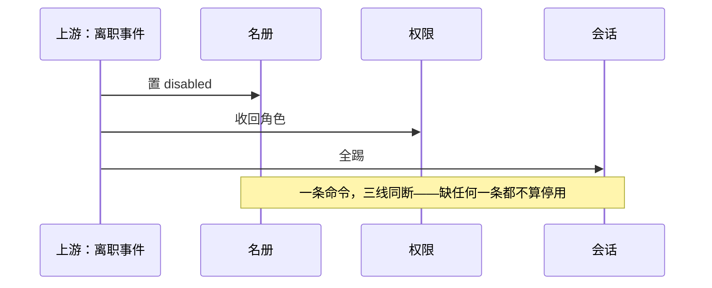

老何是运维，新同事报到的第一天，他干了三件事：建账号、设密码（写在便签上递过去）、按主管口头说的勾了几个权限。

新同事很开心，老何也很熟练。但这种熟练的流程里，埋着三笔迟早要找上门的账：

1. **密码是别人替你设的。** 经手的人知道，便签也可能被谁看见；
2. **权限靠「口头说」、只加不减。** 换岗之后旧权限没人摘，一年后没人说得清他能动什么；
3. **人走了，账号忘了停。** 门没锁，钥匙还在他手上。

这三件事在行业里有统一的说法：**JML（Joiner-Mover-Leaver）——入职、转岗、离职**的账号生命周期管理。它处理的听起来是「行政流程」，实际上每一格都对应真实的事故。

## 三个真实教训

### 夏威夷卫生部（2023）：「人走，门没锁」

2023 年 1 月，夏威夷州卫生部的电子死亡登记系统（EDRS）遭未授权访问（2023 年 3 月公开通报）：一个**未停用的外部旧账号**进了系统——该账号原属一名**已经离开**的医疗证明签署人，人走了，账号没有停。

据报道，约 **3,400 份**死亡记录可能被查看。这起事件谈不上复杂：没有漏洞利用、没有钓鱼，只有一件「忘了做」的事——**人离开时，账号还在名册上。**

### Okta（2022）：「名册外的人」

2022 年 3 月，Okta 披露其第三方客服分包商 Sitel 的一名支持工程师的**工作站被远程访问**，攻击者的访问窗口约为 **2022 年 1 月 16 日至 21 日**（约五天）。

Okta 在分析 **125,000+ 条日志**后表示，**最多 366 家（约 2.5%）**客户的租户可能被访问过；公司随后终止了相关会话并停用了账号。据 Okta 官方口径，攻击者主要通过内部管理工具 SuperUser（SU）操作，而该工具本身是**按最小权限设计**的。

这起事件的教训在「名册」的边界上：**外包人员、第三方支持这类「名册外的人」，是定期清点最容易漏掉的覆盖盲区。** 他们的权限通常收窄得当，但「谁还在、谁已经不该在」这件事，往往没人持续盯着。

### Twitter（2020）：「合法入口」被滥用

2020 年 7 月，约 **130 个**高知名度账号被盯上，其中约 **45 个**被接管并用于发布诈骗内容。攻击者用**电话社工**骗取了内部员工凭证，随后通过**内部账号管理工具**操作（该工具可以改绑定邮箱，进而发起改密）。

公司事后限制了对该工具的访问并加强了审查。这起事件的攻击链有个刺眼之处：**认证侧被冒用之后，攻击者走的是授权侧的「合法入口」。** 内部管理工具是必要的能力，但正因为它必要，它是最该被看着的那把钥匙。

## 一条生命线，三格状态

JML 的工程实现，是把「开账号、给权限、收回」放进**同一条生命线**，用一个简单的状态机表达：

| 状态 | 账号 | 权限包 | 会话 |
|:--|:--|:--|:--|
| **待入职**（pending） | 已建未激活 | 未发 | 无 |
| **在职**（active） | 可用 | 按工种整包挂载 | 有（可查、可踢） |
| **已停用**（disabled） | 关闭入口 | 收回 | **全灭（会话一起踢）** |

*图 1：一条生命线三格状态——入职 pending → active、转岗只换权限包、离职 active → disabled；停用是一条命令，不是一个序列。*

关键设计有三点：

- **邀请代替手建。** 新人靠一张**限时、一次性、绑定邮箱**的邀请进来，**密码由本人设置**——从源头消灭「密码经手别人」。这是标准做法：NIST SP 800-63A 把注册与登记（enrollment）单立成篇，就是为了把「账号怎么来的」说清楚。
- **停用是一条命令，不是一串操作。** 状态置为 disabled 时，**名册改状态 + 权限收回 + 会话全踢**一次完成。「账号停了、人还挂着」这种半状态，是设计缺陷，不是操作失误。
- **停用 ≠ 抹掉。** 停用关的是入口；数据保留与删除是另一条线（受数据保留政策与合规要求管辖），别在离职流程里顺手删数据。

*图 2：停用泳道——上游一个离职事件，名册、权限、会话三线同断；缺任何一条，「人走」就只是名册上的一个词。*

标准侧的对应关系是现成的：NIST SP 800-53 的 **AC-2（账户管理）** 明确要求停用不活跃账号（AC-2(3)）、临时账号自动到期（AC-2(2)）；SP 800-63B-3 §6 讲认证器的绑定、丢失、吊销、续期（-4 版中移入 §4「认证器事件管理」）——**认证器的生命周期和账号的生命周期是两条并行的时间线，离职时要一起处理**（踢会话就是处理认证器侧）。

## 权限的四段线：申请、审批、回头看、还回来

账号生命周期之外，权限本身还有一条独立的生命周期。成熟做法把它分成四段：

| 段 | 管什么 | 缺了会怎样 | 落地形态 |
|:--|:--|:--|:--|
| **申请** | 写下要借什么 | 事后说不清「谁要的」 | 借条（工单） |
| **审批** | 别人点头、自己不能批自己 | 一个人自己说了算 | 审批流（不能自批、过期自动拒） |
| **回头看** | 隔一阵清点「还在用吗、还该有吗」 | 只加不减、越滚越宽 | 定期复查（recertification） |
| **还回来** | 人走 / 到期：收回，连开着的门一起关 | 门一直开着 | 停用 + 撤角色 + 断会话 |

这一套在合规里全是硬要求：NIST SP 800-53 的 **AC-6(7)**（按频率复查用户权限）、**AC-2(3)**（停用账户）、**AC-6**（最小权限）、**AC-5**（职责分离）；**ISO/IEC 27001 的 A.9.2.5**（2013 版编号，2022 版为 A.5.18：用户访问权定期复查）；**PCI DSS** 要求访问权定期复查（v4.0 起要求至少每 6 个月一次）。微软 Entra 的 PIM（Privileged Identity Management）是这套思路的工业实现：特权**即时激活**、可按角色要求审批、激活**最长 24 小时**、**不能自批**。

「回头看」的频率是取舍：太频拖累业务、太疏形同虚设。合理的做法是按风险分级——**动钱、动权、能看一堆人的，才层层走；小事不必**。但前提是复查**真看**：不真看的复查，等于没查。

## 从手建到同步：SCIM 与 LDAP

规模上来之后，「谁来开账号、谁来停账号」的答案会从「管理员」变成「上游名册」：

- **过去**：管理员手建，密码便签递送，权限口头勾选；
- **现在**：上游人资系统（HRIS）持有权威名册，入职自动开、离职自动停；
- **协议**：**SCIM 2.0**（RFC 7643 / RFC 7644，2015 年 9 月发布）是现代主流——一套 REST 接口做用户的创建、更新、停用；企业内网侧则常见 **LDAP**（RFC 4511，目录服务）。

同步的诚实边界：**自动同步有快慢，空档得自己盯。** 上游改了、下游还没收到的那段时间，账号处于「该停未停」的窗口。冲突策略（skip / overwrite / merge）要在接入时就定好，别等第一次冲突现场拍脑袋。

## 管理员扮演：最该被看着的那把钥匙

有些场景下，管理员必须「变成」用户来解决问题——比如复现故障、协助排查。这个能力（impersonation / 扮演）本身不是原罪，**问题是它往往没有留痕、没有时限、没有理由。**

治理「扮演」有三个要件：

1. **谁来扮演**：只限最高管理员，且不能扮演自己、不能跨租户；
2. **带证据**：签发的临时凭证里要带上「谁在扮演、为什么、这次扮演的编号」（`impersonated_by` / `imp_reason` / `imp_id`）；
3. **有时限 + 有留痕**：临时凭证短时有效（如 1 小时），起手即落审计（warn 级别，含编号与理由），提供「一键退出扮演」。

判据一句话：**能变成你，不是本事；能说清是谁变的、变了多久，才是。**

## Autional 的做法

账号生命线落在 `tenant-service` 与 identity 服务：

1. **请帖机制（`TenantInvitation`）**：新人凭邀请进入——限时（`ExpiresAt`）、一次性（`AcceptedAt`）、邮箱字段加密、可带默认角色；邀请事件全记录（Created / Accepted / Revoked / Resent / Expired / Deleted）；准入模式三选一：自由注册（open）、审批（approval_required）、仅邀请（invitation_only）。
2. **成员状态机（`TenantMember`）**：`active / pending / disabled`——停用时名册改一格、角色收回、**会话全踢**（`ListActiveSessions` + 踢下线）一次完成。
3. **权限默认最小**：新成员先挂租户默认角色（`TenantDefaultRole`），要加走审批（`ApprovalRequest`：自己提的不能自己批、过期自动拒、执行前再跑一次职责分离检查）。
4. **到期自动清**：临时角色与临时审批由 `ExpiredRoleCleaner` 到期清理；改权限前可以用 `SimulatePermission` 先试算影响面。
5. **上游同步**：提供 SCIM 2.0（`scim_handler.go`）与 LDAP/AD（`ldap_sync`）对接，入职自动开、离职自动停。
6. **扮演治理**：impersonation 仅 super_admin 可发起、不能扮自己、目标必须同租户；临时凭证带 `impersonated_by / imp_reason / imp_id`，TTL 1 小时，起手记录 `admin.impersonation.login`（warn 级），一键 `stop-impersonation` 退回管理员。

诚实边界：部门与组织信息在 `tenant-service`，我们的实现只保存引用；PIM 的审批要求按角色可配（并非所有激活都需审批）。另外，「人走了权限自动没」不会发生——**任何时候都需要有人执行「还回来」这一步**（自动化只是把这个动作接到上游事件上，不会让它可以被省略）。

## 常见误区

- 「开账号就是点一下」——是「请、给、收」三件事串成的一条生命线；
- 「离职 = 退块工牌」——还要收权限、踢会话，不然账号停了、他那头还挂着；
- 「停用 = 删干净」——停用只是关闭入口，数据删除是另一条线；
- 「自动同步 = 不用管」——同步有快慢，空档得自己盯；
- 「批了就永久归他」——借的，要回头看、要到期；
- 「人走了权限自动没」——不会自己没，得有人还回来；
- 「复查走过场就行」——不真看，等于没查；
- 「把名字从名册上摘掉就完事」——还得把他开着的门一起关，否则账上没了、人还能进。

## 结语

账号不是「开」出来的，是**「请」进来的**；权限不是一个个「勾」的，是**按工种整包发的**；人走的时候，不是退块工牌——是把**门、钥匙、还开着的灯，一起断掉。**

下次你换工作、离职，或者只是给自己团队做一次账号盘点，先问三句话：

**新人的密码，有没有经手别人？权限是整包给的，还是一个个勾的？人走的时候，除了退工牌，会不会把「还登着的设备」一起踢掉？**
