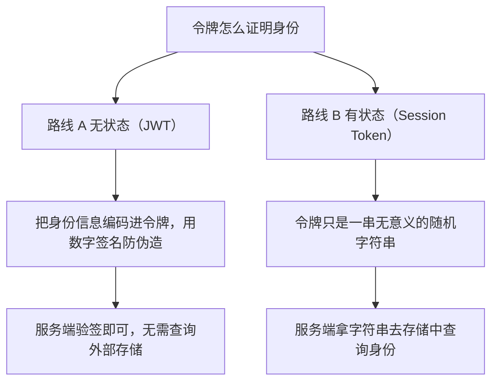
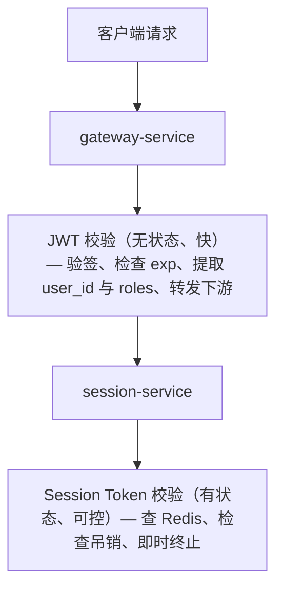

令牌是身份认证系统的血液。每一次 API 调用，都有一个令牌在客户端与服务端之间流动，承载着「我是谁」的信息。但令牌并非千篇一律——选错令牌架构，会直接影响系统的安全、性能与架构复杂度。

最常见的两种令牌——JWT（JSON Web Token）与 Session Token——代表了身份系统设计的两条哲学路线：**无状态**与**有状态**。本文完整对比两种路线，并介绍 Autional 的 session-service 如何同时支持两种模式，让你针对不同场景做出最优选择。

## 令牌的本质：携带什么，如何携带

在展开对比之前，先回答一个根本问题：**令牌到底是什么？**

令牌是认证完成后服务端签发给客户端的凭证。客户端在随后的每次请求中携带这份凭证，服务端校验其有效性以确认请求方身份。

令牌需要承载的核心信息是：**谁在发起请求（身份标识）+ 这份凭证被服务端认可（防伪造）**。

这两项需求可以用两种截然不同的方式满足：

**路线 A（无状态）**：把身份信息直接编码进令牌，用数字签名防伪造。客户端持有完全自包含的令牌，服务端无需查询任何外部存储即可完成校验——这就是 **JWT** 的核心思想。

**路线 B（有状态）**：令牌只是一串无意义的随机字符串。签发时，服务端把这串字符串与对应用户信息一起存到后端。每次请求，服务端用令牌字符串去存储中查询身份信息——这就是 **Session Token** 的核心思想。



*图 1：两条路线的分野——JWT 把身份装进令牌本体，Session Token 把身份留在服务端存储。*

理解了这两条路线，两种令牌各自的强项与局限就一目了然了。

## JWT 深度剖析：无状态的代价与收益

### JWT 的结构

一个典型的 JWT 由三部分组成，用 `.` 分隔：

```
eyJhbGciOiJSUzI1NiJ9.eyJzdWIiOiIwMUFSO....  ← Header
.sdfsdfwefwefwefwefwefwefwefwefwefwefwef...  ← Payload
.sdfsdfwefwefwefwefwefwefwefwefwefwefwef...  ← Signature
```

- **Header**：描述签名算法（如 RS256、HS256）与令牌类型
- **Payload**：存放 claims，包括标准 claims（`sub`、`iss`、`exp`、`iat`）与自定义 claims（`tenant_id`、`roles`、`permissions`）
- **Signature**：对前两部分签名，保证令牌未被篡改

### JWT 的真实优势

**1. 真正的无状态**

这是 JWT 的核心卖点。服务端无需维护会话存储，也无需在每次请求时查询外部缓存。在微服务架构中，这意味着服务 A、服务 B、服务 C 可以各自独立校验同一个 JWT，而无需共享任何状态。

Autional 的架构完美体现了这一优势：identity-service 签发 JWT 后，包含 session-service、profile-service、wallet-service 在内的全部 27 个微服务都能独立校验。无需每次询问签发方。

**2. 水平扩容无需状态同步**

用 Session Token 时，如果第一个请求被路由到服务器 A，第二个请求到了服务器 B，而会话只存在于服务器 A 的内存中，服务器 B 就会要求重新认证。解决办法是共享存储（如 Redis）——但这又引入了新的复杂度。JWT 从根本上规避了这个问题。

**3. 自包含的信息携带**

JWT 的 Payload 可以携带用户角色、权限、租户 ID 等信息。服务收到 JWT 后无需额外查询，就能直接得知请求方的身份属性。这对网关层的粗粒度授权尤为高效——Autional 的 gateway-service 可以仅凭 JWT 中的角色 claims 决定是否转发请求，无需查询任何下游服务。

### JWT 的真实痛点

**1. 令牌吊销——一个近乎无解的问题**

这是 JWT 最大的架构缺陷。因为 JWT 是无状态的，服务端无法主动「吊销」一个已签发的 JWT。在过期时间（`exp`）到达之前，它一直有效。

常见的缓解手段包括：

- **令牌黑名单**：维护一份已吊销 JWT ID（`jti`）的清单，每次校验都查询一次。但这等于把状态又加了回来，抵消了 JWT 的无状态优势。
- **缩短令牌有效期**：把访问令牌有效期压到 5-15 分钟，配合刷新令牌使用。这是最主流的做法，也是 OAuth 2.0 推荐实践。
- **版本号 / 序列**：在用户表中维护 `token_version`，签发时写入 JWT。需要吊销时递增版本号——所有旧令牌立即失效。但代价是每次校验都要查库。

**2. 令牌体积膨胀**

JWT 的 Payload 携带的信息越多，令牌就越大。一个带有 15 条权限 claims 的 JWT 可以达到 2-3 KB。在高频 API 调用场景下，这意味着每个请求都多出 2-3 KB，在移动网络或 WebSocket 连接上可能成为性能瓶颈。

**3. 密钥轮换复杂**

JWT 的签名依赖密钥。当需要轮换密钥时（安全事件、定期更换），存量令牌是用旧密钥签的，但服务端需要知道该用哪把密钥来校验。这要求实现 JWK（JSON Web Key）与 `kid`（Key ID）机制，增加了运维复杂度。

## Session Token 深度剖析：表面笨重，内里优雅

### Session Token 的工作方式

```
1. User logs in → Server verifies credentials
2. Server creates a Session (generates random Session ID + stores user info) → Returns Session ID to client
3. Client carries the Session ID on subsequent requests (Cookie or Header)
4. Server queries storage by Session ID → retrieves user info → verification passes
```

### Session Token 的真实优势

**1. 即时吊销——杀手级能力**

因为会话信息存在服务端，吊销只需一个操作：删除对应的会话记录。管理员可以立即终止任意用户的会话，无需等待令牌自然过期。在安全事件中，这个能力不是「有更好」，而是「必须有」。

Autional 的 session-service 正是为此而生：管理员调用 `DELETE /api/v1/internal/session/{session_id}` 即可立即终止会话。被吊销的会话在毫秒级内对后续所有请求失效。

**2. 不向客户端暴露任何信息**

Session Token 是不透明的随机字符串（如 ULID），不包含任何敏感信息。即使令牌在传输中被截获，攻击者也无法从令牌本身提取出用户身份、角色、权限等信息。

相比之下，JWT 的 Payload 只是 Base64 编码（并未加密）——任何人都能解码读取其内容。

**3. 令牌体积恒定**

无论用户有多少权限、多少角色，Session Token 始终是一串短短的字符串。在高频 API 调用场景下，意味着每个请求的网络开销更小。

**4. 细粒度的会话管理**

服务端会话存储带来许多能力：设置会话过期时间、记录会话活跃时间戳、追踪同一用户的所有活跃会话、限制并发会话数、实现「登出所有设备」。

Autional 的 session-service 支持以上全部能力，包括会话超时、闲置超时、最大并发会话限制与会话审计日志。

### Session Token 的真实痛点

**1. 需要共享存储**

每次请求都要查询会话存储。单机部署时用内存即可；但在分布式部署中必须使用共享存储（如 Redis），引入额外的依赖与复杂度。

**2. 存储成本**

在大规模系统中，会话存储本身就是一笔不小的成本。每个活跃用户至少占用一条会话记录，上千万用户就意味着上千万条会话记录。

**3. 跨微服务的状态同步**

当多个微服务都需要校验会话时，每个服务都得访问会话存储。相比 JWT 的自包含校验，这增加了网络延迟。

## 深度对比：五维对决

| 维度 | JWT | Session Token |
|-----------|-----|---------------|
| 校验性能 | 本地密码学/签名校验，极快 | 需查询外部存储，增加网络延迟 |
| 吊销能力 | 弱（需黑名单或版本机制） | 强（删一条记录即可） |
| 水平扩容 | 原生支持，无需共享存储 | 需要共享存储（Redis/DB） |
| 信息携带 | 自包含，Payload 携带身份信息 | 零信息，令牌是随机串 |
| 客户端载荷大小 | 易膨胀，1-3 KB | 恒定，约 26 个字符 |
| 安全事件响应 | 慢（依赖 TTL 到期或黑名单） | 快（即时吊销） |
| 微服务友好度 | 任何服务可独立校验 | 需要共享状态或统一查询端点 |
| 运维复杂度 | 密钥轮换、JWK、kid 管理 | Redis 集群维护 |
| 合规性 | GDPR「删除权」难以实现 | 删除会话记录即可 |

## 实战决策树

### 适合选用 JWT 的场景

1. **纯 API 服务、无用户界面**：调用方是另一个微服务，没有浏览器环境，用 Cookie 不方便。
2. **网关层快速鉴权**：JWT 的自包含特性让网关无需回查后端即可做出路由决策。
3. **需要跨服务传递身份信息**：在 Autional 架构中，gateway-service 用 JWT 校验身份，再通过 Header 把用户信息传给下游服务。
4. **高吞吐、低延迟要求**：每次请求少一次 Redis 查询，能显著降低 p99 延迟。

### 适合选用 Session Token 的场景

1. **需要即时吊销能力**：任何面向终端用户的产品，都需要在发现风险行为时立即终止会话。
2. **安全敏感型应用**：金融、医疗、政务——这些行业需要追踪并管控每一个会话。
3. **有合规要求**：等保三级要求能够实时终止异常会话。
4. **需要细粒度会话管理**：需要查看某用户的所有活跃会话、限制并发登录、记录会话活动日志。

## Autional 的方案：双模式并存

Autional 的设计理念是：**你不应该在 JWT 与 Session Token 之间被迫二选一。** session-service 同时支持两种模式，各自在 Autional 架构中承担相应角色：



*图 2：Autional 的双模式校验路径——gateway-service 用 JWT 做无状态快校验，session-service 用会话记录做有状态管控。*

### 具体机制

**JWT 作为前端令牌**：客户端（浏览器、移动 App）持有 JWT。它携带 `user_id`、`tenant_id` 与基础角色信息，供 gateway-service 做快速校验与路由。

**Session Token 作为后端会话**：identity-service 签发 JWT 的同时，会在 session-service 中创建对应的 Session 记录。JWT 的 `jti`（JWT ID）与 Session ID 绑定。

**双重吊销保障**：
- 日常场景：JWT 有效期较短（默认 15 分钟），配合刷新令牌自动续期，减少吊销需求。
- 紧急场景：管理员通过 session-service 吊销 Session 记录。虽然 JWT 本身仍在有效期内，但 gateway-service 在关键操作（改密、销号、资金交易等）时会回查 session-service，确认 Session 是否有效。

这套设计既保留了 JWT 的高性能（网关层快速校验），又保留了 Session Token 的可控性（关键操作实时检查）。

## 令牌生命周期管理

无论你选择哪种令牌，以下机制对任何身份系统都必不可少：

### 访问令牌 + 刷新令牌

这是现代身份系统的标准模型：

- **访问令牌（Access Token）**：短有效期（15 分钟），用于 API 调用认证。Autional 的 identity-service 签发 JWT 格式的访问令牌。
- **刷新令牌（Refresh Token）**：长有效期（7 天），仅用于获取新的访问令牌。刷新令牌存储在 session-service 中，可随时吊销。

令牌过期后的自动续期流程：
```
Client Request → API → 401 (Token Expired) → Client uses Refresh Token to get new Access Token → Retry original request
```

### 令牌轮换

Autional 实现了刷新令牌轮换机制：每次用刷新令牌换取新的访问令牌时，旧刷新令牌立即失效，同时签发一个新的刷新令牌。这从根本上防范了刷新令牌被盗后被复用：

- 合法用户正常操作 → 每次轮换产生新的刷新令牌
- 攻击者尝试使用已轮换的刷新令牌 → 系统检测到「重用」→ 吊销该用户的全部刷新令牌 → 要求重新登录

### 强制吊销场景

Autional 通过 session-service 的 API 支持以下吊销场景：

| 场景 | API | 触发条件 |
|----------|-----|-------------------|
| 修改密码 | `DELETE /sessions?user_id=X` | 用户主动修改密码 |
| 异常检测 | `DELETE /sessions?user_id=X` | 自适应 MFA 检测到高风险行为 |
| 管理员强制下线 | `DELETE /sessions/{session_id}` | 管理员手动终止可疑会话 |
| 账号锁定 | `DELETE /sessions?user_id=X` | 账号被管理员禁用 |
| 登出所有设备 | `DELETE /sessions?user_id=X` | 用户选择「登出所有设备」 |

每次吊销操作都会触发审计事件，记录操作人、时间与被吊销的 Session ID，确保满足合规要求的可追溯性。

## 总结

JWT 与 Session Token 不是竞争关系——它们是互补关系。一套成熟的身份系统需要两者协同工作：

- **JWT 负责快速校验**：让网关层在每次请求上都保持低延迟
- **Session Token 负责精细管控**：支撑安全敏感检查与即时吊销

Autional 的 session-service 正是基于这一理念构建的。你不必在「性能」与「安全」之间做取舍——两者可以兼得。
