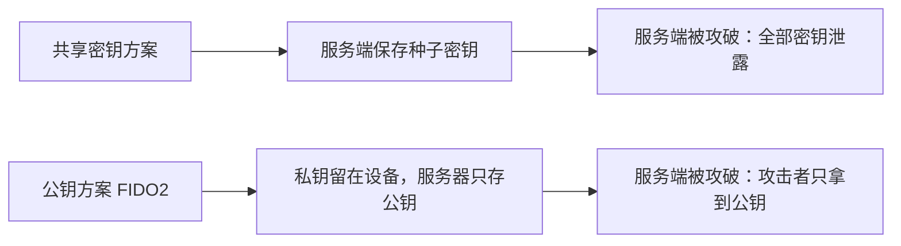
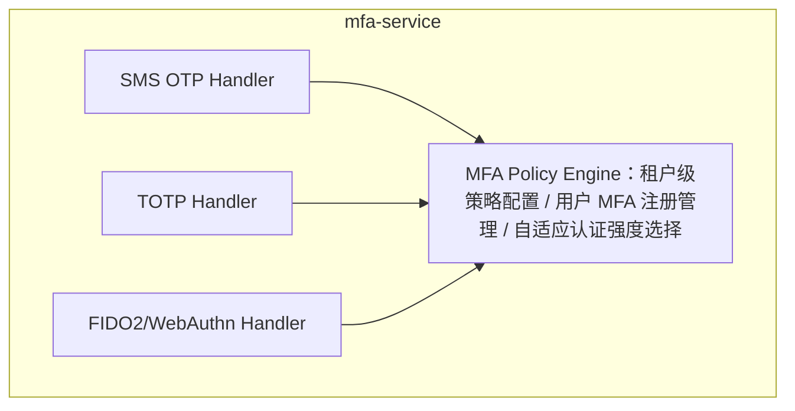

多因素认证（MFA）是抵御账号接管最有效的防线。微软的研究显示，MFA 可以阻断 99.9% 的账号失陷。但「MFA」是一个统称——具体技术实现之间的安全差距极其悬殊。

本文把四种主流 MFA 协议摆在一起，从协议层到安全层逐层剖析。

## 四种 MFA 协议速览

| 协议 | 提出年份 | 标准 | 认证因素 | 交互方式 |
|------|----------|------|---------|---------|
| 短信 OTP | 1990 年代 | 无统一标准 | 你所拥有的（手机号） | 接收短信，手动输入 |
| HOTP | 2005 | RFC 4226 | 你所拥有的（HMAC 计数器） | 硬件令牌或 App 展示，手动输入 |
| TOTP | 2008 | RFC 6238 | 你所拥有的（HMAC 时间同步） | App 显示 6 位码，手动输入 |
| FIDO2 | 2018 | W3C + FIDO | 你所拥有的（私钥）+ 你所是的（生物特征） | USB/NFC/BLE 触碰，或指纹/人脸确认 |

## 短信 OTP：最弱的 MFA，却最普及

### 工作原理

```
1. User enters phone number on login page
2. Server generates 4-6 digit random code, valid for 5 minutes
3. Server calls SMS gateway API to send the code to the user's phone
4. User receives SMS and enters the code
5. Server compares — match means pass
```

短信 OTP 的安全性依赖一个假设：**手机号可以唯一且安全地标识一个用户。** 但在 2026 年，这个假设已经非常脆弱。

### 安全弱点

**1. SIM 卡交换攻击**

攻击者通过社会工程向运营商申请补卡，把目标的手机号转移到自己掌控的 SIM 卡上。一旦得手，发往该号码的所有短信都能被其接收——包括 MFA 验证码。

2024 年，美国 SEC 的 X（原 Twitter）账号就是通过 SIM 卡交换 + 短信 OTP 劫持被攻陷的。

**2. SS7 协议漏洞**

SS7（7 号信令系统）是电信运营商之间的信令协议，设计于 1970 年代，几乎没有考虑安全问题。能访问 SS7 的攻击者（通常通过被攻陷的海外小型运营商或黑市接入）可以拦截或重定向短信。

**3. 钓鱼攻击**

用户可以在钓鱼网站上输入短信验证码，攻击者立即将其转发到真实网站。这种实时钓鱼对短信 OTP 完全有效——因为短信 OTP 没有来源绑定。

**4. 无加密、无完整性保护**

短信在运营商网络中以明文传输。基站、核心网设备、国际信令网关——任何一个节点都可以窃听。

### 评分卡

| 维度 | 评分 | 说明 |
|-----------|-------|-------|
| 安全性 | ★★☆☆☆ | 易受 SIM 卡交换、SS7 劫持、钓鱼攻击 |
| 用户体验 | ★★★☆☆ | 需等待短信送达，信号差时体验糟糕 |
| 部署成本 | ★★★★★ | 只需一个短信网关 API，客户端零部署 |
| 抗钓鱼 | ★☆☆☆☆ | 无来源绑定，钓鱼站点可直接转发 |
| 离线可用 | ★☆☆☆☆ | 依赖蜂窝网络覆盖 |

## HOTP：基于事件的 HMAC 一次性密码

### 工作原理

HOTP（HMAC-based One-Time Password）使用一个共享密钥与一个递增计数器生成一次性密码：

```
HOTP(K, C) = Truncate(HMAC-SHA-1(K, C))
Where:
  K = Shared secret (at least 128 bit, recommended 160 bit)
  C = 8-byte counter, increments after each use
  Truncate = Extract 6-8 decimal digits from HMAC result
```

```
Initialization:
  Server generates random secret K
  Server encodes K as URI or QR code (otpauth://hotp/...)
  User scans with App, App stores K, counter C initialized to 0

Authentication:
  Server sends challenge (waiting for user input)
  User presses hardware token button or App generate button
  App internally: C += 1, OTP = HOTP(K, C), display OTP
  User enters OTP
  Server: retrieves K and C from DB, computes OTP' = HOTP(K, C)
  If OTP == OTP', verification passes, C += 1

Counter sync issue:
  If the user accidentally presses the token (generates OTP but doesn't use it),
  the App's C and server's C become out of sync.
  Solution: server tries C, C+1, C+2... when verifying OTP
  (Window size configurable, typically 5-10)
```

### 特性

HOTP 的标志性特征是**事件驱动**——每次生成 OTP 都需要用户主动操作。这既是优点（可离线使用，无需时钟同步），也是缺点（误触会导致计数器漂移）。

最适合的场景：为离线环境中的员工提供一次性密码的硬件安全令牌。

### 评分卡

| 维度 | 评分 | 说明 |
|-----------|-------|-------|
| 安全性 | ★★★☆☆ | HMAC-SHA1 的密码学强度足够，但 OTP 可被钓鱼 |
| 用户体验 | ★★☆☆☆ | 需按键生成、手动输入，存在计数器同步问题 |
| 部署成本 | ★★★★☆ | 可用软件 App，硬件令牌需要分发 |
| 抗钓鱼 | ★☆☆☆☆ | 与短信 OTP 一样，OTP 可被转发 |
| 离线可用 | ★★★★★ | 无需时间同步，无需网络 |

## TOTP：基于时间的 HMAC 一次性密码

### 工作原理

TOTP（Time-based One-Time Password）是 HOTP 的时间变体——把计数器替换为当前时间戳：

```
TOTP(K, T) = HOTP(K, floor(T / X))
Where:
  K = Shared secret (typically 80 bit, Base32 encoded as 16 characters)
  T = Current Unix timestamp (seconds)
  X = Time step (typically 30 seconds)
```

```
Example:
  K = "JBSWY3DPEHPK3PXP" (Base32)
  T = 1715692800 (some Unix timestamp)
  X = 30 seconds
  
  C = floor(1715692800 / 30) = 57189760
  OTP = TOTP(K, T)
  
  Valid for [T, T+29] — 30-second window
```

你熟悉的各种 Authenticator App（Google Authenticator、Authy、Microsoft Authenticator）就是这样工作的。6 位数字每 30 秒刷新一次，全程无需联网。

### 安全加固

**时间同步容差**

客户端与服务端的时钟永远无法完美同步。服务端通常会允许 ±1 个时间步的容差（接受上一个或下一个 30 秒窗口内产生的 OTP）。

**防重放**

服务端必须记住最近已校验过的 OTP，防止在同一个 30 秒窗口内被重复使用。

Autional mfa-service 的防重放实现：

```go
func VerifyTOTP(userID, secret string, otp string) (bool, error) {
    now := time.Now().Unix()
    
    for offset := -1; offset <= 1; offset++ {
        t := now + int64(offset*30)
        expected := computeTOTP(secret, t)
        
        if otp == expected {
            key := fmt.Sprintf("totp:used:%s:%s:%d", userID, otp, t/30)
            if redis.Exists(key) {
                return false, ErrOTPReused
            }
            redis.Set(key, "1", 60*time.Second)
            return true, nil
        }
    }
    return false, nil
}
```

### 评分卡

| 维度 | 评分 | 说明 |
|-----------|-------|-------|
| 安全性 | ★★★★☆ | 密码学强度高，30 秒自动过期，但 OTP 仍可被钓鱼 |
| 用户体验 | ★★★★☆ | App 自动刷新，支持复制粘贴或自动填充 |
| 部署成本 | ★★★★★ | 用户只需在手机上装一个免费 App |
| 抗钓鱼 | ★★☆☆☆ | 30 秒窗口有所帮助，但实时钓鱼仍可转发 |
| 离线可用 | ★★★★★ | 纯时间计算，无需网络 |

## FIDO2/WebAuthn：最强的 MFA

FIDO2 与前三种 MFA 方式有本质区别——它基于公钥密码学，而非共享密钥。

### 核心差异

```
TOTP/HOTP/SMS OTP approach (shared secret):
  Server knows secret → generates expected OTP
  User knows secret → generates actual OTP
  If OTP matches → user holds correct secret

  ⚠ Problem: server stores the secret. If the server is breached, all secrets leak.

FIDO2 approach (public-key cryptography):
  User device generates key pair → private key stored securely in device → public key sent to server
  Server sends random challenge → device signs with private key → server verifies with public key

  ✅ Advantage: server only stores public keys. Even if the server is breached, attackers only get public keys.
```



*图 1：共享密钥与公钥两种信任模型——前者把全部风险压在服务端，后者让服务端被攻破也拿不到任何用户凭据。*

### FIDO2 为什么能抗钓鱼

钓鱼攻击的做法是把用户引到一个与真实站点几乎一模一样的假站点，诱骗用户输入凭证。但在 FIDO2 下：

1. 假站点的域名与真实站点不同
2. 浏览器在调用 WebAuthn API 时会校验当前页面的来源（协议 + 域名 + 端口）
3. 注册时 `rp.id` 已经绑定
4. 认证器会检查请求的 `rp.id` 是否与注册时一致
5. 不一致 → 认证器拒绝签名
6. 即使钓鱼页面做到以假乱真，攻击者也过不了认证器这一关

这是协议级的钓鱼防护——不是「提醒用户检查网址」，而是在错误的域名下密码学意义上就不可能认证成功。

### 评分卡

| 维度 | 评分 | 说明 |
|-----------|-------|-------|
| 安全性 | ★★★★★ | 公钥密码学 + 来源绑定 + 硬件安全芯片 |
| 用户体验 | ★★★★★ | 一键指纹/人脸登录，或插入密钥轻触 |
| 部署成本 | ★★★☆☆ | 需服务端支持与现代浏览器（覆盖率 95%+） |
| 抗钓鱼 | ★★★★★ | 协议级来源绑定，钓鱼站点无法通过 |
| 离线可用 | ★★★★☆ | 认证过程无需网络（注册时需要） |

## 综合对比矩阵

| 维度 | 短信 OTP | HOTP | TOTP | FIDO2 |
|-----------|---------|------|------|-------|
| 密码学基础 | 随机数 | HMAC-SHA1 | HMAC-SHA1 | ECDSA/EdDSA |
| 密钥存储 | 服务端 | 双方共享 | 双方共享 | 私钥在设备，公钥在服务端 |
| 抗钓鱼 | 无 | 无 | 极弱（30 秒窗口） | 强（来源绑定） |
| 抗 SIM 卡交换 | 无 | 不适用 | 不适用 | 不适用 |
| 离线可用 | 否（需蜂窝网络） | 是 | 是 | 是 |
| 用户交互 | 等短信 → 输入 | 按按钮 → 输入 | App 自动 → 输入 | 生物特征 / 轻触 |
| 设备依赖 | 手机 + SIM 卡 | 硬件令牌或 App | App | 平台认证器或硬件密钥 |
| 丢失风险 | SIM 卡损坏 | 令牌损坏 | 手机丢失 | 设备丢失 |
| 恢复方案 | 补卡 | 备用令牌 | 备用恢复码 | 替代认证方式 |
| 单用户成本 | 约 $0.007/条 | 令牌约 $1-30 | 免费 | 免费-$70 |
| 安全评分 | 2/5 | 3/5 | 4/5 | 5/5 |
| 推荐场景 | 过渡期或低风险 | 离线工业环境 | 通用 MFA | 高安全场景 |

## Autional 的多通道 MFA 架构

Autional mfa-service 统一管理上述所有 MFA 协议：



*图 2：mfa-service 架构——三种协议 Handler 汇聚到同一个 MFA Policy Engine，策略、注册与认证强度都由引擎统一管理。*

### 多通道注册

用户可以在安全设置中同时注册多种 MFA 方式：

```json
{
  "user_id": "01ARZ3NDEKTSV4RRFFQ69G5FAV",
  "mfa_methods": [
    {
      "type": "totp",
      "device_name": "iPhone Authenticator",
      "registered_at": "2026-01-15T10:30:00Z",
      "is_primary": false
    },
    {
      "type": "webauthn",
      "device_name": "YubiKey 5C NFC",
      "credential_id": "base64url...",
      "registered_at": "2026-03-22T14:00:00Z",
      "is_primary": true
    },
    {
      "type": "sms_otp",
      "phone_number": "+86138****8000",
      "registered_at": "2026-01-15T10:30:00Z",
      "is_primary": false
    }
  ],
  "backup_codes_remaining": 8
}
```

系统默认使用用户配置的主认证方式。当主方式不可用时会自动回退到替代方式（如硬件密钥不在身边）。

### 自适应 MFA 策略

Autional 的自适应 MFA 引擎根据登录风险分动态选择认证方式：

```
Risk Score 0-30 (Low Risk):
  → User can log in with password, MFA not required

Risk Score 31-60 (Medium Risk):
  → Prompt user for TOTP verification

Risk Score 61-85 (High Risk):
  → Force FIDO2/WebAuthn verification
  → TOTP not accepted (may be phished)

Risk Score 86-100 (Critical Risk):
  → Deny login
  → Trigger security alert
```

管理员可以按租户配置风险阈值与对应的认证策略。

## 选型建议

| 场景 | 推荐 MFA | 理由 |
|----------|-----------------|--------|
| 面向消费者的 SaaS | TOTP（默认）+ FIDO2（可选） | 体验好、零成本、安全性高 |
| 企业内部系统 | FIDO2 平台认证器（Windows Hello / Touch ID） | 设备管理方便，安全性高 |
| 金融 / 银行 | 强制 FIDO2 硬件密钥 | 安全性最高，满足监管合规 |
| 离线工业环境 | HOTP 硬件令牌 | 不依赖网络或时间同步 |
| 临时 / 过渡方案 | 短信 OTP | 用户覆盖面广，但应尽快升级 |
| 管理员 / 特权用户 | FIDO2 硬件密钥 + TOTP 备用 | 纵深防御，双 MFA 通道 |

## 总结

MFA 不是一个开关，而是一个安全等级的光谱。从最弱的短信 OTP 到最强的 FIDO2，差距跨越了一个维度：共享密钥 vs 公钥密码学，无来源绑定 vs 协议级抗钓鱼。

Autional mfa-service 把全部 MFA 协议统一在一个通道里，应用开发者无需逐个对接。更重要的是，自适应 MFA 引擎让用户不必在买到硬件密钥之前一直忍受低安全等级的认证——系统会根据风险自动升级认证要求。

MFA 是账号安全的第一道防线。不要将就于最弱的选项。
