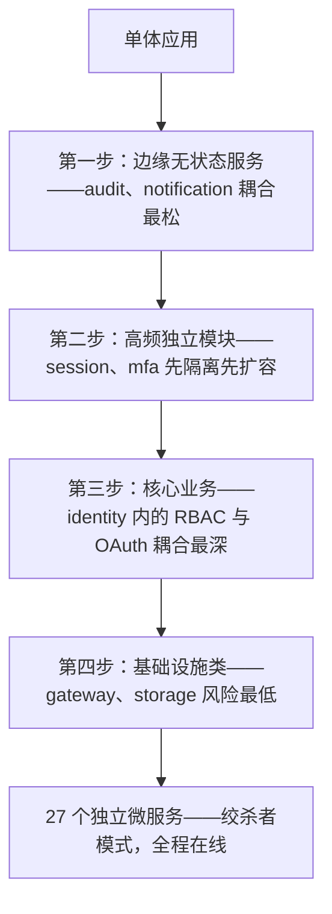
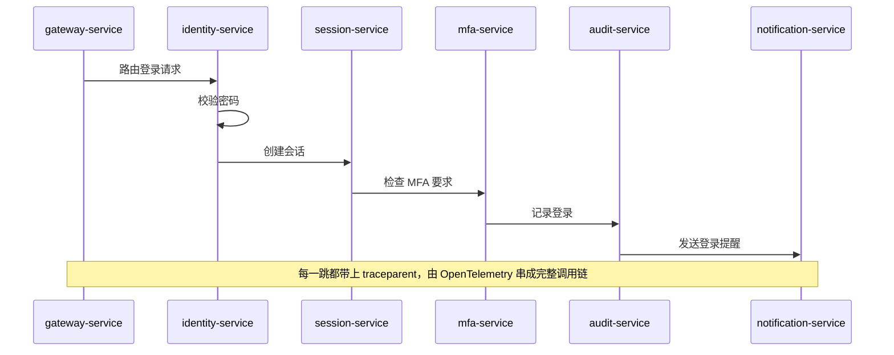

2024 年初，Autional 的第一个版本是一个不到 8,000 行代码的 Go 单体应用。它跑在一台服务器上，连着一个 PostgreSQL 实例和一个 Redis——足以支撑早期客户的登录注册需求。两年后，Autional 已演进为 27 个独立微服务，每天为各类规模的企业处理数亿次认证请求。

本文记录这段演进历程——不只是技术选型，更是一支团队在架构决策、工程文化与产品理念上的持续迭代。

## 认证系统为什么需要微服务？

团队最初提出微服务时，最常遇到的质疑是：「认证不就是查一张用户表、发个令牌吗？为什么要拆成十几个服务？」答案恰恰就藏在那句「查一张用户表」里。

### 资源需求天然不同

想想三个典型场景：

- **登录认证**：高并发、低延迟（P99 < 50ms），峰值流量可达平时的 50 倍（比如周五下午的登录高峰）。密码哈希与 JWT 签名需要大量计算资源。
- **审计日志**：高吞吐写入，延迟可容忍（< 2s 可接受），但数据量随用户活动线性增长——存储压力远大于计算压力。
- **OAuth 授权**：需要维护长生命周期状态（授权码有效期），涉及多次重定向，流量模式与常规 API 调用完全不同。

如果这三个功能共用一个进程，你无法单独为登录认证扩容 CPU 而不浪费在审计模块上；无法单独为审计日志配置高吞吐磁盘；无法独立调优 OAuth 的连接池参数。**在单体里，所有模块共享同一套基础设施配置——最弱的那一环决定了整个系统的性能上限。**

### 故障隔离：一个 Bug 不能拖垮全站

2024 年第三季度的一次生产事故留下了深刻印记。管理员批量导入用户时，一段测试不充分的 CSV 解析函数进入死循环，耗尽了所有可用 goroutine。结果：不只是导入功能挂了——整个认证系统（登录、注册、找回密码）全部不可用。数十家客户受影响，停机超过二十分钟（一个来自架构复盘的假设场景）。

微服务化之后，类似的故障被限制在单个服务内。如果 `identity-service` 的用户导入模块挂了，`session-service` 仍在校验令牌，`mfa-service` 仍在处理多因素认证，用户的登录体验完全不受影响。

### 团队自治：15 人的团队需要并行开发

随着产品变多（多因素认证、OAuth/OIDC 支持、钱包系统、合规审计、RBAC 权限模型……），团队从 3 人扩展到 15 人。在 monorepo 里，不同功能模块的代码相互缠绕，合并冲突成了日常，发布节奏互相阻塞。

微服务化之后，每个服务有独立的代码所有权（Autional 采用 Go monorepo + 独立 `go.mod` 的伪 monorepo 模式），团队可以独立开发、测试、部署。「认证组」改 `identity-service` 不会影响「合规组」发布 `compliance-service`。**发布周期从双周一次缩短为按需发布，高峰期单日可部署 8 次热修复。**

## 怎么拆：按业务能力，不按技术分层

这是我们最重要的决策之一——也是一个常见的陷阱。

### 错误做法：按技术分层拆

```
auth-handler-service → auth-service → auth-repository-service
```

这种做法只是把函数调用变成了 RPC 调用，没有解决任何实际问题，反而引入了网络延迟与序列化开销。

### Autional 的做法：按业务能力拆

我们的原则是：**一个服务 = 一个完整的业务能力**。

| 服务 | 业务能力 | 数据库 |
|---------|-------------------|----------|
| identity-service | 用户注册、登录、密码管理 | PostgreSQL |
| profile-service | 用户资料、头像、偏好设置 | PostgreSQL |
| tenant-service | 多租户管理、套餐绑定 | PostgreSQL |
| session-service | 会话创建、校验、失效 | PostgreSQL |
| mfa-service | 多因素认证（TOTP/短信/硬件密钥） | PostgreSQL |
| oauth-service | OAuth 2.1 / OIDC 授权 | PostgreSQL |
| wallet-service | 余额管理、交易记录 | PostgreSQL |
| point-service | 积分管理 | PostgreSQL |
| audit-service | 审计日志采集与查询 | MongoDB |
| notification-service | 邮件、短信、站内通知 | PostgreSQL |
| communication-service | 消息模板、通道管理 | PostgreSQL |
| storage-service | 文件上传、对象存储代理 | PostgreSQL + MinIO |
| billing-service | 计费、套餐、发票 | PostgreSQL |
| compliance-service | GDPR/DSAR、数据导出、同意管理 | PostgreSQL |
| gateway-service | API 网关、限流、路由聚合 | — |

每个服务拥有自己的数据库实例（或 schema）。**服务之间不共享数据库，只通过 API 通信。** 这保证了每个服务能独立选择最合适的存储方案。比如 audit-service 选用 MongoDB 而非 PostgreSQL——审计日志天然是文档形态，写入吞吐需求远超关系型查询需求。

### 拆分优先级：从边缘到核心

我们采用「由边缘到核心」的渐进式拆分策略：

1. **先拆边缘无状态服务**（audit-service、notification-service）：与核心认证链路耦合最松——出了问题也不影响登录。
2. **再拆高频独立模块**（session-service、mfa-service）：会话校验的 QPS 最高——隔离出来才能做专门的扩容与缓存优化。
3. **后续处理核心业务**（identity-service 内的 RBAC、OAuth）：这些模块与登录认证耦合最深，需要更谨慎的领域建模。
4. **最后是基础设施类服务**（gateway-service、storage-service）：迁移风险最低，适合先做 POC 验证。

整个拆分历时 8 个月，全程保持生产服务在线。关键策略是**绞杀者模式**（Strangler Fig Pattern）：先在单体中用接口抽象边界，把实现逐步迁移到新服务，最后切断旧路径。



*图 1：由边缘到核心的四步拆分——每一步只动耦合最松的一块，绞杀者模式让生产服务全程在线。*

## 我们必须解决的三个技术挑战

微服务不是银弹。以下是我们遇到的最大三个挑战及 Autional 的解法。

### 挑战一：分布式追踪——一次登录穿越 6 个服务

用户输入密码 → `gateway-service` 路由 → `identity-service` 校验密码 → `session-service` 创建会话 → `mfa-service` 检查 MFA 要求 → `audit-service` 记录登录 → `notification-service` 发送登录提醒。



*图 2：一次登录的完整路径——请求依次穿过 6 个服务，每一跳都携带 traceparent，慢在哪一环一眼可见。*

如果一次登录耗时过长，你怎么定位是哪一环慢了？

**Autional 的解法：OpenTelemetry 全链路追踪**

我们在所有服务间通信点实现了统一追踪：

- **HTTP 入口**（gateway-service）：注入 W3C Trace Context（`traceparent` 请求头）
- **服务间 HTTP 调用**：通过 Gin 中间件自动传播 `traceparent`
- **gRPC 调用**：通过 `otelgrpc.NewClientHandler()` 注入
- **MQ 消息**：`micro-pkg/consumer/middleware.Tracing()` 从消息头提取追踪上下文
- **数据库查询**：GORM 插件自动记录 SQL 耗时

效果：Jaeger UI 展示单次登录请求的完整调用链。定位慢查询与异常节点，从「猜 + 加日志 + 重新部署」（30 分钟）缩短到 30 秒。

### 挑战二：优雅停机——27 个服务不能乱起乱停

单体时代，`Ctrl+C` 结束进程就完事了。微服务下，关闭一个服务涉及：

- 等待在途 HTTP 请求处理完成
- 等待 MQ 消费者 ack 当前消息
- 关闭数据库连接池
- 关闭 Redis 连接池
- 通知注册中心摘除节点
- 等待 gRPC server 关闭

顺序错了就可能导致消息丢失、请求失败或连接泄漏。

**Autional 的解法：统一引导框架 `micro-middleware/app`**

我们抽象出一套统一的 Application 架构——27 个服务都用同一套启动框架：

```go
app := app_pkg.New("identity-service", logger).
    WithRouter(router).
    WithHealth(healthHandler).
    WithServer("grpc", grpcServer).
    WithServer("mq-consumer", mqConsumerServer).
    WithCleanupNamed("db", func() error {
        sqlDB, _ := db.DB()
        return sqlDB.Close()
    }).
    WithReadTimeout(30 * time.Second).
    WithWriteTimeout(30 * time.Second)

app.Run(11001)
```

关键设计决策：

- **Server 接口抽象**：任何监听端口的组件（HTTP Server、gRPC Server、MQ Consumer）都实现 `app.Server`（`ListenAndServe` + `Shutdown`），生命周期由框架管理。
- **具名清理且返回错误**：`WithCleanupNamed(name, fn)` 取代了旧的无名 `WithCleanup`。每个清理步骤都有名字且返回错误。停机时按注册的逆序执行——任何一步失败都会记日志，但不阻塞后续清理。
- **信号捕获与超时控制**：`app.Run()` 捕获 SIGINT/SIGTERM，先关闭 Server（停止接收新请求），再执行 Cleanup（释放资源）。若 30 秒内未完成，强制退出。

这套统一框架不仅解决了优雅停机，还把新服务的 `main.go` 从 200 多行压缩到 30 行。接入新服务时，团队只需定义 Router 与清理函数——其余都由框架处理。

### 挑战三：数据库隔离——服务不能共库，但数据要一致

微服务的金科玉律是「每个服务独占自己的数据库」。但现实中：

- `identity-service` 创建了用户，接着 `profile-service` 需要创建对应资料
- `billing-service` 变更了套餐，接着 `tenant-service` 必须更新租户的套餐信息
- `wallet-service` 扣了款，接着 `point-service` 需要发放积分

重度依赖分布式事务（2PC）会同时伤害性能与可用性。

**Autional 的解法：最终一致性 + 领域事件**

我们选择「最终一致性」作为跨服务数据同步的默认策略：

1. **事件发布**：事务提交后，`identity-service` 通过 `micro-pkg/event.Publisher` 发布 `user.created` 事件。
2. **事件订阅**：`profile-service` 的 MQ Consumer 监听 `user.created`，自动创建资料记录。
3. **重试与幂等**：`micro-pkg/consumer` 框架内置重试（指数退避）与 DLQ（死信队列）机制。消费失败时消息自动重新入队，最多重试 3 次，随后进入 DLQ 等待人工或自动处理。
4. **幂等保证**：所有跨服务操作按唯一事件 ID 去重，确保在 at-least-once 投递语义下的正确性。

对需要强一致的场景（如钱包扣款），我们保持在单个服务内用数据库事务完成，绝不跨服务边界。

## 工程文化的同步演进

架构演进不只是技术。以下这些非技术实践同样重要：

### CI 检查体系

从单体到 27 个服务，人工评审已无法保证代码质量与架构一致性。我们构建了一条包含 30 多个 Python 检查脚本的 CI 流水线：

- **架构约束**：`check-dto-compliance.py` 确保所有 HTTP 响应使用 `dto_base` 统一信封；`check-factory-types.py` 校验工厂模式的一致性
- **编码规范**：`check-error-codes.py` 校验错误码已在 `base/error/registry.go` 注册；`check-encoding.py` 扫描 GBK 混入与 UTF-8 损坏
- **运行时安全**：`check-db-schema.py` 比对 GORM 模型与实际数据库表结构，发现版本漂移

每一行代码在提交前都必须通过全部检查。**一套好的 CI 体系比任何架构文档都更能保证一致性。**

### 文档即代码

我们坚持把架构决策记录在 AGENTS.md 中，与代码存放在同一仓库。任何涉及架构变更的 PR 都必须更新 AGENTS.md。新加入的开发者读一遍 AGENTS.md，一天之内就能理解整个系统的架构约束与设计理念。

### 技术债透明化

不是所有技术债都需要立刻偿还。我们把技术债分为三档：P0（安全风险）、P1（影响研发效率）、P2（代码异味），每季度评审一次。关键原则是：**欠债可以——但你必须清楚自己欠了什么。**

## 现在与未来

今天，Autional 已在微服务架构上稳定运行超过 12 个月。27 个服务通过统一网关对外提供服务，覆盖从个人开发者到企业客户的各类用户。

我们正在探索的方向：

- **Service Mesh**：把服务间认证、限流与重试逻辑从应用层下沉到 Sidecar，进一步简化服务代码。
- **多地域部署**：利用 PostgreSQL 逻辑复制 + Redis Geo-Replication，把跨可用区认证延迟控制在 10ms 以内。
- **边缘计算集成**：把 session-service 的令牌校验能力部署到 Cloudflare Workers / AWS Lambda@Edge，把认证延迟降到个位数毫秒。

## 给考虑微服务的团队

1. **不要过早拆分。** 如果团队不足 5 人、用户数不到 10 万，单体是更好的选择。我们的拆分是在团队达到一定规模、DAU 达到相当量级后才开始的。
2. **从边缘到核心。** 先从风险最低的模块入手，建立信心与流程，再啃核心模块。
3. **统一框架是生命线。** 如果没有统一的 App 引导、日志、追踪、错误处理与配置管理框架贯穿 27 个服务，运维成本会指数级上升。
4. **数据库隔离不可妥协。** 一旦两个服务共用一个数据库，你就失去了独立部署与独立优化的能力。
5. **分布式追踪不是可选项。** 在微服务架构里，没有追踪就像在黑暗中调试。

Autional 的微服务之旅仍在继续。如果你对某个具体模块的架构感兴趣，欢迎翻阅我们的[平台文档](https://docs.autional.cn)，或在 GitHub 仓库中提交 Issue 提问。
