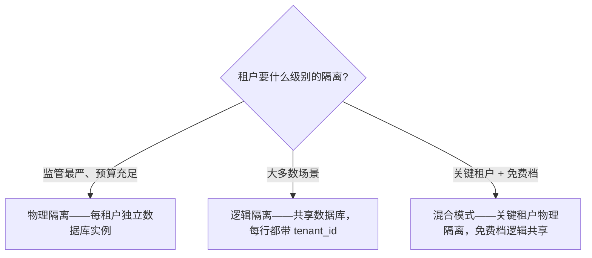

## 租户隔离模型

### 物理隔离
每个租户一个独立的数据库实例。安全性最高，成本也最高。

### 逻辑隔离
共享数据库，每一行都带 tenant_id。安全与效率之间的平衡——Autional 中最常见的模式。

### 混合模式
关键租户采用物理隔离；免费档租户逻辑共享。

*图 1：三种隔离模型的选型——按监管要求与成本预算对号入座，逻辑隔离是 Autional 最常用的默认档。*

## 关键设计决策

1. **每个查询都带租户 ID** —— 由仓储层强制、CI 校验
2. **跨租户防护** —— 管理员不可能误访问其他租户的数据
3. **按租户配置** —— 自定义密码策略、品牌、域名

## 合规影响

多租户架构需要审慎的 GDPR 与 SOC 2 规划。每个租户的数据边界必须清晰界定且可审计。哈希链审计日志为数据隔离提供密码学证明。
