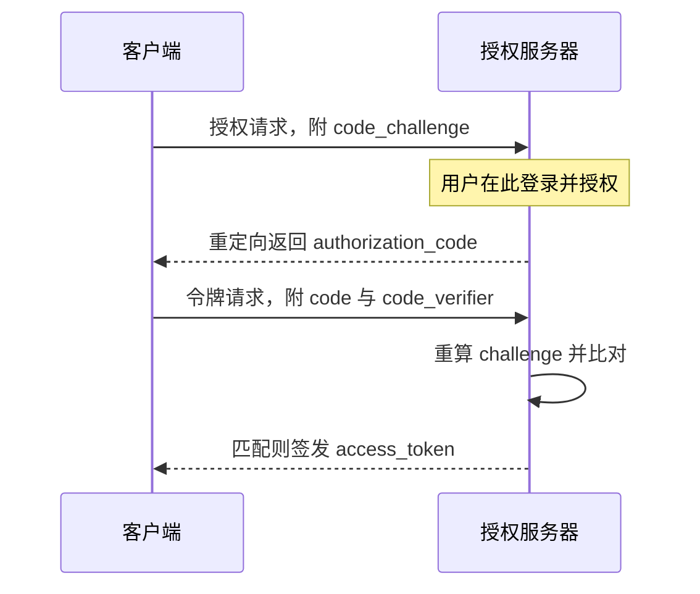
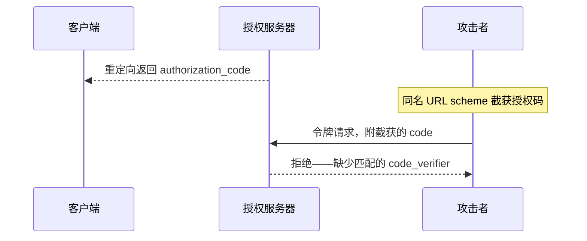

OAuth 2.0 发布十余年后，其安全缺陷已被充分暴露。2025 年通过的 OAuth 2.1 草案，是对原规范的一次重大安全升级，其中有一项核心变化：

> **PKCE（Proof Key for Code Exchange）成为所有授权码流程的强制要求。Implicit 授权流程被正式移除。**

这对移动应用与 SPA 开发者意味着什么？让我们从头讲起。

## 问题：为什么授权码流程不够安全？

在理解 PKCE 之前，先理解它要解决的问题。

### 标准授权码流程

OAuth 2.0 的授权码模式（Authorization Code Grant）工作流程如下：

1. 客户端把用户重定向到授权服务器
2. 用户登录并授权
3. 授权服务器通过重定向 URL 返回 `authorization_code`
4. 客户端在令牌端点用这个 `code` + `client_secret` 换取 `access_token`

这个流程在服务端应用中（`client_secret` 可以安全存储）是安全的——即使攻击者在第 3 步截获了授权码，没有 `client_secret` 也无法在第 4 步换取令牌。

### 但在移动应用与 SPA 中……

移动应用与 SPA **无法安全存储 `client_secret`**。APK 包可以被反编译；JavaScript 代码直接暴露在浏览器中。攻击者可以轻易提取出 `client_secret`。

这就产生了一个严重的安全漏洞——**授权码截获攻击（Authorization Code Interception Attack）**：

```
1. Attacker installs the target app on their own phone
2. Attacker registers a custom URL scheme (e.g., myapp://callback) to intercept system redirects
3. Attacker induces the user to authorize on their phone (but the target app is the victim's installation)
4. After authorization completes, the authorization code is returned via the redirect URL
5. If the attacker can intercept the code (malicious app registered the same custom scheme)
   → Attacker has the code + extracted client_secret → can exchange for access_token
6. Attacker now accesses the API as the victim
```

这个问题在移动端尤为严重——Android 允许多个应用注册同一个自定义 URL scheme。2024 年之前的 iOS 版本也有同样的风险。

## 解法：PKCE 的工作原理

PKCE 的核心思想非常优雅：**在流程开始时创建一个只有客户端知道的随机密钥；在流程结束时用这个密钥证明「我就是发起请求的那个客户端」。**

### PKCE 的四个关键步骤

```
Step 1: Client generates code_verifier

  code_verifier = randomly generated 43-128 character high-entropy string
  e.g.: "dBjftJeZ4CVP-mB92K27uhbUJU1p1r_wW1gFWFOEjXk"

Step 2: Client computes code_challenge

  code_challenge = BASE64URL(SHA256(code_verifier))
  e.g.: "E9Melhoa2OwvFrEMTJguCHaoeK1t8URWbuGJSstw-cM"

  code_challenge_method = "S256"

Step 3: Send code_challenge in the authorization request

  GET /authorize?
    response_type=code&
    client_id=myapp&
    redirect_uri=https://myapp.com/callback&
    code_challenge=E9Melhoa2OwvFrEMTJguCHaoeK1t8URWbuGJSstw-cM&
    code_challenge_method=S256

Step 4: Send code_verifier in the token request

  POST /token
    grant_type=authorization_code&
    code=abc123&
    client_id=myapp&
    code_verifier=dBjftJeZ4CVP-mB92K27uhbUJU1p1r_wW1gFWFOEjXk

  Server verifies:
  BASE64URL(SHA256(code_verifier)) == code_challenge ?
  If matched → issue access_token
  If not matched → reject (401)
```



*图 1：授权码 + PKCE 的完整流程——code_challenge 随授权请求上路，code_verifier 留在客户端本地，最后一步才出示给授权服务器。*

### 攻击者为什么绕不过 PKCE？

即使攻击者成功截获了授权码，他仍面临一个无解的问题：

- 攻击者能看到 `code_challenge`（在第 3 步的 URL 中明文传输）
- 攻击者能截获 `authorization_code`（在第 3 步返回）
- 但**攻击者拿不到 `code_verifier`**——这个值从不在网络上传输，只存在于合法客户端的本地内存中

SHA256 是单向哈希函数。你无法从 `code_challenge` 反推出 `code_verifier`。没有 `code_verifier`，向令牌端点发起的请求就会被拒绝。



*图 2：截获不等于换到令牌——攻击者攥着授权码，却拿不出只存在于合法客户端本地的 code_verifier，令牌端点直接拒绝。*

这就是 PKCE 的精髓：**用一个只存在于客户端本地的随机密钥证明身份，而这个密钥从不需要在网络上传输。**

## Autional 的实现：oauth-service 全自动处理 PKCE

在 Autional 的 `oauth-service` 中，PKCE 不是可选项——它是默认行为。作为符合 OAuth 2.1 的身份平台，Autional 承担了 PKCE 的全部复杂度：

### 授权端点（/authorize）

```go
// oauth-service automatically:
// 1. Parses and validates code_challenge and code_challenge_method
// 2. Stores the association between code_challenge and authorization_code
// 3. If code_challenge is missing from the request → rejects (401)
func (h *AuthorizationHandler) HandleAuthorize(c *gin.Context) {
    req := parseAuthorizeRequest(c)
    
    // OAuth 2.1: PKCE is mandatory for all authorization code flows
    if req.CodeChallenge == "" {
        c.Error(auth.ErrPKCERequired)
        return
    }
    if req.CodeChallengeMethod != "S256" {
        c.Error(auth.ErrInvalidCodeChallengeMethod)
        return
    }
    // ... proceed with authorization
}
```

### 令牌端点（/token）

```go
// oauth-service automatically:
// 1. Reads the original code_challenge from storage
// 2. Recomputes the code_challenge from the request's code_verifier
// 3. Compares the two code_challenge values
// 4. Match → issue token; mismatch → reject
func (h *TokenHandler) HandleTokenExchange(c *gin.Context) {
    req := parseTokenRequest(c)
    
    storedChallenge := h.store.GetCodeChallenge(ctx, req.Code)
    computedChallenge := base64URLEncode(sha256(req.CodeVerifier))
    
    if !subtle.ConstantTimeCompare(storedChallenge, computedChallenge) {
        c.Error(auth.ErrInvalidCodeVerifier)
        return
    }
    // ... issue tokens
}
```

一个关键的安全细节：Autional 使用 `crypto/subtle.ConstantTimeCompare` 而非普通字符串比较，以防止通过计时攻击推断出有效的 `code_verifier`。

### 配套客户端 SDK

Autional 已发布 @autional/react 等 npm 软件包，PKCE 逻辑已内置于 SDK。Vue、Next.js 等框架适配在路线图中；其他技术栈通过标准 OAuth 2.0 / OIDC 流程接入：

```typescript
// Web SDK (React)
import { useAutional } from '@autional/react';

function LoginButton() {
  const { isAuthenticated, loginWithOAuth } = useAutional();
  
  const handleLogin = async () => {
    await loginWithOAuth({
      provider: 'google',
      redirectUri: 'https://myapp.com/callback',
      // ⬇️ SDK auto-generates code_verifier and computes code_challenge
      // Developers don't need to worry about PKCE details
    });
  };
  
  return !isAuthenticated && <button onClick={handleLogin}>Login</button>;
}
```

## 被淘汰的 Implicit 流程：为什么必须移除

OAuth 2.1 正式移除了 Implicit Grant 流程。这不是突然的决定——安全社区多年来一直在呼吁废弃它。

### Implicit 流程的问题

Implicit 流程最初是为了给纯前端应用（JavaScript SPA）提供一种无需后端的授权方式：

```
GET /authorize?response_type=token&client_id=myapp&redirect_uri=...

→ Server returns access_token directly in the URL fragment:
   https://myapp.com/callback#access_token=xxx&expires_in=3600
```

问题清单：

1. **访问令牌暴露在 URL 中**：URL fragment 不会发送给服务器，但可能通过浏览器历史、浏览器扩展以及（某些场景下的）referrer 请求头泄露
2. **没有客户端认证**：没有 client_secret，也没有 PKCE——任何知道 redirect_uri 的人都能发起流程
3. **无法刷新令牌**：Implicit 流程不支持 refresh_token（令牌直接暴露在 URL 中，无法安全存储长期凭证）
4. **令牌过期后需完整重新授权**：用户体验更差

### 迁移路径：Implicit 流程 → 授权码 + PKCE

| 维度 | Implicit 流程 | 授权码 + PKCE |
|-----------|--------------|--------------------------|
| 适用场景 | SPA（已废弃） | SPA、移动端、桌面端 |
| 访问令牌位置 | URL fragment（不安全） | HTTPS 响应体（安全） |
| 客户端认证 | 无 | PKCE code_verifier |
| 刷新令牌支持 | 否 | 是 |
| 令牌刷新 | 需要重新授权 | 静默刷新 |
| OAuth 2.1 状态 | 已移除 | 强制要求 |

### 从 Implicit 流程迁移只需极小改动

如果你的应用还在使用 Implicit 流程，好消息是：迁移到授权码 + PKCE 的改动非常小。

**改造前（Implicit 流程）：**
```javascript
// response_type=token → access_token appears directly in URL fragment
const hash = window.location.hash;
const accessToken = new URLSearchParams(hash.substring(1)).get('access_token');
```

**改造后（授权码 + PKCE）：**
```javascript
// 改造后：授权码 + PKCE 由 SDK 托管，开发者无需手写交换逻辑
import { useAutional } from '@autional/react';

const { loginWithOAuth } = useAutional();
await loginWithOAuth({ provider: 'google' });
```

对已经使用 React SDK（`@autional/react`）的 Autional 用户而言，**无需任何代码改动**。oauth-service 会自动用 PKCE 处理所有授权码流程，对客户端完全透明。

## PKCE 的局限：不是银弹

PKCE 解决了授权码截获攻击，但它并不能解决所有 OAuth 安全问题：

- **PKCE 无法防范恶意客户端**：如果攻击者诱骗用户安装了伪装成合法应用的恶意 App，PKCE 无法阻止授权（攻击者的 App 可以自己生成 code_verifier）
- **PKCE 依赖 HTTPS**：虽然 PKCE 提供了完整性保护，但授权请求与令牌响应仍然需要 HTTPS 来防范中间人（MITM）攻击
- **PKCE 无法防 CSRF**：仍然需要 `state` 参数来防止跨站请求伪造

因此，Autional 推荐的安全组合是：

```
PKCE (anti-auth code interception) + state (anti-CSRF) + DPoP (anti-token replay, planned) + strict redirect_uri validation
```

## 总结

OAuth 2.1 的 PKCE 强制要求是一个迟到但正确的安全决策。对移动端与 SPA 开发者而言，它可能需要一些代码改动，但安全收益显著：

1. **即使攻击者截获了授权码，也无法将其换取令牌**
2. **从 Implicit 流程迁移到 PKCE 后，应用获得 refresh_token 支持，用户体验更好**
3. **Autional 的 oauth-service 与 React SDK 承担了 PKCE 的全部复杂度——开发者只需极小适配**

如果你正在构建需要 OAuth 授权的移动应用或 SPA，请从第一天起就使用授权码 + PKCE。如果你现有应用仍在使用 Implicit 流程，是时候迁移了——OAuth 2.1 不只是最佳实践，它是所有身份平台的未来标准。

Autional 的 `oauth-service` 从诞生之初就遵循 OAuth 2.1 规范，提供开箱即用的 PKCE 支持。更多实现细节请访问我们的文档与 GitHub 仓库。
