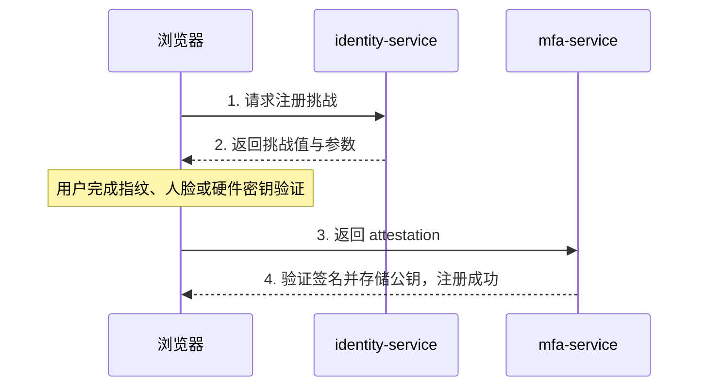

## 起点：为什么会有密码？

1961 年，MIT 的兼容分时系统（CTSS）引入了密码的概念，这是人类历史上的第一套密码系统。目的很简单：让共享同一台大型机的多位研究人员能保护各自的文件不被他人查看。

Fernando Corbato——CTSS 密码系统的发明者——在 2014 年的一次采访中说：「密码已经变成了一种噩梦。」

他于 2019 年去世，享年 93 岁。在他去世的三年前，FIDO 联盟发布了 WebAuthn 标准，正式开启了他这场「噩梦」的终结。

## 阶段一：明文密码时代（1961-2000 年代）

### 工作原理

用户记住一串秘密字符串。服务器（理想情况下）保存该字符串的哈希值。登录时比对哈希。

### 问题所在

从诞生第一天起，密码就带着两个结构性缺陷：

**人类记忆的极限**：一个达到安全强度的密码（随机的 16 位大小写字母、数字与符号），人类几乎不可能记住。于是人们发明了自己的「安全策略」——用生日、宠物名字，或者所有网站都用同一个密码。

**共享秘密的脆弱性**：密码是客户端与服务器之间的共享秘密。只要任何一方泄露，整个认证体系就会崩塌。

2009 年，RockYou 数据泄露事件暴露了 3200 万个明文密码。其中最常见的前三名是：`123456`、`12345`、`123456789`。十五年后的 2024 年，NordPass 的全球统计依然显示 `123456` 是最常见的密码。

人类不会改变，需要改变的是认证方式。

## 阶段二：短信 OTP（2000 年代-2010 年代）

### 解决了什么

在「你知道的东西」（密码）之外加入了「你拥有的东西」（手机）——双因素认证的雏形。

### 引入了什么

2016 年，NIST SP 800-63B 正式将短信 OTP 标注为「受限」，原因包括：

- **SIM 卡交换攻击**：攻击者通过社工手段让运营商把目标号码转移到自己的 SIM 卡上——所有短信验证码直接落到攻击者手中
- **SS7 协议漏洞**：七号信令系统（Signaling System 7）存在已知缺陷，可在网络层拦截短信
- **延迟与送达**：国际短信可能延迟 30 秒以上，甚至无法送达

### 现状

尽管 2016 年被 NIST 标注为「受限」，短信 OTP 在 2026 年依然被广泛使用。「成本低」与「用户熟悉」让它难以彻底退场，但业界共识是：**新系统不应把短信 OTP 作为唯一的第二因素。**

Autional 的 mfa-service 仍提供短信 OTP 选项（用于兼容存量用户），但建议管理员优先选择 TOTP 与通行密钥。

## 阶段三：TOTP（2008 年至今）

### 突破

TOTP（基于时间的一次性密码，RFC 6238）不依赖电信网络——验证码由用户设备上的种子密钥结合当前时间计算得出，不需要短信。

### 解决了什么

- 不再依赖电信网络（消除 SIM 卡交换与 SS7 风险）
- 可离线使用（Google Authenticator、Authy 等在无网络时也能生成验证码）
- 一次配置，长期有效

### 遗留问题

- **种子密钥仍是共享秘密**：如果服务器的种子密钥库被攻破，攻击者可以生成任意用户的 TOTP
- **钓鱼依然有效**：攻击者的钓鱼站点可以实时把 TOTP 验证码转发给真实站点（中间人攻击 Adversary-in-the-Middle）
- **体验平平**：打开认证器 App、找到对应条目、读出 6 位数字再输入（还得在 30 秒内完成）

## 阶段四：推送认证（2013 年至今）

### 突破

不再需要输入验证码——登录时服务器向用户的可信设备发送推送通知（经 APNs/FCM），用户点击「批准」或「拒绝」。

### 解决了什么

- 大幅改善体验（不必再手动输入验证码）
- 推送可以携带上下文（登录地点、设备类型、时间），帮助用户判断是否为本人操作

### 引入了什么

- **MFA 疲劳攻击**：攻击者拿到凭据后不断发送推送通知，直到用户不胜其烦、不加思索地点下「批准」
- 2022 年 Uber 数据泄露事件正是由此导致——攻击者持续向一名 Uber 员工发送推送，再在 WhatsApp 上冒充 IT 支持，说服对方批准

### 防御手段

- **号码匹配（Number Matching）**：推送不再是简单的「批准/拒绝」，而是要求用户输入认证设备上显示的 2 位数字，以证明该认证器能访问当前会话
- **限流**：连续拒绝后锁定账号
- Autional 的 mfa-service 已支持号码匹配推送

## 阶段五：FIDO U2F（2014-2018）

### 突破

这是一次革命：FIDO U2F（Universal 2nd Factor）不再依赖共享秘密，而是使用公钥密码学：

1. 注册时，硬件安全密钥（如 YubiKey）生成一对密钥。公钥发送给服务器，私钥永不离开设备
2. 登录时，服务器发送随机挑战值，安全密钥用私钥签名，服务器用公钥验证

### 根本性改进

- **服务器上没有共享秘密**（只有公钥——即使泄露也无用）
- **抗钓鱼**（签名与域名绑定——来源校验内建于协议，无法在应用层绕过）
- **硬件隔离的私钥**（私钥永远无法被软件读取）

### 局限

- 需要额外硬件（USB/NFC 安全密钥）
- 不适合大规模消费级场景（成本、发放、丢失）
- 主要作为第二因素使用，无法取代密码

2017 年，Google 在内部做了一次实验，要求 85000 名员工使用 FIDO U2F 安全密钥。结果是：钓鱼攻击成功次数为零（此前每年都有数起）。

## 阶段六：FIDO2 / WebAuthn + Passkey（2018-2026）

### 突破

FIDO2 是 U2F 的演进，包含两个核心标准：
- **WebAuthn**（W3C 标准）：浏览器与认证器之间的 JavaScript API
- **CTAP2**（Client to Authenticator Protocol）：平台与外部认证器之间的协议

关键创新：

1. **平台认证器**：无需外部硬件——设备自带的 TPM/安全隔区本身就是认证器。你的 MacBook 的 Touch ID、iPhone 的 Face ID、Windows Hello 都是 FIDO2 平台认证器
2. **跨设备同步**：借助平台云同步（iCloud 钥匙串、Google 密码管理工具、Windows Hello），私钥可以在用户的多个设备间安全同步
3. **通行密钥（Passkey）**：FIDO2 凭据的品牌名称——本质上是可跨设备同步的 FIDO2 凭据

### 2025-2026：临界点

数据显示，通行密钥已经达到临界规模：

- **Apple**：在 iOS 19 中，通行密钥是新应用账号的首选注册方式。超过 95% 的 iCloud 用户自动具备通行密钥支持
- **Google**：2025 年第四季度，Google 账号上的通行密钥认证次数超过每月 10 亿次。2026 年第一季度，Google 宣布通行密钥成为 Workspace 的默认登录方式（密码作为后备）
- **Microsoft**：2025 年 12 月，Microsoft 宣布内部已彻底淘汰密码——全部 22 万名 Microsoft 员工都通过通行密钥与 Windows Hello for Business 完成认证
- **Amazon**：2025 年黑色星期五期间，超过 40% 的登录使用了通行密钥
- **跨境电商 Shopee/Lazada**：引入通行密钥后，东南亚地区的登录转化率提升了 18%

### Autional 的通行密钥实现

Autional 自 2025 年起内置完整的 WebAuthn RP 支持：

*图 1：通行密钥注册的泳道时序——浏览器取挑战值，用户在设备上完成指纹或人脸确认，attestation 回到 mfa-service 验签并存储公钥，私钥全程不出设备。*

登录时的断言流程与之类似——服务器发送挑战值，平台认证器用私钥签名，服务器用公钥验证。

## 阶段七：下一步是什么？

### 持续认证

从「登录时验证一次」走向「持续验证」。基于行为生物特征（打字节奏、鼠标移动模式）与上下文信号（位置、时间、设备状态），系统在整个会话过程中持续评估信任度。

### 没有密码的账号恢复

目前——如果你丢失了通行密钥私钥（设备丢失且未云同步），需要回退到密码或恢复码。下一步——基于社交恢复或托管式恢复的无密码账号找回。

### 后量子密码学迁移

2026 年，NIST 的后量子密码标准（CRYSTALS-Kyber、CRYSTALS-Dilithium 等）正在被纳入 FIDO 标准体系。通行密钥的密钥对将逐步从 ECDSA 过渡到抗量子的 Dilithium。这可能要花 5-10 年，但准备工作从今天就该开始。

## 总结

| 阶段 | 时间 | 核心机制 | 是否抗钓鱼 | 是否无共享秘密 | 体验复杂度 | 当前状态 |
|-------|------|----------------|:---:|:---:|:---:|:---:|
| 密码 | 1961+ | 共享秘密 | ❌ | ❌ | 低 | 仍广泛使用 |
| 短信 OTP | 2000 年代+ | 电信网络 | ❌ | ❌ | 中 | 应避免 |
| TOTP | 2008+ | 时间同步 | ❌ | ❌ | 中 | 推荐的备用方案 |
| 推送通知 | 2013+ | 设备验证 | ❌ | ❌ | 低 | 推荐 |
| FIDO U2F | 2014+ | 公钥 | ✅ | ✅ | 中 | 企业场景 |
| 通行密钥 | 2022+ | 公钥 + 跨设备 | ✅ | ✅ | 极低 | **推荐首选** |
| 持续认证 | 2026+ | 行为分析 | — | — | 无感 | 探索中 |

从 1961 年到 2026 年，身份认证从「由人类记住的秘密」走到了「由硬件生成、连人类自己都无法读取的秘密」。通行密钥不是终点，但它是我们第一次拥有既安全（抗钓鱼、无共享秘密）又易用（扫脸/指纹/Face ID，无需密码）的认证方式。

Autional 完整支持上表中的每一个阶段——不是因为你在 2026 年还需要部署短信 OTP，而是因为你可以针对不同的用户群体、不同的安全等级与不同的合规要求，选择合适的认证方式组合。从密码到通行密钥的演进不是一次迁移，而是一段旅程。沿途的每一站，Autional 都已备好。
