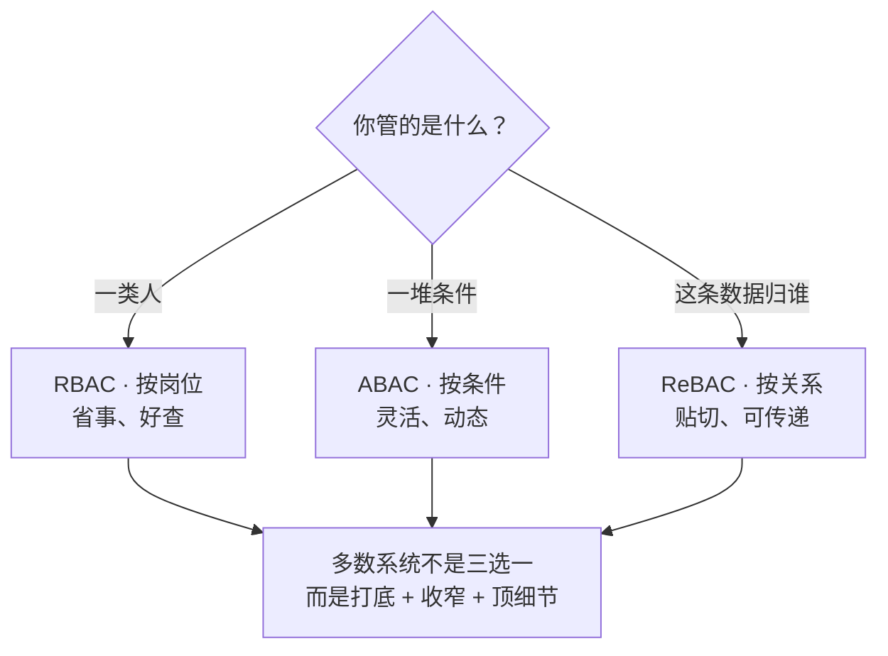

一个新来的后端工程师接到第一张权限工单：给「订单中心」加一个「导出报表」的按钮，只让运营和财务用。

他做完之后问了自己一个问题：**运营小满点下这个按钮，她能看到哪些订单？**

团队里三个人给了三个答案：

- 「她是运营组的，运营组有这个权限」——按**岗位**算；
- 「工作日 9 点到 18 点、公司内网、且订单状态是已完结，才放行」——按**条件**算；
- 「她只能看自己跟进的店铺的订单」——按**关系**算。

三个答案都没错，但它们说的是三件不同的事。这就是权限系统里最容易踩的第一个坑：**把三个问题当成了一个**。

## 「他能不能看」，只有三种问法

任何一句「他能不能看」，拆开都落在三种问法里：

| 问法 | 凭据 | 对应的模型 |
|:--|:--|:--|
| 他**是哪类人**？ | 他戴哪张工牌（岗位、角色） | RBAC |
| 他**符不符合条件**？ | 他身上的一堆属性，当场比对 | ABAC |
| 他**和这条数据有没有关系**？ | 他和数据之间连着的线 | ReBAC |

- **RBAC**（Role-Based Access Control，基于角色的访问控制）：把权限打包成「角色」，人挂角色。改一次角色，挂它的人一起变。
- **ABAC**（Attribute-Based Access Control，基于属性的访问控制）：不预先打包，拿主体、对象、操作、环境四类属性当场算——「是不是财务」「是不是工作日」都只是属性之一。
- **ReBAC**（Relationship-Based Access Control，基于关系的访问控制）：看用户和对象之间的**关系图**——「小满和张老板是不是同一个团队的」「这份文档是不是小满建的」。

三套办法答的是三个不同的问题：**按岗位答「他这类人能不能」；按条件答「他这条件能不能」；按关系答「他和这东西能不能」。** 选型的第一步，不是背名词，是想清楚你到底在问哪一句。

## 时间线：这套东西不是拍脑袋发明的

权限模型的每一步进化，都对应一次被现实打脸。

| 时间 | 事件 | 解决的问题 |
|:--|:--|:--|
| 早期 | ACL / DAC：「一人一张清单，谁拥有谁决定」 | 有清单可查，但人一多就管不动 |
| 早期 | MAC：军事多级安全标签 | 强制按密级管控，但刚性 |
| **1992-10-13** | Ferraiolo 与 Kuhn（NIST）提出 RBAC：权限绑角色、不绑个人 | 人员流动频繁时不必逐人改清单 |
| **1996** | Sandhu 等人发表《Role-Based Access Control Models》（IEEE Computer 29(2)） | 给出 RBAC0–RBAC3 的分档框架 |
| **2000** | NIST 统一为 NIST RBAC 模型 | 行业有了一致的参照 |
| **2004-02-11** | 通过为美国国家标准 **ANSI/INCITS 359-2004**（2012-05-29 修订为 INCITS 359-2012） | RBAC 成为正式标准 |
| **2014-01** | NIST 发布 **SP 800-162**《Guide to ABAC》（2019-02 勘误更新） | ABAC 有了定义与考量清单 |
| **2019** | Google 发表 **Zanzibar** 论文（USENIX ATC 2019） | 关系法被证明可以做到全球规模 |

一句话概括这条线：**从「给个人发钥匙」到「给岗位发钥匙」，再到「按条件发钥匙」，最后到「按关系发钥匙」——每换一种问法，就换一种钥匙。**

## RBAC：按岗位，最主流的那套

RBAC 的核心操作只有三步：**权限打包成角色 → 人挂角色 → 判定时查角色**。

它成为企业与多租户系统的主流默认，不是没有原因的：改一次角色，挂这个角色的人一起变；要审计「谁有导出权限」，查角色名单即可；判定行为稳定、可预期。

但「RBAC」这四个字母下面，其实还分四档（Sandhu 1996 的 RBAC0–RBAC3）：

| 档 | 多了什么 | 补了哪个洞 | 代价 |
|:--|:--|:--|:--|
| RBAC0 打底 | 权限打包成「套餐」挂人 | 一人一张清单管不动 | 套餐一多就乱 |
| RBAC1 能套 | 大套餐自动带上小套餐的每一项（角色继承） | 改一样要动一片 | 套过头会多出看不见的「能做的事」 |
| RBAC2 相冲 | 两份相冲的套餐不许落在同一人（职责分离） | 一个人从头做到尾，出事查不清 | 只拦得住你**列出来的**冲突对 |
| RBAC3 | 继承 + 相冲都要 | 人多岗细，单靠一样不够 | 齐全，但也要花心思打理 |

NIST 的统一模型把同样的事情叫作四个组件：Core（平铺的用户-角色-权限）、Hierarchical（层级继承）、Static SoD 与 Dynamic SoD（静态/动态职责分离）。

**RBAC 的硬边界**：遇到「**哪一条**数据」这个问题，它答不了。运营有「查看订单」权限——但她能看的是全平台的订单，还是自己店铺的订单？这要靠数据范围来收窄，我们会在另一篇里展开。

### 角色爆炸：RBAC 最真实的代价

RBAC 用久了，最容易长出来的是「角色爆炸」。Kuhn、Coyne 与 Weil 在 2010 年《Adding Attributes to Role-Based Access Control》（IEEE Computer 43(6)）里指出：大型组织的 RBAC 部署可能需要**成百上千个角色**。

原因很朴素：业务只差「一点点」条件——「华东区财务」「华东区财务但只在月末」「华东区财务但只在月末且只能看已完结订单」——每一种都新建一个角色，角色表就变成了业务条件表的穷举。

这也是 ABAC 登场的直接动机：**与其把条件的每一种组合都预煮成角色，不如把条件本身交给判定引擎当场算。**

## ABAC：按条件，灵活但难伺候

ABAC 的官方定义来自 NIST SP 800-162（2014-01，2019-02 勘误更新）：判定基于**主体、对象、操作、环境**四类属性。

举一个典型的 ABAC 规则（XACML 风格）：

```xml
<Rule Effect="Permit">
  <Target>
    <AnyOf><Match MatchId="string-equal">
      <AttributeValue>export</AttributeValue>
      <AttributeDesignator Category="action" AttributeId="action-id"/>
    </Match></AnyOf>
  </Target>
  <Condition>
    <Apply FunctionId="and">
      <Apply FunctionId="string-equal">
        <AttributeValue>finance</AttributeValue>
        <AttributeDesignator Category="subject" AttributeId="department"/>
      </Apply>
      <Apply FunctionId="time-in-range">
        <AttributeValue>09:00:00/18:00:00</AttributeValue>
        <EnvironmentAttributeDesignator AttributeId="current-time"/>
      </Apply>
    </Apply>
  </Condition>
</Rule>
```

好处一眼可见：条件变了，改规则；不需要新建角色。代价同样明显：

- **规则容易绕**——多条规则叠加，最终谁能干什么，很难一眼看懂；
- **算得慢**——每次判定要实时取属性（部门、时间、位置……），比查一张角色表重；
- **难审计**——「他为什么有权限」的答案是一条条规则求值出来的，不是一张名单。

ABAC 不是「更高级的 RBAC」。它把复杂度从「角色表」搬到了「规则库」——复杂度没有消失，只是换了地方。

## ReBAC：按关系，答「这条数据归谁」

ReBAC 的思路来自社交网络时代：数据天生带关系——文档属于文件夹、文件夹属于团队、团队里有成员。与其给「团队」发一个角色，不如在用户和对象之间存一根「线」，判定时问：**从这个人出发，能不能走到这个对象？**

Google 的 Zanzibar（2019）是这个思路的工业级证明。论文给出的数字：

- 系统承载**两万亿条以上**的访问控制关系（trillions of ACLs）；
- 每秒处理**数百万次**授权请求（millions of authorization requests per second）；
- 三年间可用性 **99.999%**，95 分位延迟**低于 10 毫秒**。

代价是：关系能层层传递，**牵一发动全身**；元组量巨大，存与查都重。它适合「对象级共享与归属」——云盘、协作文档、社交关系；不适合拿来当所有权限的底座。

## 三种模型对比

| 维度 | RBAC（按岗位） | ABAC（按条件） | ReBAC（按关系） |
|:--|:--|:--|:--|
| 凭啥判 | 你戴哪张工牌 | 你身上的一堆条件，当场比对 | 你和这条数据有没有连线 |
| 答的问题 | 他这类人能不能 | 他这条件能不能 | 他和这东西能不能 |
| 粒度 | 粗（资源:动作） | 细（任意条件组合） | 细（对象级、可传递） |
| 好处 | 简单、好查、稳定 | 灵活、动态、随条件变 | 天然表达层级/共享/归属 |
| 代价 | 角色爆炸、静态、不吃上下文 | 规则易绕、难一眼看懂、算得慢 | 牵一发动全身、元组量大、存查重 |
| 标准 | INCITS 359 / NIST RBAC | NIST SP 800-162 / OASIS XACML | Zanzibar（2019）/ NGAC |
| 一句话 | 按岗位发权限 | 按条件判权限 | 按关系判权限 |

## 怎么选：先问你问的是哪种问题

| 你要管的 | 用哪套 | 为什么 |
|:--|:--|:--|
| 一类人（同一岗位常做的事） | 按岗位 | 省事、好查 |
| 时间、部门、设备这类条件 | 按条件 | 灵活，不用穷举角色 |
| 「这条数据到底归谁」 | 按关系 | 贴切，可传递 |
| 现实（几样都要） | **混着用** | 多数系统不是三选一，而是打底 + 收窄 + 顶细节 |



*图 1：选型决策流——先问「你管的是什么」，模型跟着问题走；现实系统多半三层叠着用。*

两条常被忽略的选型纪律：

1. **更细的办法，不等于更安全。** 规则配不好，再细也照样漏；ReBAC 的线画歪了，照样把不该看的数据连过去。
2. **三套都不能替代「最小权限」这条纪律。** 这条纪律比选型更早：Saltzer 与 Schroeder 在 1975 年就写下了「只给刚好够用的权限」。一个著名的反面教材是 Capital One（2019）：一个权限过宽的云角色被利用，约 **1.06 亿**用户与申请人的资料外泄；美国货币监理署（OCC）在 2020 年 8 月开出 **8000 万美元**罚单。模型选得再对，给出去的范围过宽，一样出事。

## 认证 ≠ 授权：两件事，两套规矩

选型之外，还有一条更基础的划线：**「能进去」是放行，「你是谁」和「你能做什么」是两件事。**

这个划线在标准的分工里看得很清楚：NIST 的电子认证指南 **SP 800-63** 处理的是身份认证；属性、授权与访问控制由 **SP 800-53 的 AC 家族（AC-3 访问执行）** 单独覆盖。两套规范历来分开，就是因为它们是两个问题。

工程上的推论：**不要因为「登录成功了」就默认「权限没问题」。** 登录凭证证明「你是谁」，证明不了「你能动哪些数据」。把这两件事混在一张凭证里，改权限要等人重新登录，凭证泄露等于权限清单拱手送人。

## Autional 的落地：三层并存

回到开头那张工单。Autional 的答案不是三选一，而是三层各答各的问题：

1. **按岗位打底（RBAC）**：`rbac-service` 实现 NIST RBAC 的 Core + 层级继承（`ParentID` 继承链，`checkCircularHierarchy` 用 BFS 防环）+ 静态职责分离（`ConflictPair` 冲突对，种子数据内置 3 对）。改一次角色，挂它的人一起变。
2. **按条件收窄（ABAC）**：`abac_evaluator` 对表达式求值，采用 **deny-override** 语义——按岗位先判，角色放行的操作，再被条件层兜一层（比如时间窗、环境限制）。
3. **按关系兜底（ReBAC）**：`rbac_relationships` 存 Zanzibar 风格的关系元组，`micro-pkg/rebac` 提供 BFS 与 Expand——「这条数据归谁」交给它答。

配套的还有两条纪律：

- **默认给得少**：新账号进来先给最小角色，要加权限走审批（PIM 即时角色），大权限不常驻。
- **凭证里不带权限**：认证归 `identity-service`、授权归 `rbac-service`，两个服务物理分开。`role_checker.go` 里写得很直白——**access token 不携带角色，角色按需解析**。这意味着改权限**立刻生效**（不用等人换凭证），凭证泄露也**泄露不出权限清单**。

诚实边界：ABAC 要用的部门/组织信息在 `tenant-service`，我们的实现只保存引用（两套条件实现的语义统一仍是待办）；动态职责分离（Dynamic SoD，即「两份角色可以先都拿着、但不许同一时刻一起用」）尚未实现——覆盖到的是「够用」，不是「全」。各系统具体落在哪一档、怎么混用，公开资料通常不全，选型时请以自己系统的实测为准。

## 常见误区

- 「更细的办法更安全」——错。规则配不好，再细也照样漏。
- 「三种得三选一」——错。现实里多半混着用：岗位打底、条件收窄、关系顶细节。
- 「名字唬人」——RBAC/ABAC/ReBAC 只是行话，本质就是三种问法。
- 「登录成功 = 有权限」——登录答「你是谁」，权限答「你能做什么」，两码事。
- 「权限给完就没事」——权限只增不减是常态；转岗、离职时不收回，旧权限会一直挂着。
- 「角色 = 头衔」——角色是「能做的事的打包」，不是「经理/总监」。

## 结语

下次再设权限，先别急着勾选框。先问自己一句：**我要管的，是一类人、一堆条件，还是「这条到底归谁」？**

问法定了，办法就定了。三套模型不是三种武器，而是三种问法——**管权限，先看你在问哪种问题。**
