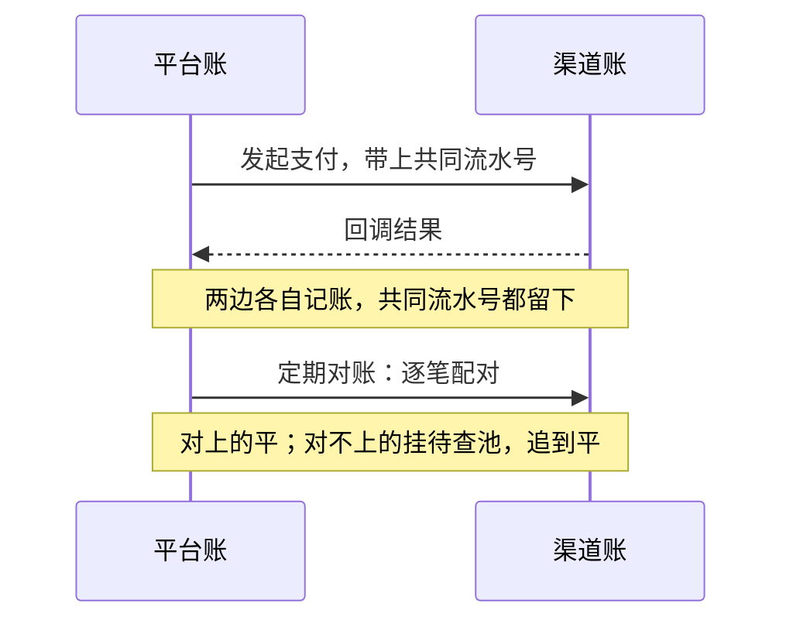
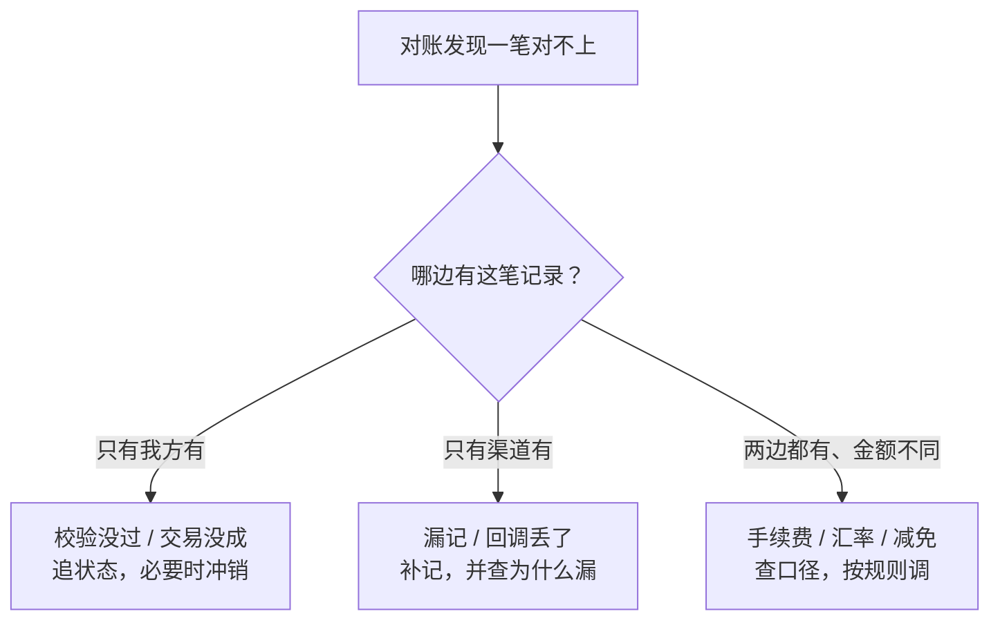

月底，财务发现平台的流水和渠道账单差了 3 分钱。查了一天，从手续费口径查到汇率，最后发现：手续费是用二进制浮点算的——单笔的零头小到看不见（`0.1 + 0.2` 加出来是 `0.30000000000000004`），成千上万笔攒下来，正好差出这 3 分钱。

钱为什么会对不上？答案分两半：一半在**表示**（金额怎么存、怎么算），一半在**核对**（两本账怎么比）。两半都做对，才谈得上「一分不差」。

## 对账不是对总数，是对每一笔

先看最常见的错误做法：拿两个汇总之和比对。「今天平台流水 100 万，渠道账单也是 100 万，平了。」

它的问题：

| | 核总数 | 逐笔核 |
|:--|:--|:--|
| 看什么 | 两个汇总之和 | 两边的每一笔 |
| 怎么认同一笔 | 不需要 | 靠**流水号**配对 |
| 一进一出（付了又退） | 互相抵消，看不出来 | 两笔各算，认得出 |
| 能发现「少一笔 / 多一笔」 | 可能仍然平 | 挑得出来 |
| 适合 | 只看个大概 | **要「每一分都有来路」** |

**总数是「看着平」，逐笔才是「真的平」。** 逐笔的前提是：每一笔钱在两边都带上**同一个流水号**。平台内部一个、渠道一个，两边的号都留在记录里，配对时靠共同号认「同一笔」。



*图 1：对账泳道——平台账与渠道账各自记账，配对靠共同流水号；对不上的先挂「待查池」，不直接改账。*

## 差异的三类来路

对不上不等于做假，也不等于算错。最常见的差异就三类：

| 差异形态 | 典型原因 | 处理方向 |
|:--|:--|:--|
| 只有我这边有 | 校验没过 / 交易没成 | 追状态，必要时冲销 |
| 只有渠道有 | 漏记 / 回调丢了 | 补记，并查为什么漏 |
| 两边都有、金额不同 | 手续费 / 汇率 / 减免 | 查口径，按规则调 |



*图 2：差异因果链——对不上一笔，先问「哪边有记录」：只有我方有、只有渠道有、还是两边金额不同；三种来路，三种处理。*

常见来路清单：重试产生的重复、**退款**、手续费口径、跨日/时区的时间差、漏记、金额口径不同（含税 vs 不含税）。

处理纪律只有一条，但至关重要：**没配上的差异不能直接改。** 一改总数就**假平**了，真差的那笔**再也找不回来**。正确路径：先挂进「待查池」（保留原始流水号和两侧时间）→ 顺着号追到卡点 → 查清楚再动账。

还有一条时间维度的诚实：**在途 ≠ 错。** 因为结算周期、跨日、时区，一边记了、另一边还没记——这种差异等另一边记上自然就平。对账总是**按一段一段核**（按日、按结算期），当天差一笔，先别下结论。

### 时间戳铁律：记账时间 ≠ 对账时间

这是内源教训里最贵的一条：**记账时间（`CreatedAt`）与对账时间（`ReconciledAt`）不可混用。**

混用了会怎样？账天天对不上，怎么查都查不出——因为「以哪个时间对齐两边」这件事本身就错了。落库时两个时间各存各的：一个回答「这笔什么时候发生」，一个回答「这笔什么时候被核对过」。

## 真实事故：两个经典

### Vancouver 交易所：22 个月「跌掉一半」

1982 年 1 月，温哥华证券交易所的指数从 **1000** 起步。指数每天更新约 **3000 次**，每次计算把结果**只保留三位小数，三位以后直接砍掉**——不是四舍五入，是截断。

截断是**系统性向下**的误差。单次砍掉的零头微不足道，但一天 3000 次、一个月约 20 个交易日，误差逐笔累积，指数以每月约 **25 点**的速度「下跌」。**22 个月**后，指数跌到约 **524.811**——而按正确算法计算出的真实值，一直在一千点附近徘徊。

1983 年 11 月的一个周末，修复上线，指数从 **524.811 一步跳回 1098.892**。跌掉的那一大截，压根不是行情，是零头攒出来的。

这个故事常被当作笑话讲，但它是所有对账差异的原型：**误差本身很小，系统性累积使它巨大。**

### TSB 银行：数据迁成功了，平台崩了

2018 年 4 月，英国 TSB 银行把约 **13 亿条**客户数据迁入新系统。迁移本身完成得很干净——然后平台立刻出了故障：全部门店受影响，在其约 **520 万**客户中，相当一部分人无法正常办理业务，**将近 200 万客户一度进不去自己的账户**，业务直到 **2018 年 12 月**才恢复。

后果：已赔付客户 **3270 万英镑**；2022 年 12 月，英国金融行为监管局（FCA）与审慎监管局（PRA）合计罚款 **4865 万英镑**（FCA 2975 万 + PRA 1890 万），定性为运营风险管理与治理失败。

它和「对账」的关系：**迁移的完成不等于账的延续。** 新旧系统之间，历史的每一笔是否仍然可对、可查、可追溯——这需要在迁移设计里就把「逐笔可对」当作验收标准，而不是迁移完了再补。

## 金额精度：为什么 `0.1 + 0.2 ≠ 0.3`

现在翻到表示的那一半。

计算机用**二进制浮点**表示实数，国际标准是 **IEEE 754**（首版 1985，现行 IEEE 754-2019）。IEEE 754 保证的是**一致性**（同样的输入，所有平台算出同样的结果），**不保证十进制精确**。

原因用一句人话就能说清：十进制的 `1/3 = 0.3333…` 永远写不完；**二进制里的 0.1 也是这么个写不完的数**。写不完就存不下，只能存近似——你存进去的「0.1」，已经短了一丁点。

于是有了那个著名的现世报：

```
0.1 + 0.2 = 0.30000000000000004
```

不用定点（decimal）而用浮点存钱，有四个真实后果：

1. **累加漂移**：100 笔 0.1 加起来 ≠ 10.0；
2. **比较失败**：`0.1 + 0.2 == 0.3` 为假，条件分支走错；
3. **对账对不上**：差几分钱，查半天（就是本文开头那一幕）；
4. **报表 / 发票金额错**：错在最显眼的地方。

### 金额该怎么存

| 表示方式 | 精确表示 0.1/0.3 | 舍入可控 | 代价与适用 |
|:--|:--|:--|:--|
| `float32` / `float64` | ✗ | ✗ | **禁止用于金额**——累加漂移 + 比较失败 |
| 整数「分」 | ✓ | ✓ | 成本最小；需统一最小单位与币种换算（Stripe 采用的路线） |
| `DECIMAL(p,s)` | ✓ | ✓ | 成本中等；需选对精度（数据库侧普遍选择） |
| 字符串 | ✓ | ✓ | 成本大；用于**传输 / 展示**，避免多次浮点转换 |

三个配套纪律：

- **传输与展示用字符串**——「每转一道手，它就可能再被『差不多』一次」；
- **位数要留足**：Autional 的金额统一 `decimal(20,4)`，历史上从 `float64` 迁移到 `decimal`、精度从 `(15,2)` 升到 `(20,4)`，共 **7 个模型迁移**；税率单独用 `decimal(10,6)`——多币种与税额计算需要更多小数位；
- **币种代码用 ISO 4217**（三位字母代码），不要自造。

### 舍入：规则必须写死，不能靠默认

| 舍入方式 | 偏差方向 | 适用 |
|:--|:--|:--|
| 截断（砍掉） | **系统性向下**（Vancouver 事故的根源） | 几乎不适用于金额 |
| 四舍五入 | 近似无偏，但 `.5` 恒向上 | 通用，但大量 `.5` 时仍轻微有偏 |
| 银行家舍入（.5 向偶数） | 接近无偏 | 财务 / 统计常用；**需显式声明** |

不论选哪种：**舍入规则在代码里写死，不靠语言默认。** 不同语言、不同库的默认行为不完全一致，把「钱怎么进位」交给默认值，等于把账本交给运气。

### 汇率不是数字，是「会过期的报价单」

汇率在系统里应该建模成一个值对象：`{From, To, Rate, QuoteID, ExpiresAt}`——带**报价号**和**过期时间**。

为什么要有过期时间？因为汇率随时在动。拿一张陈旧汇率去结算，事后对账时两边金额必然不同。**过了期就得换，不能拿旧的算**——这条规则写在数据模型里，比写在制度文档里可靠。

## 对账 ≠ 审计 ≠ 账本防篡改

这三件事常被混为一谈，目标其实完全不同：

| | 对账 | 审计 | 账本防篡改 |
|:--|:--|:--|:--|
| 管什么 | 对不对得上 | 谁在什么时候做了什么 | 记下来之后有没有被改 |
| 靠什么 | 共同流水号 + 逐笔比 | 不可篡改的记录 | 哈希链 + 序号 |
| 发现问题后 | 挂待查池，追平 | 留证，追责 | 逐笔验，报警 |

在对账的上游，「账本」本身也有工程要求：**只追加的事件流**（每笔钱一条事件：金额、变动前余额、变动后余额、序号、前序哈希、本笔哈希），余额是事件的**投影**，`(wallet_id, sequence_num)` 唯一索引防重复序号，哈希链让每一条都能被验证。再加每日**快照**，让回溯不必从头重放。

标准侧值得知道的锚点：**ISO 20022** 的现金管理报文 **camt.052 / camt.053 / camt.054**（账户报告 / 银行对客户对账单 / 借贷通知）官方描述就写明用于 "cash management and/or reconciliation"；camt.053 在设计上替代 SWIFT 的 MT940 / MT950 对账单。会计口径里，这种「两边对不上先挂起来」的差异有个正式名字：**未达账项**（items in transit）。至于「记录不可篡改」的监管要求（如 SEC 17a-4 与 WORM 存储），各家条款与实现的逐条映射差异很大，公开资料通常不完整——落到自己的合规清单时请以官方原文为准。

## Autional 的做法

对账链路分布在 `pay-service`、`billing-service` 与 `wallet-service`：

1. **每笔钱都带平台流水号**：`GatewayRef`（渠道侧）与 `InternalRef`（内部）两边都留，配对靠共同号认「同一笔」。
2. **定时逐笔核**：`SchedulerBillingReconciliation` 按天/按结算期拉两边账核对，先数对上的（`MatchedCount`），再数对不上的（`MismatchedCount`）。
3. **差异挂着追**：对不上的记成 `ReconciliationRecord`（两边金额都保留：`GatewayAmount` vs `InternalAmount`，外加 `DiffAmount`），一挂上就告警，等人追查——**不自动改数**。
4. **两个时间各存各的**：`CreatedAt`（记账）与 `ReconciledAt`（对账）不混用。
5. **金额侧**：`decimal(20,4)` 存储、字符串传输、`Currency` 用 ISO 4217、汇率带 `QuoteID` 与 `ExpiresAt`；钱包账本用事件流 + 哈希链 + 每日快照兜底。

诚实边界：各企业对账频率与差异口径差异很大，Autional 的默认节奏（按天/按结算期）是工程选择而非行业硬性规定；上文提到 SEC 17a-4 / WORM 属「可关联」级别的类比，条款级映射需按目标市场单独核实。

## 常见误区

- 「总数一样，账就对上了」——一笔「付了又退」两笔一起缺，一进一出正好抵消，总数看不出来；
- 「对不上 = 有人做假 / 自己算错」——多是手续费、退款、时差、漏记这类寻常差；
- 「对不上就改一笔凑平」——改了总数就假平，真差再也找不回来；
- 「对账的时间就是记账的时间」——混用会天天对不上（这是真实教训）；
- 「0.1 + 0.2 只是显示问题」——二进制根本没有精确的 0.1，误差真实存在；
- 「小数点后两位就够」——多币种、汇率、税额需要更多位；
- 「精度事故是算错了」——往往是**舍入规则写错**（Vancouver 用了截断）；
- 「汇率就是一个数字」——应是带报价号与过期时间的报价。

## 结语

对账不是对总数——是**对每一笔：同一个号，认成同一笔；剩下的，追到平。**

而钱不能「差不多」：**数字可以差不多，钱不行。差一分，账就是错的。**

三句判据，下次对不上账时按顺序问：

**这两笔，凭什么说是同一笔？没配上的那些，去哪了？差的那些，是错了，还是还在路上？**
