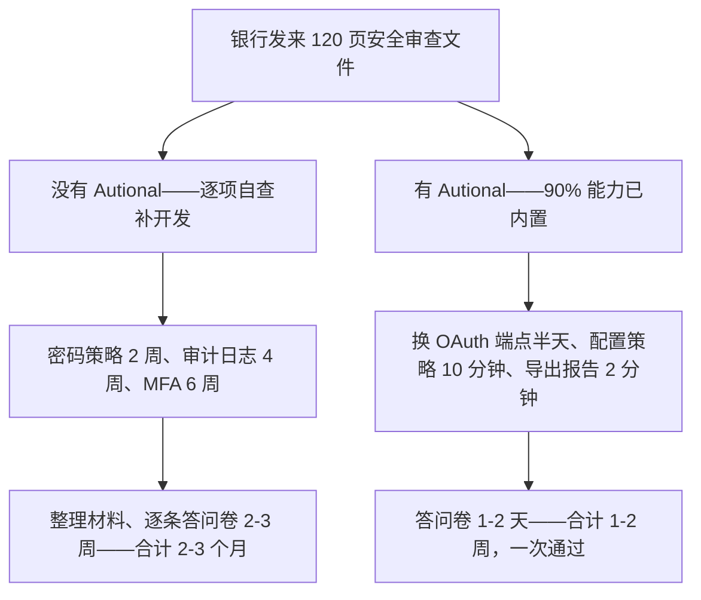

在企业级 SaaS 销售中，有一个经典场景：你的产品功能打动了客户，报价也在预算之内，POC 一路顺利——然后，客户的**安全团队**出现了。

他们发来一份 100 多题的安全审查问卷，涵盖访问控制、数据加密、审计日志、安全认证、事件响应、供应链安全……如果没有系统性的合规准备，这封邮件就足以让你的销售团队陷入被动。

> **合规说明**：本文所述的技术能力代表 Autional 平台的设计目标，不构成合规认证的法律声明。最终的合规责任由客户承担。

本文将探讨如何把合规从后端的「成本中心」变成前端的「营收引擎」。

## 合规：从成本到营收的范式转变

长期以来，合规被视为「不得不做的恶」——为满足监管要求而必须承担的成本。但在 2026 年的企业采购环境中，这种观念正在发生根本性转变。

合规不再是成本中心，**而是营收的助推器。**

## 安全审查问卷这场博弈

当客户的 CISO 团队发来安全问卷时，你的回答质量直接决定这笔单子能否推进。

### 典型审查问卷

| 类别 | 典型问题 | 未做准备时的回答 | 做好准备后的回答 |
|----------|-----------------|-------------------|-----------------|
| 访问控制 | 如何管理用户权限？是否支持 RBAC？ | 「我们有管理员和普通用户两种账号」 | 完整的 NIST RBAC 实现：角色继承、职责分离（SoD）、审批流。见 SOC 2 Type II 报告第 3.2 节 |
| 密码策略 | 密码如何存储与传输？ | 「我们用了加密」 | bcrypt cost=12 加盐哈希，传输采用 TLS 1.3，复杂度/历史/有效期策略均可配置 |
| MFA | 是否支持多因素认证？ | 「在开发中」 | TOTP/SMS/Email/Passkey 四种方式，可按角色与应用精细控制，新用户强制启用 |
| 审计日志 | 操作是否有记录？是否防篡改？ | 「我们有一张操作日志表」 | 全量审计日志、密码学哈希链防篡改、支持 Merkle 证明，可作为 SOC 2 / 等保审计证据 |
| 数据加密 | 敏感数据如何保护？ | 「数据库是加密的」 | 传输采用 TLS 1.3 + mTLS；静态数据字段级 AES-256-GCM 加密；敏感字段使用 json:"-" 防止泄露 |
| 安全事件 | 如何处理安全事件？ | 「我们会及时处理」 | 安全事件管理自动化：检测 → 定级 → 响应 → 通知，72 小时内上报监管 |
| 安全认证 | 是否通过任何安全审计？ | 「还没有」 | SOC 2 Type II（进行中）、等保 2.0 三级（进行中）。安全架构透明、可审计 |

「做好准备后的回答」里没有一条是临场编的——它们都是 Autional 的内置能力，是你产品的一部分。

## Autional 如何为你的销售团队赋能

### 1. 认证背书：让第三方替你说话

Autional 正在推进 SOC 2 Type II 认证与等保 2.0 三级测评。当你的产品构建在 Autional 之上时，独立审计流程已经在进行中。

当客户问「你们通过安全审计了吗？」，你可以回答：「我们采用 Autional 身份平台，该平台正在推进 SOC 2 Type II 认证，安全架构透明、可审计。」

**一张证书，胜过一百页自述。**

### 2. 自动化合规报告

compliance-service 的报告模块可以直接生成以下报告，用于客户的安全审查：

- **安全态势报告**：MFA 采用率、密码策略合规率、异常登录统计
- **访问审计报告**：用户权限清单、角色分配历史、权限变更记录
- **数据保护报告**：加密覆盖率、敏感字段清单、数据驻留分布
- **事件响应报告**：历史安全事件处理记录、SLA 达成率

这些报告由哈希链保护的审计日志生成，具备密码学完整性保证。客户的 CISO 可以独立验证报告数据的真实性。

### 3. SIEM 集成：对接客户的安全体系

大型企业客户通常有自己的安全运营中心（SOC）与 SIEM 系统。Autional 的 audit-service 支持把审计事件实时推送到 Splunk、ELK 等主流 SIEM 系统。这意味着：

- 客户的 SOC 团队可以在自己熟悉的安全看板上看到与 Autional 相关的安全事件
- 无需再跑到「另一个系统」里手动查审计日志
- 安全告警接入客户既有的告警与响应流程

**融入客户的安全运营，而不是让客户改习惯来迁就你。**

### 4. GSMA 数据保护评估

如果你的客户来自欧盟，或有 GDPR 合规需求，Autional 的 DSAR 自动化、告知同意管理与数据可携带支持——这些能力可以直接覆盖 GSMA 数据保护评估问卷（DPIA）中的大部分条目。在合规谈判中，这些内置能力意味着更短的审查周期与更高的通过率。

## 真实场景推演

设想你是一家 SaaS 项目管理工具的创始人，有 50 家中小企业客户。某天，一家知名银行表达了采购意向，同时附上了 120 页的安全审查文件。

*图 1：同一封 120 页安全审查的两种走法——自研补课按月计算，Autional 把周期压到按周计算。*

**没有 Autional 时**：
- 逐条对照现有系统自查——哪些能过、哪些不能
- 发现密码策略没有强制复杂度 → 排期开发（2 周）
- 发现没有审计日志 → 排期开发（4 周）
- 发现不支持 MFA → 排期开发（6 周）
- 整理合规材料、逐条回答问卷 → 2-3 周
- 合计：2-3 个月。大概率在评审阶段就被淘汰

**有 Autional 时**：
- 安全审查所需能力的 90% 已内置于 Autional
- 用 Autional 的 OAuth 端点替换自研登录 → 半天
- 配置密码策略与 MFA 策略 → 10 分钟
- 导出 SOC 2 Type II 报告与合规报告 → 2 分钟
- 回答安全问卷——大部分条目直接引用现成报告 → 1-2 天
- 合计：1-2 周。安全审查一次通过

## 关键结论

在 SaaS 早期，竞争壁垒是**功能**——谁能做出别人做不到的事。到了中期，壁垒是**体验**——谁能把复杂的事做简单。而现在，一个新的竞争壁垒正在显现：**信任**。

当你的客户——尤其是金融、医疗、政府与大型企业客户——把用户数据托付给你的平台时，他们需要的不只是一页写着「我们重视安全」的 PPT。他们需要：

- 一份能让法务部门审阅的 SOC 2 Type II 报告
- 一条能接入其 SOC 运营的实时审计数据流
- 可密码学验证的防篡改审计日志
- 标准化、可量化的安全态势看板

Autional 让这些信任基础设施成为产品的原生能力，使 SaaS 团队能把「安全合规」从销售过程中最大的障碍变成最大的卖点。

**2026 年，合规是 SaaS 赛道最强的竞争护城河。**
