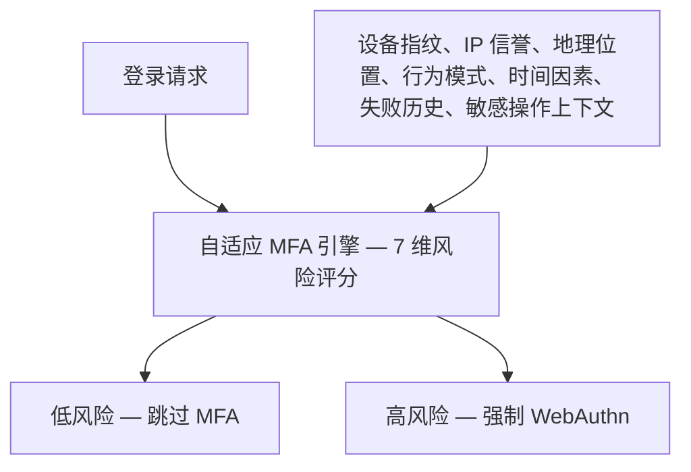
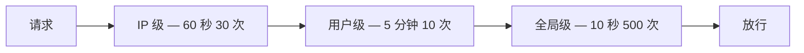

身份安全是 SaaS 产品的第一道防线，也是最重要的防线。Verizon 的《2025 数据泄露调查报告》显示，86% 的 SaaS 数据泄露事件涉及身份凭据被攻破或滥用。

本清单覆盖 8 个安全领域、30 个具体检查项。每一项包含三个部分：**检查什么**（评估标准）、**为什么重要**（风险说明）、**Autional 怎么做**（参考实现）。

> **合规说明**：「Autional 怎么做」部分描述的是 Autional 平台的设计目标与参考实现，不构成安全合规的法律声明。安全合规的最终责任由各 SaaS 产品提供方承担。

## 一、密码策略（6 项）

### 1. 强制最小密码长度 ≥ 8 位

**检查什么**：系统是否允许设置短密码（6 位及以下）？是否强制了最小长度？

**为什么重要**：8 位随机密码暴力破解约需 8 天（SHA-256 GPU），而 6 位只需 30 分钟。每多一位，破解难度呈指数级上升。

**Autional 怎么做**：identity-service 默认最小密码长度为 8。租户管理员可通过密码策略调整为 12、16 甚至 20 位。注册与改密时强制校验长度。

### 2. 拦截常用弱密码

**检查什么**：系统是否接受 `123456`、`password`、`admin123` 这类密码？

**为什么重要**：NordPass 的统计显示，`123456` 依然是全球使用最多的密码。这些是攻击者字典攻击的第一批条目。

**Autional 怎么做**：内置常用弱密码黑名单——基于 Have I Been Pwned 的 Pwned Passwords 数据集，收录 10 万条。设置密码时实时比对，黑名单定期更新。

### 3. 使用 bcrypt/scrypt/argon2 做密码哈希

**检查什么**：密码在数据库中如何存储？明文还是哈希？如果是哈希，是 MD5/SHA1 还是 bcrypt？

**为什么重要**：2012 年 LinkedIn 泄露的 650 万条密码使用了无盐 SHA-1——其中 90% 在 72 小时内即被破解。

**Autional 怎么做**：默认 bcrypt（cost factor=12），哈希自动包含随机盐。预留 Argon2id 接口以便透明升级——用户下次登录时自动迁移哈希。

### 4. 密码过期策略

**检查什么**：是否有定期密码过期机制（如 90 天）？是否有密码历史（禁止重复使用最近 N 个密码）？

**为什么重要**：密码泄露可能是无声的——半年前泄露的密码，攻击者也许一直没用。强制定期更换可以压缩风险窗口。

**Autional 怎么做**：可配置的密码有效期（30/60/90/180 天）、密码历史（保存最近 5-24 个密码哈希）。

### 5. 账号锁定机制

**检查什么**：连续失败 N 次后，账号是否会被临时锁定？锁定时长是否合理？

**为什么重要**：没有锁定的登录端点对暴力破解毫无防御。攻击者可以无限次尝试密码组合。

**Autional 怎么做**：默认 5 次失败 → 锁定 30 分钟。递进式锁定：第 1 次 5 分钟，第 2 次 30 分钟，第 3 次 2 小时，第 4 次需管理员解锁。

### 6. 密码强度指示器

**检查什么**：用户设置密码时是否有强度提示？是否会建议包含大写字母、数字与特殊字符？

**为什么重要**：如果用户不知道自己密码弱在哪里，就不会主动选择强密码。好的强度指示器可以将弱密码率降低 40%。

**Autional 怎么做**：登录页（auth-pages）内置密码强度指示器，基于密码熵而非简单规则，实时评估并展示强度（弱/中/强/极强）。

## 二、多因素认证（5 项）

### 7. MFA 是全局启用还是按用户群启用？

**检查什么**：MFA 是全局强制还是可选？能否对管理员强制、对普通用户可选？

**为什么重要**：MFA 可以阻止 99.9% 的账号失陷。但对所有用户一刀切强制，可能把一部分用户挡在门外。最佳策略是：特权角色强制执行，普通用户推荐使用。

**Autional 怎么做**：MFA 策略可按租户、角色组或单个用户配置。管理员默认强制 MFA（WebAuthn）；普通用户可选启用 TOTP。

### 8. 支持哪些 MFA 方式？

**检查什么**：系统是否支持 TOTP？FIDO2/WebAuthn 硬件密钥？短信 OTP？

**为什么重要**：不同 MFA 方式的安全等级差异巨大。短信 OTP 可通过 SIM 卡交换攻击绕过，而 FIDO2 具备协议级的抗钓鱼能力。

**Autional 怎么做**：mfa-service 完整支持 TOTP、WebAuthn（FIDO2）、HOTP、短信 OTP 与备用码。管理员可以配置允许使用的 MFA 方式列表。

### 9. 是否有 MFA 恢复机制？

**检查什么**：用户丢失 MFA 设备（换手机、硬件密钥损坏）时如何恢复？是否有备用码或管理员重置通道？

**为什么重要**：没有恢复机制，用户一旦丢失设备就会被永久锁在门外。但如果恢复机制太弱（例如只回答安全问题），防护就形同虚设。

**Autional 怎么做**：三种恢复机制：（1）注册 MFA 时自动生成 10 个一次性备用码；（2）管理员审批流重置 MFA；（3）支持一个用户绑定多个 MFA 设备（主设备 + 备用设备）。

### 10. 是否有 MFA 跳过/记住设备机制？

**检查什么**：用户是否可以在一段时间内跳过 MFA（例如「信任此设备 30 天」）？

**为什么重要**：如果每次登录都要 MFA，用户会不胜其烦，甚至试图绕过。信任设备机制能在便利与安全之间取得平衡。

**Autional 怎么做**：支持「记住此设备」——记录设备指纹哈希，超过可配置的天数或设备指纹发生变化时，重新要求 MFA。

### 11. 自适应 MFA：能否按风险调整认证强度？

**检查什么**：系统能否识别异常登录行为（新位置、新设备、非常规时间），并自动提升认证要求？

**为什么重要**：传统 MFA 对所有人一视同仁。同一用户从公司内网登录与从境外登录面临同样的验证——前者被打扰，后者却防护不足。

**Autional 怎么做**：自适应 MFA 引擎使用 7 维风险评分（设备指纹、IP 信誉、地理位置、行为模式、时间因素、失败历史、敏感操作上下文）动态决定认证强度。低风险跳过 MFA，高风险强制 WebAuthn。

*图 1：自适应 MFA 的决策路径——7 维风险信号汇聚成一次评分，低风险放行、高风险升级到 WebAuthn。*

## 三、会话管理（4 项）

### 12. 是否有绝对超时与空闲超时？

**检查什么**：登录会话是否永久有效？是否有无操作自动登出机制？

**为什么重要**：永不过期的会话意味着一个被遗忘的浏览器标签页几个月后仍能访问企业系统，风险极高。

**Autional 怎么做**：session-service 支持双重超时：绝对超时（如 8 小时后强制重新认证）与空闲超时（如 30 分钟无操作后登出）。两者均可按租户配置。

### 13. 是否限制单设备登录或并发数？

**检查什么**：同一用户能否在多台设备同时登录？是否有最大并发会话数限制？

**Autional 怎么做**：session-service 全局跟踪每个用户的所有活跃会话。管理员可设置最大并发会话数（如 3），超出后强制终止最早会话或拒绝新登录。

### 14. 会话能否被立即吊销？

**检查什么**：发现安全事件（如账号失陷）时，管理员能否立即终止该用户的所有活跃会话？

**为什么重要**：JWT 最大的弱点是无法即时吊销——必须等令牌过期或引入黑名单。即时吊销是安全事件响应的基本要求。

**Autional 怎么做**：session-service 提供 `DELETE /sessions?user_id=X` API 立即终止所有活跃会话。JWT 的 `jti` 与 Session ID 绑定；敏感操作时 gateway-service 会向 session-service 校验会话有效性。

### 15. 会话 Cookie 是否设置了 Secure、HttpOnly、SameSite？

**检查什么**：会话 Cookie 的属性是否安全配置？

**Autional 怎么做**：`Set-Cookie` 响应头强制 `Secure=true; HttpOnly=true; SameSite=Lax`。在纯 HTTPS 环境下，Cookie 无法被 JavaScript 读取，也无法随跨站请求携带。

## 四、API 安全（4 项）

### 16. 登录与 API 端点是否限流？

**检查什么**：登录端点是否有限流？API 是否有全局限流？

**Autional 怎么做**：gateway-service 实现三层限流：IP 级（60 秒窗口，30 次请求）、用户级（5 分钟窗口，10 次请求）、全局级（10 秒窗口，500 次请求）。基于 Redis 的分布式限流实现跨网关实例的共享计数。

*图 2：三层限流——请求依次通过 IP 级、用户级、全局级三道闸门，计数由 Redis 在多网关实例间共享。*

### 17. 服务间 API 是否使用内部认证？

**检查什么**：微服务之间的 API 调用是否需要认证？还是直接暴露（假设内网安全）？

**为什么重要**：零信任架构要求即使在网络内部，内部 API 也要认证。「城墙之内皆安全」是过时的安全模型。一旦攻击者突破外围防御，未认证的内部 API 毫无还手之力。

**Autional 怎么做**：内部 API 通过 `auth_mw.InternalAPIKeyAuth()` 中间件强制 `X-API-Key` 认证。内部 API 密钥通过环境变量注入，不从配置文件读取。

### 18. API 密钥的存储与使用是否正确？

**检查什么**：API 密钥在数据库中明文存储还是哈希存储？创建后能否再次查看完整密钥？

**Autional 怎么做**：API 密钥以 SHA-256 哈希存储。完整密钥仅在创建时向用户展示一次，之后只可见前缀（如 `tk_a1b2c3d4****`）。校验时比对哈希，而非明文。

### 19. 是否支持 IP 白名单？

**检查什么**：API 密钥能否限制到特定 IP 或 IP 段？

**Autional 怎么做**：每个 API 密钥都可配置 IP 白名单。gateway-service 在校验 API 密钥时比对请求 IP 是否在白名单内。

## 五、审计日志（3 项）

### 20. 认证相关事件是否全部记录？

**检查什么**：登录成功/失败、改密、MFA 注册/校验、权限变更等是否完整记入审计日志？

**Autional 怎么做**：audit-service 对所有认证事件记录完整审计日志（谁、做了什么、何时、来自哪个 IP、结果如何）。日志使用哈希链保证不可篡改。

### 21. 审计日志是否防篡改？

**检查什么**：拥有数据库权限的管理员能否删除或修改审计日志？

**Autional 怎么做**：audit-service 使用哈希链（每条日志的哈希包含上一条日志的哈希）与 Merkle 树，为审计日志提供密码学完整性证明。任何一条日志被插入、删除或修改，都会破坏哈希链并被检出。

### 22. 日志中的 PII 是否脱敏？

**检查什么**：密码、令牌、证件号等敏感细节是否被误记入日志？

**Autional 怎么做**：日志中间件自动脱敏 PII 字段（手机号、邮箱、证件号）与敏感字段（password_hash、access_token、api_key），只保留脱敏后的版本。

## 六、数据加密（3 项）

### 23. 数据库中是否有未加密的 PII 字段？

**检查什么**：用户的手机号、邮箱、证件号等在数据库中是明文还是密文？

**Autional 怎么做**：PII 字段使用 AES-256-GCM 字段级加密。加密密钥经云 KMS 管理，只存在于进程内存中，绝不以明文落盘。

### 24. 是否有加密密钥轮换机制？

**检查什么**：加密密钥（用于 PII 加密、JWT 签名）多久轮换一次？

**Autional 怎么做**：数据加密密钥（DEK）每 90 天轮换一次；KMS 主密钥每年轮换一次。JWT 签名密钥采用 JWK 格式并自动生成 `kid`（Key ID），支持密钥轮换期间的平滑过渡。

### 25. 数据传输是否加密？

**检查什么**：所有 API 通信是否走 HTTPS/TLS？服务间通信是否加密？

**Autional 怎么做**：对外 API 强制 HTTPS（HTTP 请求自动重定向）。内部 gRPC 通信使用 mTLS（双向 TLS），服务端与客户端互相校验证书。

## 七、访问控制（3 项）

### 26. 是否落实最小权限原则？

**检查什么**：用户是否拥有超出所需的权限？是否存在用管理员账号做日常操作的情况？

**Autional 怎么做**：RBAC（基于角色的访问控制）系统，内置预定义角色（超级管理员、管理员、安全管理员）与自定义角色。权限可细化到单个 API 端点。支持权限模拟与反向查询。

### 27. 是否有租户数据隔离？

**检查什么**：不同租户的数据是否完全隔离？一个租户能否访问另一个租户的数据？

**Autional 怎么做**：所有数据库查询强制 `WHERE tenant_id = ?`。中间件从 JWT 中提取 `tenant_id` 注入上下文；Service 层在所有查询上自动注入租户过滤。跨租户访问数据在架构上不可能发生。

### 28. 是否有职责分离（SoD）控制？

**检查什么**：是否存在不能由同一人兼任的互斥角色（如审批人与申请人）？

**Autional 怎么做**：RBAC 系统支持静态职责分离（SoD），可定义互斥的角色对（如「管理员」与「审计员」）。当给用户分配互斥角色时，系统拒绝该操作并触发告警。

## 八、供应链与合规（2 项）

### 29. 第三方依赖是否定期审计？

**检查什么**：你的开源库与 SaaS 依赖是否存在已知漏洞？上次审计是什么时候？

**Autional 怎么做**：所有 Go 依赖使用 `go mod tidy` 管理，并定期执行 `govulncheck` 扫描。Docker 镜像基于最小化的 Distroless 基础镜像构建，减小攻击面。

### 30. 是否有合规认证或框架对标？

**检查什么**：你的系统对标哪些安全框架（SOC 2、ISO 27001、等保 2.0）？是否有认证计划？

**Autional 怎么做**：Autional 正在推进 SOC 2 Type II 认证。内置满足等保三级要求的能力，覆盖身份鉴别、访问控制、安全审计、数据加密。提供自动化的合规证据收集与导出。

## 自评打分

每通过一项计 1 分，满分 30 分。

| 得分 | 等级 | 行动 |
|-------|-------|--------|
| 25-30 | 安全成熟 | 保持并持续监控 |
| 18-24 | 基本达标 | 补齐短板，优先处理一星与二星项 |
| 10-17 | 存在风险 | 需要立即启动安全加固项目 |
| 0-9 | 危险 | 系统处于暴露状态，需紧急处置 |

这份清单的目标不是拿满 30 分，而是找出你的安全盲区。每一个缺失项，都对应着一次真实可能发生的安全事件。
