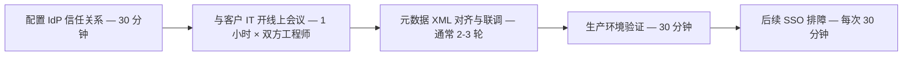
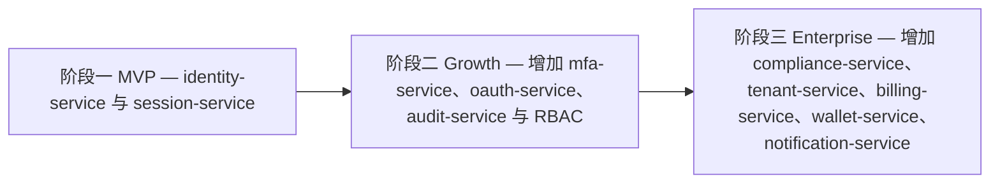

## 场景：你正在启动一款 SaaS 产品

你和合伙人都有深厚的行业积累。产品原型在 Figma 里打磨得很精致。后端 Go，前端 React，数据库 PostgreSQL。你们俩技术都很强。

然后你开始想：**用户怎么登录？**

你的第一反应可能是：「不就是个登录页吗？找个库两天就能搞定。」

这个想法有三个问题：

第一，你没有考虑阶段二和阶段三——登录只是开始。MFA、SSO、RBAC、审计、合规都在后面等着。

第二，你低估了身份安全的边界效应——一次安全事故的代价，可能超过你前三年的营收。

第三，你没有算过复利效应——靠「迭代演进」堆出来的技术债，在身份系统里会以指数级增长。

## 身份系统的三个阶段

### 阶段一：只要能登录（第 0→6 个月）

你的 SaaS 刚上线，用户几百人。你需要：

- 邮箱/手机号注册 + 密码登录
- 基础密码策略（最小长度 8，拦截常见弱密码）
- Cookie/会话管理
- 简单的角色区分（普通用户与管理员）

**自研成本**：1-2 周（1 名全栈工程师），涵盖注册/登录页、密码哈希、会话存储与中间件。

**Autional 私有化部署（商业授权）**：identity-service 负责用户注册与登录，session-service 负责会话管理。无需额外的 MFA 或 SSO。30 分钟完成接入。

**关键提醒**：即使在阶段一，有些基础设施决策也是难以回头的：

- 用户密码必须使用 Argon2id 哈希（不是 bcrypt，更不是 SHA256）
- 用户 ID 格式（ULID vs UUID vs 自增整数）——一旦选定，很难更改
- 软删除策略（用户「注销」账号后，数据如何处置）

用 Autional，这些基础设施决策已由专业团队做好——Argon2id 密码哈希、ULID 主键、符合 GDPR 的软删除。

### 阶段二：面向企业客户（第 6→18 个月）

你签下了第一个企业客户。需求突然升级：

**他们提出**：

- 「我们需要 SAML SSO——公司用的是 Azure AD」
- 「我们需要双因素认证——金融行业要求的」
- 「我们需要细粒度的角色管理——不只是管理员/用户两种」
- 「你们有 SOC 2 报告吗？」
- 「我们需要审计日志——谁在什么时候改了这个字段」

**自研成本**：3-6 个月（2-3 名工程师）。仅 SAML SSO 集成一项就远比想象中复杂——每个 IdP 都有自己的脾气（Azure AD、Okta、OneLogin、PingIdentity……），而 SSO 的调试通常需要和企业客户的 IT 团队来回拉锯。

**Autional 进阶能力**：启用 mfa-service（TOTP + Passkey），配置 RBAC 细粒度角色，开通 oauth-service 提供 OIDC/SAML SSO，启用 audit-service 记录审计日志。无需改代码——只需配置。

**SAML SSO 的隐性成本**：每接入一家企业客户的 SSO：

1. 技术团队配置 IdP 信任关系（30 分钟）
2. 与客户 IT 团队开线上会议（1 小时 × 双方工程师）
3. 元数据 XML 对齐与联调（通常 2-3 轮）
4. 生产环境验证（30 分钟）
5. 后续 SSO 排障（每次 30 分钟）

*图 1：每接入一家企业客户的 SSO 流程——五个步骤单看都不大，乘上 50 家客户后，仅支持成本每年就超过 100 人时。*

按 50 家企业客户算，仅 SSO 相关的支持成本每年就会超过 100 人时——还没算代码维护。

### 阶段三：合规与规模化（第 18 个月以后）

你的 SaaS 进入快速增长期。新的挑战：

- **合规认证**：SOC 2 Type II、ISO 27001 要求完整的访问控制与审计体系
- **多地域部署**：欧洲客户要求数据存在法兰克福，中国客户要求数据在上海
- **多产品线**：第二条产品线需要共享用户身份，但不共享全部权限
- **收购/拆分**：用统一身份系统管理多条业务线

**自研成本**：12 个月以上（3-5 名专职工程师）。这已不再是「SaaS 产品的一部分」——它变成了「一个独立的身份平台」。

**Autional 企业级能力**：compliance-service 覆盖 SOC 2/ISO 27001/GDPR 合规自动化。通过数据驻留策略实现多地域部署。通过 tenant-service 与 identity-service 的层级角色体系支持多租户 + 多产品。

> **接入说明**：本文的工作量估算与价格参考基于典型行业场景。实际接入时间与成本会因存量系统复杂度、团队经验、业务规模等因素而变化。具体合规认证要求以属地监管机构的最新指引为准。

## 自研 vs 采购：TCO 分析

我们来算一笔三年总拥有成本（TCO）的账。假设是一个 20 人的 SaaS 团队，10 万月活用户：

### 自研身份系统

| 阶段 | 时间投入 | 人力成本 | 说明 |
|-------|----------------|------------|-------------|
| 阶段一（基础认证） | 2 周 × 1 人 | ¥15,000 | 注册/登录/会话 |
| 阶段二（MFA+SSO+RBAC） | 4 个月 × 2 人 | ¥240,000 | SAML/OIDC 集成 |
| 阶段三（合规+多地域） | 8 个月 × 3 人 | ¥720,000 | 审计/隐私/数据驻留 |
| 持续维护（3 年） | 3 年 × 0.5 人 | ¥540,000 | 安全补丁/IdP 适配/合规更新 |
| **自研合计** | | **¥1,515,000** | |

### 使用 Autional

| 阶段 | 方案 | 费用 | 接入时间 |
|-------|------|------------|------------------|
| 阶段一 | 私有化部署 | 商业授权另议 | 1 天 |
| 阶段二 | 进阶能力 | 商业授权另议 | 仅配置 |
| 阶段三 | 企业级能力 | 商业授权另议 | 专业部署 |
| **3 年合计** | | **以商务报价为准** | |

自研的总体成本明显高于采购——而这还没算上这些隐性成本：

- 安全漏洞的响应时间（自研意味着只能靠自己）
- 合规认证被拒后的返工成本
- 因身份系统不完整而丢掉企业客户的机会成本
- 资深工程师不去做核心业务功能、而去维护身份代码的机会成本

## 创业公司常见的身份架构误区

### 误区一：「等需要了再说」

「我们现在只需要简单登录。等有了企业客户再加 SSO。」

问题是：等到你有 10 万用户、10 张表依赖用户 ID 字段、5 个微服务各写了一套认证中间件时，「加 SSO」的工作量是「第一天就用」的 3-5 倍。

### 误区二：共用账号

「运维就用一个 root 账号干所有事。」

这不是技术问题，而是严重的合规缺陷。HIPAA、SOC 2、等保 2.0 都明确要求用户标识唯一，禁止共用账号。

### 误区三：什么都自己造

「我们团队很强，自己写身份系统没问题。」

技术能力不是瓶颈，持续维护才是。OAuth 2.1 草案在陆续发布，SAML 4.0 在讨论，Passkey 规范在不断推进，每季度都有新的安全 CVE 要跟进。一个 20 人创业公司的产品团队，扛得住这些吗？

### 误区四：把身份与业务系统耦合

「在用户表加个 role 字段，认证中间件写在业务服务里就行了。」

当你需要支持多应用、多租户、多身份源时，这种耦合会变得极其痛苦。身份系统应该是一个独立、解耦的基础设施层，通过标准协议与业务系统交互。

## Autional 如何伴随你的 SaaS 成长

Autional 的设计理念是「渐进式采用」——你不需要第一天就上齐 27 个微服务：

*图 2：渐进式采用——阶段一只需两个服务，阶段二按需加上 MFA、SSO 与审计，阶段三再扩展企业级服务。*

这种渐进式采用让你可以：

- 阶段一：只部署 2 个服务，资源占用极小
- 阶段二：按需开启 MFA/SSO/审计
- 阶段三：在生产验证之后再扩展企业级能力

## 总结

身份系统不是你产品的附属功能，而是影响产品竞争力的基础设施。对 SaaS 创业公司来说，正确的策略是：

1. **从第一天就用专业方案**，避免不可持续的技术债
2. **选择能陪你成长的平台**，而不是「大而全但用不上」的方案
3. **把工程时间花在核心业务上**——身份的事交给专业的人

Autional 为 SaaS 创始人提供了一条清晰的路径：从私有化部署快速起步，到企业级 SSO、合规与多地域部署——云托管（路线图中）开放后，身份系统还能随业务一起演进。
