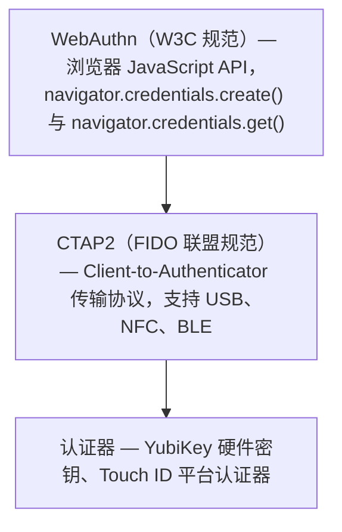
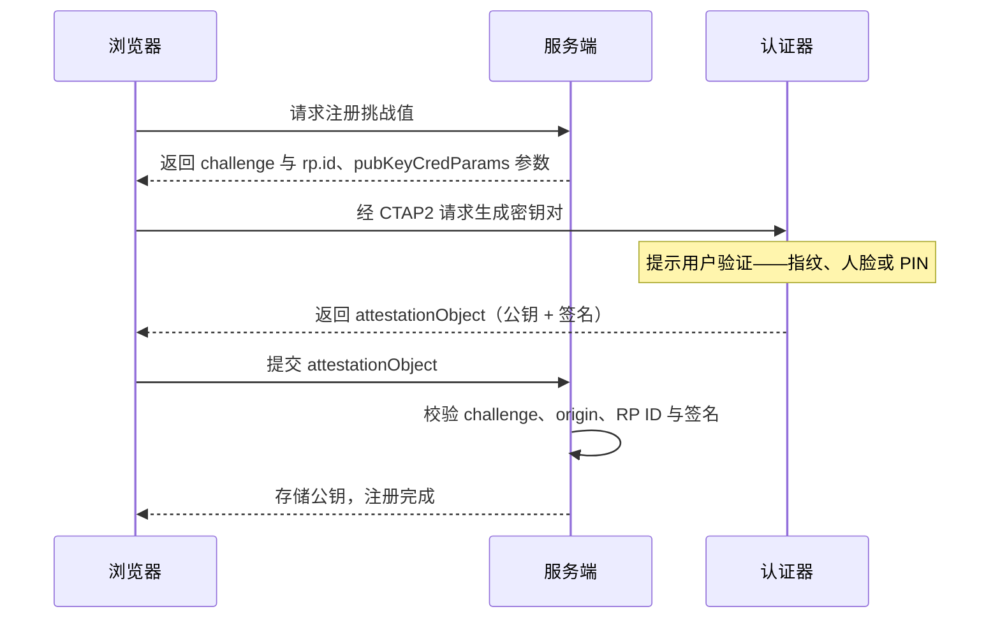

WebAuthn（Web Authentication）是 W3C 与 FIDO 联盟制定的、基于浏览器的免密认证标准。与传统的「用户名 + 密码」不同，WebAuthn 基于公钥密码学——客户端生成并持有私钥，服务器只保存公钥。私钥永不离开用户设备。

本文将从协议层逐层拆解，最后说明 Autional 如何把这套复杂协议封装成开箱即用的企业级能力。

## 协议总览：FIDO2 的分层架构

FIDO2 由两个核心部分组成：



*图 1：FIDO2 的三层架构——WebAuthn 是网页能触到的 API，CTAP2 负责浏览器与认证器之间的传输，密钥生成与签名都发生在认证器内。*

- **WebAuthn**：运行在浏览器中的 JavaScript API，定义了网页与认证器如何交互。开发者通过 `navigator.credentials.create()` 创建凭据，通过 `navigator.credentials.get()` 获取凭据断言。
- **CTAP2**（Client to Authenticator Protocol）：浏览器与物理认证器之间的通信协议。当用户插入 USB 安全密钥或通过 NFC 触碰时，CTAP2 定义了数据传输格式。
- **Authenticator（认证器）**：负责生成密钥对、保存私钥并执行签名操作的硬件或软件模块。

FIDO2 并不要求开发者了解 CTAP2 的细节——浏览器负责处理 CTAP2 通信，开发者只需调用 WebAuthn API。但理解协议全貌，有助于做出正确的安全架构决策。

## 注册流程：attestation（创建凭据）

注册是整个 WebAuthn 流程的起点——用户首次把一台设备绑定到账号上。



*图 2：注册流程的泳道时序——浏览器取挑战值，认证器生成密钥对并签名，attestationObject 回到服务端验签入库，私钥全程不出认证器。*

### 第一步：服务端生成挑战值

```
Client → Server: POST /webauthn/register/begin
    Body: { "display_name": "My YubiKey" }

Server Processing:
    1. Generate 32-byte random challenge (crypto/rand)
    2. Generate user ID (Autional ULID)
    3. Query user's already-registered credentials (for excludeCredentials)
    4. Store challenge temporarily (Redis, TTL 5 minutes)

Server → Client:
    {
      "challenge": "base64url...",
      "rp": { "id": "iam.tianv.com", "name": "Autional" },
      "user": {
        "id": "base64url...",
        "name": "user@example.com",
        "displayName": "Nickname"
      },
      "pubKeyCredParams": [
        { "type": "public-key", "alg": -7 },   // ES256
        { "type": "public-key", "alg": -257 }  // RS256
      ],
      "authenticatorSelection": {
        "authenticatorAttachment": "cross-platform",
        "userVerification": "required"
      },
      "attestation": "none"
    }
```

`rp.id` 是 Relying Party ID——它必须是当前域名的合法子集。例如服务运行在 `iam.tianv.com` 上，`rp.id` 可以是 `iam.tianv.com`，但不能是 `example.com`。这个限制是 WebAuthn 抗钓鱼的核心机制之一。

`authenticatorSelection` 控制：

- `authenticatorAttachment: "platform"`——仅平台认证器（例如 Touch ID、Windows Hello）
- `authenticatorAttachment: "cross-platform"`——仅漫游认证器（例如 USB 安全密钥）
- `userVerification: "required"`——需要生物特征或 PIN 解锁认证器

### 第二步：客户端调用 WebAuthn API

```javascript
const publicKeyCredential = await navigator.credentials.create({
  publicKey: optionsFromServer
});
// publicKeyCredential contains:
//   - id: credential ID (base64url)
//   - rawId: credential ID raw bytes
//   - response.clientDataJSON: client data (challenge, origin, type)
//   - response.attestationObject: authenticator data (public key, signature)
//   - type: "public-key"
```

这次调用会触发浏览器的 WebAuthn 流程：

1. 浏览器校验 `rp.id` 与当前域名是否匹配
2. 浏览器通过 CTAP2 与认证器通信，请求生成新的密钥对
3. 认证器提示用户验证（指纹、人脸、PIN）
4. 认证器生成 ECDSA（ES256）密钥对，私钥安全保存在认证器内
5. 认证器用私钥对 `clientDataJSON` 的哈希签名，生成 attestation
6. 返回包含公钥与签名的 `attestationObject`

### 第三步：服务端校验并存储

```
Client → Server: POST /webauthn/register/complete
    Body: {
      "id": "base64url...",
      "rawId": "base64url...",
      "response": {
        "clientDataJSON": "base64url...",
        "attestationObject": "base64url..."
      },
      "type": "public-key"
    }

Server Processing:
    1. Verify clientDataJSON.type === "webauthn.create"
    2. Verify clientDataJSON.challenge === stored challenge
    3. Verify clientDataJSON.origin === expected origin
    4. Parse attestationObject, extract:
       - authData: authenticator data (RP ID hash, flags, counter, public key)
       - fmt: attestation format ("none", "packed", "tpm", etc.)
    5. Verify RP ID hash in authData matches
    6. Verify userPresent and userVerified flags in authData
    7. Extract public key (CBOR decode → COSE Key → ECDSA public key)
    8. Compute SHA-256 hash of clientDataJSON
    9. Verify signature in attestationObject (optional, depends on attestation param)
    10. Store in database:
        - credential_id: credential ID
        - public_key: public key (DER encoded)
        - counter: signature counter (for clone detection)
        - transports: supported transport methods (usb, nfc, ble, internal)
        - device_name: user-set device name
```

Autional 的 mfa-service 在注册校验阶段做了以下安全加固：

- **严格校验来源**：只接受配置好的允许来源列表，防止跨域攻击
- **挑战值防重放**：挑战值一次性使用，用完立即删除，防止重放
- **计数器校验**：保存认证器的签名计数器，后续校验要求计数器递增——若检测到计数器回退，说明私钥可能已被克隆
- **防重复注册**：同一个 credential ID 不能注册到不同账号

## 认证流程：断言校验

认证流程比注册简单，因为公钥已经在服务端——只需验证用户确实持有对应的私钥。

### 第一步：服务端生成挑战值

```
Client → Server: POST /webauthn/authenticate/begin
    Body: { "user_id": "01ARZ3NDEKTSV4RRFFQ69G5FAV" }

Server Processing:
    1. Query user's all registered credential IDs (for allowCredentials)
    2. Generate new random challenge
    3. Store challenge temporarily
    4. Optionally restrict userVerification requirements

Server → Client:
    {
      "challenge": "base64url...",
      "allowCredentials": [
        { "id": "base64url...", "type": "public-key", "transports": ["usb","nfc"] }
      ],
      "userVerification": "required",
      "timeout": 60000
    }
```

### 第二步：客户端对挑战值签名

```javascript
const assertion = await navigator.credentials.get({
  publicKey: optionsFromServer
});
// assertion contains:
//   - response.authenticatorData: authenticator data (RP ID hash, counter)
//   - response.clientDataJSON: client data (challenge, origin)
//   - response.signature: authenticator's signature over (authenticatorData + clientDataJSON hash) using private key
```

认证器的处理流程：

1. 校验 `rp.id` 与注册时保存的 RP ID 是否一致
2. 提示用户验证（指纹/人脸/PIN）
3. 用私钥对 `(authData || SHA-256(clientDataJSON))` 签名
4. 内部计数器递增（用于克隆检测）
5. 返回签名结果

### 第三步：服务端校验签名

```
Server Processing:
    1. Look up public key from database using credential_id
    2. Verify clientDataJSON.type === "webauthn.get"
    3. Verify clientDataJSON.challenge === stored challenge
    4. Verify clientDataJSON.origin === expected origin
    5. Verify RP ID hash in authenticatorData
    6. Verify userPresent and userVerified flags
    7. Verify signature counter > last recorded counter (anti-clone)
    8. Construct signature data: authenticatorData || SHA-256(clientDataJSON)
    9. Verify signature with public key (ECDSA verify)
    10. Signature verification passes → authentication success
    11. Update counter value in database
```

## 认证器类型与安全等级

| 特性 | 平台认证器 | 漫游认证器 |
|---------|-----------------------|----------------------|
| 实现形态 | Touch ID、Windows Hello、Android 生物识别 | YubiKey、飞天（Feitian）、Google Titan |
| 私钥存储 | 设备安全芯片（TEE/Secure Enclave） | 认证器内部安全芯片 |
| 跨设备使用 | 不直接支持（需通行密钥同步） | 支持（随身携带即可） |
| 用户验证 | 生物特征（指纹/人脸） | PIN 或生物特征（高端型号） |
| 抗钓鱼 | 高（来源绑定，私钥留在设备内） | 最高（物理隔离 + 来源绑定） |
| 丢失风险 | 设备丢失需走恢复流程 | 物理丢失需备用密钥 |
| 适用场景 | 日常登录、中低安全要求 | 管理操作、高安全要求 |

Autional 允许租户管理员在 MFA 策略中配置可接受的认证器类型：

```yaml
webauthn_policy:
  allowed_attachments:
    - platform
    - cross-platform
  user_verification: required
  attestation: none
```

## Autional 的实现架构

Autional 完整的 WebAuthn 实现由两个服务协作完成：

### identity-service 的职责

identity-service 提供面向用户的 WebAuthn API 入口：

```
POST   /api/v1/mfa/webauthn/register/begin
POST   /api/v1/mfa/webauthn/register/complete
POST   /api/v1/mfa/webauthn/authenticate/begin
POST   /api/v1/mfa/webauthn/authenticate/complete
GET    /api/v1/mfa/webauthn/credentials
DELETE /api/v1/mfa/webauthn/credentials/{id}
```

主要职责：

- 管理挑战值的生成、存储与校验（与 session-service 协同）
- 控制用户交互流程
- 凭据的增删改查管理

### mfa-service 的职责

mfa-service 承担 WebAuthn 协议的核心密码学运算：

```
Internal API (for identity-service consumption):
POST /api/v1/internal/mfa/webauthn/verify-registration
POST /api/v1/internal/mfa/webauthn/verify-authentication
```

主要职责：

- `attestationObject` 的 CBOR 解析
- 公钥提取与格式转换（COSE Key → DER 公钥 → crypto.PublicKey）
- 注册签名校验
- 认证签名校验
- 计数器管理（防克隆）

### 为什么要拆成两个服务？

这种职责分离体现了 Autional 的微服务设计理念：

1. **关注点分离**：identity-service 负责用户交互，mfa-service 负责密码学运算。更换签名算法或新增认证器类型时，只需改动 mfa-service。
2. **独立扩展**：注册与认证中的密码学运算（ECDSA 校验）非常吃 CPU。通行密钥推广期间注册请求可能激增——mfa-service 可以独立扩容，不影响 identity-service。
3. **安全边界**：公钥存储与签名校验逻辑集中在 mfa-service，缩小了审计范围，也减小了安全风险面。

## 开发者体验

对集成 Autional 的开发者来说，启用通行密钥只需三步：

1. **在管理控制台启用通行密钥**：进入 MFA 策略配置，开启 WebAuthn，选择允许的认证器类型。
2. **前端代码（零行）**：Autional 的登录页（auth-pages）已内置完整的 WebAuthn 流程。用户的浏览器会自动检测通行密钥支持情况。
3. **用户注册**：用户登录后进入安全设置，点击「添加通行密钥」，系统自动调用 `navigator.credentials.create()`，引导用户完成指纹/人脸注册。

整个过程不需要集成方理解 CTAP2、CBOR、COSE Key、attestation 等任何底层概念。

## 安全最佳实践

### 1. 严格配置 RP ID

RP ID 是 WebAuthn 抗钓鱼能力的基础，必须与你的域名精确匹配——不允许使用通配符。如果你的服务有多个子域（例如 `app.example.com` 与 `admin.example.com`），你需要在两种方案中做选择：用 `example.com` 作为共享 RP ID（凭据可在所有子域通用），或为每个子域配置独立的 RP ID（隔离性更高）。

在 Autional 的多租户场景中，每个租户可以拥有独立域名；系统会在注册时为每个租户配置正确的 RP ID。

### 2. 用户验证策略

`userVerification` 有三个级别：

- `discouraged`：不要求用户验证。适合低风险操作。
- `preferred`：认证器支持时建议验证。适合日常登录。
- `required`：必须验证。适合敏感操作。

Autional 的自适应 MFA 引擎可以根据操作的风险等级动态决定 `userVerification` 策略——查看资料用 `preferred`，修改密码用 `required`，大额转账用 `required` + 强制硬件密钥。

### 3. 凭据备份与恢复

用户注册通行密钥后，需要防止因设备丢失而被锁在门外。Autional 的策略：

- 通行密钥作为主要认证因素（替代密码），同时保留 TOTP 与备用码作为恢复通道
- 支持同一账号注册多个通行密钥（主设备 + 备用设备）
- 在管理控制台提供管理员重置 MFA 的功能（需审批流程）

## 总结

WebAuthn 代表着身份认证的未来——用公钥密码学取代共享秘密。它的安全性远超密码与传统 MFA，原因在于：

1. **私钥永不离开设备**：服务端只保存公钥，即使数据库被拖库也无法伪造认证
2. **与域名绑定**：钓鱼站点无法通过来源校验，在协议层消灭钓鱼
3. **无需记忆**：用户体验优于密码

Autional 把 WebAuthn 从一个复杂的协议标准封装成了开箱即用的能力。你的应用只需一次 API 调用，就能让用户用指纹登录。
